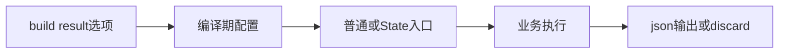
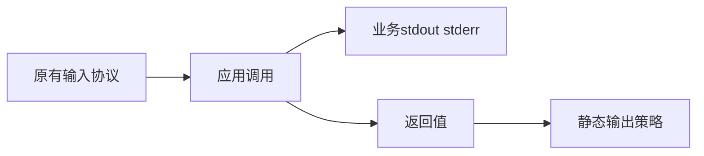

# 应用返回值输出实施计划

## Intent：最终目标

让独立 ZX/RX CLI 显式选择是否将业务返回值写成 JSON，使自行管理 stdout 的工具不必借助 Zig 宿主。

## Data：可用证据

标准输入输出已在 394687c6 实现并验证。当前两个 runner 执行业务后均固定输出 JSON，void 固定 null。build.Options 已整体参与构建产物配置摘要；watch 复用相同 Options 和原生构建路径。

## Edges：边界与限制

新增 `zxc build ... --result json|discard`，默认 json 保留既有行为。仅 app 构建有效，lib、compile、fmt、verify 等拒绝该选项；重复和未知值拒绝。discard 只丢弃返回值的输出，不跳过业务执行，不隐藏 stderr、不吞错误、不改变退出状态，也不改变输入参数协议。stdout 写入仍由业务显式调用 std:process。

构建生成 result.zig 编译期常量，runner 静态选择序列化；配置源码纳入产物摘要。独立函数缓存无需因入口输出策略失效。watch 与 State 使用同一策略，无动态分发或运行库。

## Answer：交付与成功标准

选项解析、帮助、产物配置、两个入口、草稿与参考。实际验证默认 json 和 discard 分别运行，副作用保留且返回值仅按配置输出，State 入口与参数拒绝遵循相同规则。无新增测试、无全量测试；完成单独提交 push。

## 自我复核

discard 不等于静默模式，业务副作用和错误保持可见。默认行为与库 execute 契约不变。普通与 State 入口已实际构建运行。

## 验证结果

编译器 dist 构建成功。同一 RX 应用默认输出 abcabcnull 换行，discard 输出 abcabc，两者 stderr 均为 abc；State discard 返回成功且无标准输出。五种非法参数均退出 1。热构建 generated=0/reused=8。结果保存在同名目录中。未新增测试、未执行全量测试，watch 长驻行为及跨平台运行未在本轮实测。

discard 文本入口收到 0xff 时退出 1，stderr 为 InvalidUtf8，stdout 为空，证实返回值策略未吞业务错误。
