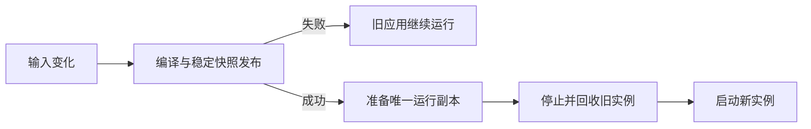
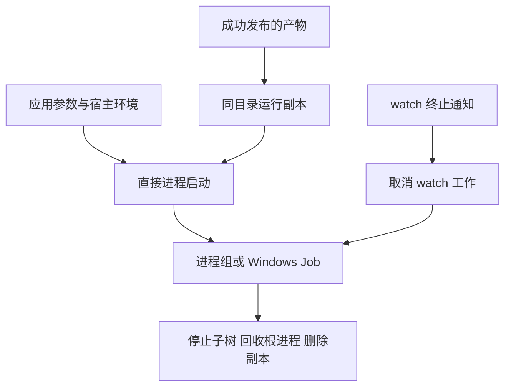

# 开发热重载实施计划

## Intent：最终目标

为原生应用提供 `zxc build entry --out app --watch --run -- [应用参数]`。首次构建成功后运行应用；后续成功构建后停止旧实例并启动新实例；编译失败继续运行旧实例。发布产物仍是独立程序，没有应用运行库或动态解释器。

## Data：可用证据

现有 watch 已跟踪编译输入、保留失败前产物并在稳定快照后发布，但没有启动或更新运行中的应用。`std.process.spawn` 支持 POSIX pgid 和 Windows suspended 启动。Zig 0.17 的 POSIX Child.kill 实际发送 TERM 后等待，不提供强制停止期限；取消 Child.wait 还可能清空仍运行的 pid。因此运行实例由唯一 owner 管理，不并发 wait/kill，也不依赖取消 wait 来结束应用。

## Edges：边界与限制

- 这是开发期进程重启，不是函数地址热替换、零停机发布或内存状态迁移。Store 在新进程重新初始化。
- 只接受本机原生 app、process 宿主、watch 模式；库、Node 插件和显式交叉目标不能自动运行。
- 应用参数通过 `--` 原样传递，不使用 shell。stdout/stderr 继承；stdin 关闭，避免独立进程组读取终端触发 SIGTTIN。
- 运行同目录中的唯一副本，保持相邻资源路径，并避免 Windows EXE 锁阻止发布。可执行文件自身路径会改变；副本退出后删除。
- POSIX 使用独立进程组，先 TERM、限定等待，再 KILL 并回收根进程；主动脱离该组的后代不受监管。Windows 使用 Job Object、挂起启动、加入 Job 后恢复，避免正常启动阶段逃离监管。
- 子进程不应改变身份以脱离父进程的信号权限。macOS 对只剩退出进程的组可能返回 EPERM：只有确认根子进程已退出时才继续回收，活进程的权限错误仍报告。
- watch 捕获终止通知并取消工作任务，让编译与运行实例沿正常退出路径清理。无法承诺 POSIX SIGKILL、宿主崩溃或断电时执行清理。
- 不执行全量测试、不新增正式测试。使用现有应用的定向构建和进程行为检查。

## Answer：交付与成功标准

CLI 参数、独立运行实例 owner、平台进程管理、终止控制、watch 成功发布后的启动接线，以及使用 reference。验证初次启动、成功重建切换、失败保留旧实例、恢复、自然退出、忽略 TERM 时有界停止、终止 watch 后清理运行实例。跨平台编译与实跑证据分别记录。

## 平台生命周期调查

使用 waitid 的 WNOWAIT 探测自然退出，在发送进程组终止信号前不回收根 PID，避免 PID/组号重用竞态。macOS SDK 的 sys/wait.h 给出 WEXITED=4、WNOHANG=1、WNOWAIT=32；Linux 使用标准库对应常量。Windows WaitForSingleObject 的零超时不关闭 handle，随后仍由唯一 owner 完成 wait。

首次 Gateway 运行暴露 macOS 的 zombie 进程组信号行为。独立启动 sleep、向组发送 TERM、保留未回收子进程后，killpg(0) 与 killpg(KILL) 都返回 errno 1；回收结果为 TERM。Apple 的 [kern_sig.c](https://github.com/apple-oss-distributions/xnu/blob/main/bsd/kern/kern_sig.c) 中 killpg1 遍历组时排除 SZOMB，未找到可发送对象时返回 EPERM。处理只作用于已确认退出的 macOS 根子进程，并保留其他权限错误。

CLI 标准输出/错误改为 streaming writer。父 CLI 与继承描述符的应用共同写入重定向文件时，使用各自的定位写入偏移会覆盖已有内容；顺序写入保持标准流的共享语义。

## 实施与验证

- 正式入口增加 --run 和 -- 后的应用 argv；build 缓存身份清除 run/run_args，运行参数不会改变编译身份。
- 独立 process owner 管理运行副本及进程生命周期，POSIX 和 Windows 分别实现组管理与 Job 管理。interrupt 只在 --run 模式安装终止通知，控制线程取消 watch 工作并等待清理完成。
- Gateway 实跑响应 5 → 6，故意制造未声明名字后旧 PID 与响应 6 保持，修复后新 PID 返回 7。最终发送 SIGTERM 结束 watch，根进程全部回收，运行副本数量为 0，见 [行为记录](开发热重载/行为记录.json)。
- 已有 argv 应用准确接收 `--literal`、`a b`、`$(never executed)` 三个参数，自然退出后报告 exit 0 并继续观察，Ctrl+C 后副本数量为 0。
- 已有 child_process 应用启动忽略 TERM 的 shell 与 sleep，终止 watch 后三个组成员均不再运行，见 [子树记录](开发热重载/子树记录.json)。
- 确认 Zig 后端子进程正在运行时发送 SIGINT，watch 在该次观测中 16ms 退出，后端已回收，没有启动运行副本，见 [取消记录](开发热重载/取消记录.json)。这是单次观测，不是所有工作负载的延迟上界。
- 七组不兼容参数组合均在解析阶段拒绝。未新增正式测试，未执行全量测试；独立测试会话的文件未改动。
- 最终源码的 `zig build dist`、`-Dtarget=x86_64-linux-musl`、`-Dtarget=x86_64-windows-gnu` 均 14/14 步骤成功。后两者是交叉构建，不是实际运行。最终本机构建再次验证自然退出及运行副本已被删除时的终止清理，均 exit 0、无副本残留，见 [最终清理记录](开发热重载/最终清理记录.json)。

## 自我复核

首次实跑暴露 zombie 进程组的 macOS 行为及标准流定位写入问题，已依据平台源码和复现修复，没有把权限错误一律忽略。一次验证脚本错误地等待诊断包含变量名，但现有诊断只输出通用名字错误；脚本等待超时后正常清理，改为匹配实际诊断再完整运行，没有改变编译器诊断来迁就验证。

停止旧实例后启动新实例失败，不回滚到旧进程；此行为在 reference 中明确。进程重启不等于状态迁移或零停机热替换，不得把本项宣称为任意在线部署方案。Mac 实跑与 Windows/Linux 构建证据分开记录，交叉构建不能替代平台运行检查。

最终复核将自然退出与显式停止收口到同一个受取消保护的清理路径，避免停止成功后、删除副本前收到取消而留下文件。启动失败的副本回收也屏蔽取消；路径内存无论删除成功与否都只释放一次。
