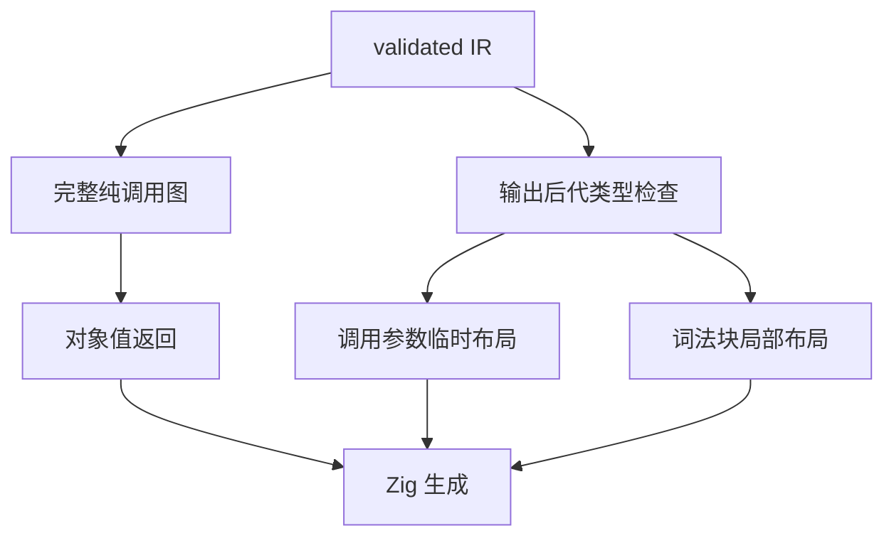
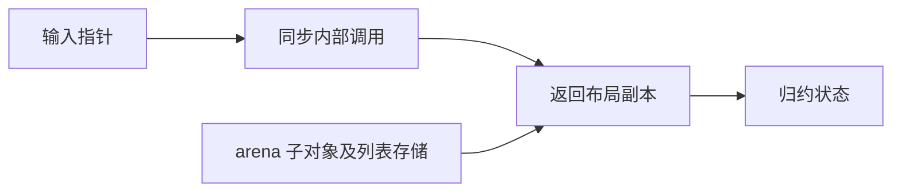

# 引用状态值返回

## Intent：最终目标

让完整 ZX 词法扫描中的内部纯函数直接返回对象布局，减少逐字节状态根分配。列表扩容是独立问题，本次不宣称解决其二次复制。

## Data：可用证据

- 完整词法扫描草稿已与旧词法器核对 837 份源码，无差异。
- 当前值返回仅允许非消费输入、标量字段对象，引用成员状态无法使用。
- validated IR 的 optional、list、tuple、object 子类型编号严格小于父类型，类型图无环。
- 纯调用图排除 external、Store、Parallel，并检查契约中的调用。
- statement lowering 逆序执行，局部栈符号必须提前登记。

## Edges：边界与限制

值返回资格、参数临时布局资格、局部布局资格分别判定。输出的后代类型包含临时根类型时保留 arena 分配。类型检查覆盖所有容器，不放宽所有权校验，不改变公共指针 ABI。局部布局存活到词法 block 结束；不得返回表达式 block 内临时布局的地址。消费操作仍按原求值顺序执行。

## Answer：交付与成功标准

1. 扩展内部纯函数对象值返回，加入输出后代类型检查。
2. 为不会通过输出逃逸的局部对象建立 block 级布局绑定。
3. 更新生成缓存版本和参数资格依赖。
4. 构建正式 CLI、重建词法草稿、核对已有输入与内存观测；不新增用例，不运行全量测试。





## 自我批判

类型无环只证明根地址不能进入返回值，不代表对象内部没有分配，也不代表列表追加已经线性。只在纯函数中使用局部栈布局，防止原生调用或状态存储保留地址。结果需以构建及已有数据核对确认。

## 实施结果

内部纯函数输出为对象即可生成值返回版本，消费输入不再一律排除；所有权校验保持原有路径。新 `locals.zig` 在逆序语句 lowering 之前登记本 block 的安全对象符号，生成布局常量并在引用处取地址，退出 block 后恢复符号表。输出后代含该类型的局部对象继续使用原指针生成路径。

调用参数独立检查 callee 的输入类型是否出现在输出后代中，存在时保留 arena 根。生成缓存版本提升为 v4，同时记录 callee 值返回与参数资格。IR 的字段读取、函数参数、结果等都按 TypeId 严格校验；检查覆盖 list、optional、tuple、object。

CLI `dist` 构建 14/14 成功，模块化应用构建成功，独立单文件 Zig 生成及宿主构建成功。生成代码唯一导入为 std。原 837 份输入使用相同 SHA-256 核对 token、comment、diagnostic 全部内容，零差异，见[核对记录](已有源码核对.json)。未新增测试用例。

最初误用默认 `zig build`，该入口会编译测试包，遇到既有 RX 测试 helper 使用 Zig 已弃用的 `std.meta.fields`；已停止该入口。没有执行全量测试，随后仅使用 `dist` 构建。该测试 helper 不属于本次修改范围。

| 源码                  | 字节数 | token 数 | 优化前 arena | 优化后 arena |
| --------------------- | -----: | -------: | -----------: | -----------: |
| shipping.zx           |    228 |       53 |       122714 |        29020 |
| model.zx              |   1094 |      224 |       800124 |       334554 |
| keyword_transition.zx |   9750 |     2283 |     32423436 |     31696780 |

[内存观测](内存观测.jsonl)使用原宿主，输入来自独立分配器，不计入扫描 arena。小输入改善明显，大输入仍以 token 列表反复复制为主。后续必须处理跨函数列表增长；这次没有改变列表 ABI、容量表示或追加实现，也没有宣称完成正式自举。

复现：

```sh
zig build dist -Doptimize=ReleaseSafe --summary all

zig-out/bin/zxc build docs/2026-10-05/完整词法扫描/lex.zx --out /tmp/zxc_bootstrap_lexer_value

zig-out/bin/zxc docs/2026-10-05/完整词法扫描/lex.zx --out /tmp/zxc_bootstrap_lexer_value.zig

zig build-exe --dep lexer -Mroot=docs/2026-10-05/完整词法扫描/observe.zig -Mlexer=/tmp/zxc_bootstrap_lexer_value.zig -O ReleaseSafe -femit-bin=/tmp/zxc_lexer_value_memory

/tmp/zxc_lexer_value_memory docs/2026-10-05/首页示例/shipping.zx docs/2026-10-05/完整词法扫描/model.zx docs/2026-10-05/完整词法扫描/keyword_transition.zx
```

## 结果复核

这次成功消除了多处状态根的 arena 分配；嵌套子对象、列表存储、普通指针返回入口仍有分配。837 份输入不是所有生命周期组合的证明，安全边界主要来自 validated IR 的严格类型关系、无环类型图及完整纯调用图；未来若增加引用重解释、闭包捕获或外部逃逸通道，必须重新审计此资格判定。
