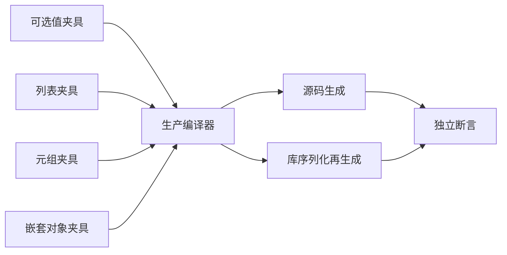
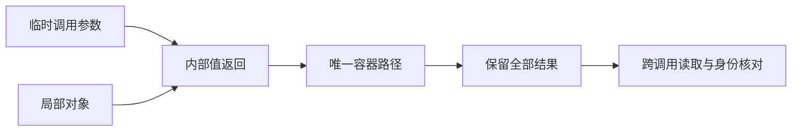

# 逃逸容器分支独立回归

## Intent

独立验证输出后代类型搜索的 optional、list、tuple、嵌套 object 路径，避免上轮 direct Cell 字段同时触发保护而掩盖某一递归分支缺陷。

## Data

生产提交 73ddf462 中 value_call/analysis.zig 的 containsDescendant 分别遍历这四类类型。423d6896 已验证组合容器场景与有界引用状态归约，但综合输出中存在直接 Cell 字段。

## Edges

每份新输出只出现一种容器路径；参数与局部对象分别通过相同容器逃逸。沿用 map 内归约强制调用值返回版本。只修改测试包，不新增生产语义，不计入 Test262 适配。有限运行测试不构成普遍生命周期证明。

## Answer

四组独立 ZX 模块通过源码与库编码解码两条路线执行，检查所有返回对象的数值、参数与局部对象身份、跨调用身份以及实际分配点失败清理。Debug 和 ReleaseSafe 完成后记录真实汇总，提交并推送。

## 实施记录

新增 escape_optional、escape_list、escape_tuple、escape_nested 四个模式。每组 step 接收 Cell 参数并建立另一个局部 Cell，只通过该组指定容器返回这两个对象。容器类型分别为 Cell?、Cell[]、[u64, Cell] 和两层嵌套对象。

共用 containers.zig 检查 0、1、2、31、1024 次调用，所有调用完成后才读取完整输出。断言输入不变、返回数值、容器长度或元组标记、参数与局部对象身份不同、不同调用持有不同对象，并逐实际分配点注入 OOM。每模式两项测试 × 源码/库两条路线，新增 16 项执行检查，整个目标从 88 项增至 104 项。

Debug 构建 87/87、测试 104/104 通过。四组 source 和 library 生成源码均确认含实际值返回调用；library 额外保留导出 wrapper，因此调用出现次数多于 source，这是生成结构差异，不是重复计为新增测试。相关 SHA-256 和输出 shape 记录在容器源码指纹.json。

## 自我复核

本轮移除了直接 Cell 字段对容器递归分支的掩盖，但不能由运行时未崩溃推断任意未来优化都安全。验证依据同时包含生成路径、完整返回值、跨调用身份和分配失败检查。可选值本轮保持非空以强制验证引用保留；空可选值继续由上一轮 references 场景覆盖。

测试没有绕过生产编译器，也没有修改其所有权规则。Test262 适配计数保持不变。全量 Debug 回归仍独立运行，不能用本目标通过替代全量结论。

ReleaseSafe 最终结果：87/87 构建步骤、104/104 测试通过。未发现生产缺陷，未向实现会话发送消息。
