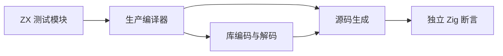

# 引用状态返回回归

## Intent

验证 73ddf462 引入的含引用状态值返回优化：保持借用输入、逃逸对象与局部对象的生命周期，源码和库两路结果一致。

## Data

现有 value_return 测试覆盖标量和枚举状态，尚无本轮引用布局的专门回归。实现通过输出后代类型判断参数和局部对象能否放栈。

## Edges

只修改 packages/test 测试。输入使用独立分配器；输出在 arena 存活期内读取。有限测试不证明所有类型图安全，不计 Test262 适配。全量 Debug 进程 76834 继续运行，其编译快照早于此次生产提交。

## Answer

扩展既有 test-value-return：引用状态长归约、对象逃逸到对象/可选/列表/元组、失败分配清理。源码及库序列化路径在 Debug 和 ReleaseSafe 执行。逐项记录结果并提交推送。




## 实施与复核

新增 references 与 escaping 两种模式，沿用既有源码及库编码/解码后生成路径。共新增 5 个 Zig test 定义，两条路径共 10 项执行检查，整个目标由 78 项增至 88 项。

references 使用独立输入内存，检查列表存储和子对象身份、可选子对象空/非空、输入不变、空归约 seed 身份，以及 2048/16384 次归约下 arena 和请求分配量不超过 4096 字节、分配次数不超过 4，且禁用 resize。

escaping 在 map 中对单元素列表归约，使 step 实际经过值返回入口，并将 1024 次调用的结果保留至循环结束后验证。参数逃逸到直接字段，三个独立局部对象分别逃逸到可选值、列表和元组。逐项检查原始值、偏移结果和不同调用之间的对象身份。两种模式均执行所有实际分配点失败注入。

初始夹具将同一 owner 多次转移，生产所有权检查正确拒绝；已改用独立局部对象。初始普通 map 虽然通过，但生成代码调用普通指针入口，不能证明目标优化；已改为上述归约路径，重新验证生成源码中存在实际 function_0_value 调用，而非仅有未使用定义。生成源码指纹见源码指纹.json。

自我批判：四种容器同时出现，不单独证明 containsDescendant 的每个递归分支；尤其直接 Cell 字段已经足以禁止同类型对象放栈。这轮证明综合生命周期与借用行为，后续仍需独立类型/容器排列测试，不能宣称完整逃逸分析已证明。固定上限只用于无新增列表存储的 references 场景，escaping 正常允许随结果数量分配。

Debug 最终夹具运行：59/59 构建步骤，88/88 测试通过。ReleaseSafe 在修改目标调用路径后再次执行：59/59 构建步骤，88/88 测试通过。两条生成路径均复核了实际值返回调用，并记录生成源码 SHA-256。

复现命令（packages/test）：

```sh
zig build test-value-return -j2 --summary all
zig build test-value-return -Doptimize=ReleaseSafe -j2 --summary all
```

新增覆盖属于 zxc 实现特性，不增加 Test262 已适配计数。未发现生产缺陷，不向实现会话发送消息。全量回归另行等待最终结果。
