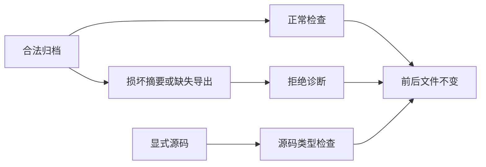

# 归档语义检查回归计划

## Intent：最终目标

阶段404：验证 semantic lint 消费真实已发布库，检查归档公共接口、完整性和显式源码选择，防止归档成功掩盖指定源码的错误。

## Data：可用证据

以当前 CLI 的 build --mode lib 发布 ZX 和 RX 公共模块。测试临时消费项目只保留库清单和 library.zxcir，不保留原始源码或生成 Zig 文件。复用单包与工作区的只读快照断言。

## Edges：边界与限制

不手工构造合法归档、不依赖旧版本固件或历史构建产物。发布属于测试准备，允许创建输出；lint 本身必须只读。语义检查不执行库业务或验证形式化契约，不计成 Test262 新适配。

## Answer：交付与成功标准

新增 compiled 专项并接入 test-semantic-lint；源码/清单/工作区入口消费成功，错误类型、损坏摘要、缺失公共模块拒绝，显式源码检查与归档清单检查保持各自范围。Debug、ReleaseSafe 通过并提交推送。




## 首次验证与缺陷

13 项归档测试中 7 项通过、6 项失败。ZX/RX 消费同一归档通过，直接归档清单检查和工作区检查被 configuration formatting required 阻断。发布产物 name/version/library 与 exports 之间缺少配置格式要求的块间空行。已将真实 CLI 发布与消费复现发送实现会话，首次失败日志保留，不在 fixture 中自动格式化发布产物。

另一个测试准备问题是通过普通 stringify 改写缺失导出清单会丢失格式；改为 YAML Document 在既有节点上替换 module 字段，保留文档的块间空行。这个准备问题与生产发布缺陷分别处理，不把它误报给实现会话。

专项 TypeScript 最初因返回泛化 Record 导致 spread 后键类型丢失而报错；收窄发布函数返回值为推导出的明确产物形状，移除不必要类型断言，检查通过。未修改生产源码。

## 修复复验

实现会话修复清单 writer 的标量与块字段间空行。未经测试补充格式化的原始发布清单，已通过直接 semantic lint 与工作区检查。YAML Document 只用于构造缺失导出的负例，不用于修正生产发布产物。

归档组最终 16 项：无原始源码的 ZX、RX、消费清单、归档清单、工作区五入口；两个消费输入类型错误；损坏摘要与缺失导出在源码、归档清单、工作区三入口共六项；显式合法/错误源码两项；显式合法源码与空归档清单的范围对照一项。全部命令前后文件快照一致。

Debug 与 ReleaseSafe 各 14/14 步骤、67/67 测试通过（旧 51 + 新 16），两模式共 134 次执行，不将重复执行算成独立用例。专项 TypeScript、Zig 格式及 diff 检查通过。未运行全仓回归。

## 自我批判与剩余边界

首次失败被配置检查提前阻断，因此不能据此声称后续归档内容校验已执行；修复后才验证损坏摘要和缺失导出的具体诊断。本套件使用当前 CLI 发布的真实归档，避免“生成器与读取器都读同一手写假数据”的弱证据；仍不证明跨版本兼容、原生 ABI、运行结果或全部归档攻击面。

当前覆盖纯 ZX 和普通 RX 归档；Store 归档、原生资源与形式化验证继续由相应已有专项及后续补充负责。本阶段未增加 Test262 审阅或适配记录，不改变上游对齐完成度。长期目标保持未完成。

## 复验命令

在 packages/test 执行：

```sh
zig build test-semantic-lint --summary all
zig build test-semantic-lint -Doptimize=ReleaseSafe --summary all
npx tsc --ignoreConfig --noEmit --strict --target ES2024 --module NodeNext --allowImportingTsExtensions --erasableSyntaxOnly --types node tests/semantic_lint/*.ts
```
