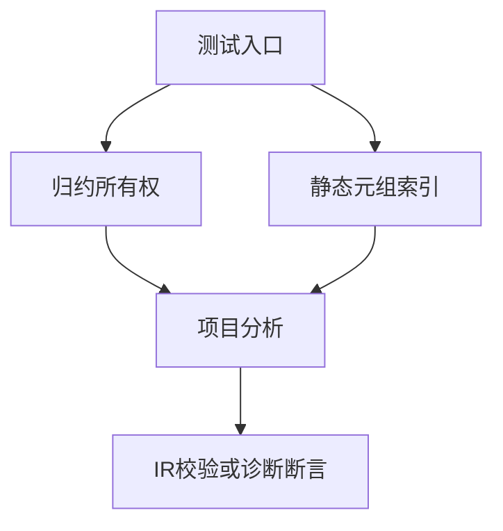
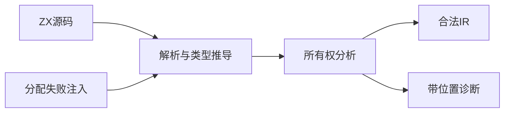

# 归约所有权与元组索引验证计划

## Intent：最终目标

第 384 部分：验证已提交的归约累加器所有权和静态元组索引分析契约，防止把初值所有权、回调下一轮状态和元组成员类型混淆。

## Data：可用证据

生产依据为 8466323c；追加生成优化 5b04a033 留待独立运行时验证。成熟测试参考 tests/ownership/loans 的项目分析、IR 校验与分配失败路径。共享工作区有其他会话的改动，提交仅包含本部分文件。

## Edges：边界与限制

只修改测试和文档，不修改生产实现。本部分验证编译分析与 IR，不宣称运行时输出、容量复杂度或全部 Test262 对齐完成。不扩展尚在实现的跨函数消费契约。发现生产缺陷时向指定实现会话报告。

## Answer：交付格式与成功标准

按归约与静态索引分文件组织细粒度 Zig 测试；成功情况验证输出所有权与 IR 合法性，失败情况验证诊断代码和位置；代表性成功、拒绝路径遍历分配失败。执行 ownership 聚合检查、记录结果后独立提交并 push。

## 执行记录

正式测试位于 packages/test/tests/ownership/reduce，复用现有 test-ownership-contracts 入口。新增 25 项测试：归约 16 项、静态元组索引 9 项，其中 3 项调用 checkAllAllocationFailures 遍历成功归约、借用递推拒绝和越界诊断的分配失败路径。

- Debug：4/4 构建步骤、41/41 测试通过。
- ReleaseSafe：4/4 构建步骤、41/41 测试通过。
- 两种模式运行相同的 41 项测试，不累计为 82 项独立用例。
- 初次误从仓库根目录调用子包目标，因目标不存在退出 1；随后在 packages/test 执行，完整日志保存在同名目录。
- Zig 格式检查与本次 diff 空白检查通过。未修改生产实现，未发现生产缺陷，因此未向实现会话发送消息。

## 自我批判与续作边界

本部分从真实 ZX 文本分析，验证 IR 和输出所有权，不以生成文本快照替代行为检查。但这些是编译期检查，尚不能证明生成代码运行时的结果、OOM 清理和容量增长性质。现有实现把累加器由 owned 降为 borrowed 后重新检查回调，本次覆盖了能够触发第二次检查的条件返回路径；并未穷举任意复杂回调。

下一部分继续为 5b04a033 的 append-only reduce 生成优化增加真实 Zig 运行时输出、分配失败和分配次数检查，避免使用耗时阈值。整个 Test262 对齐目标仍未完成。
