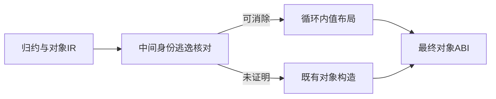
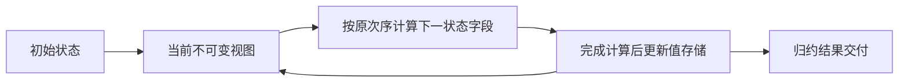

# 归约状态布局实施计划

## Intent：最终目标

改进编译器状态机的对象归约生成：可以证明中间对象身份不逃逸时，循环内保存值布局，结束后再按既有对象 ABI 交付结果，避免每次迭代都向请求 arena 分配一个对象。保持输入输出、错误顺序和借用语义，不新增专用运行库。

## Data：可用证据

当前 genz/transform.zig 的 reduce 将 callback 生成结果赋给累加器。aggregate.object 统一通过 construct 分配对象，所以即使 State 只有 count、total 两个整数，每个元素仍执行一次 allocator.create。真实 ZX 示例与生成 Zig 已保存到归约状态布局目录，另有直接执行生成模块的 arena 容量观测程序。该目录是实现和性能观测材料，不是新增测试套件。

已有只追加列表优化说明仅靠表面 owned 标记不能移动或释放任意 slice。对象优化同样必须核对完整累加器指针的逃逸：native 调用、嵌套回调或包含累加器的集合都可能把旧视图带出本次计算，不能简单改写为可变对象后让旧视图跟着变化。

## Edges：边界与限制

- 第一原则是保存不可变视图语义，不改变对象公开指针 ABI。
- 静态分析决定是否能使用局部值存储；不满足证明条件继续原生成路径，不猜测动态存活期。
- 输出对象、保持原值分支和条件分支应由同一 lowering 处理，不能按示例名称、字段名或固定输入长度优化。
- 候选方向为分离对象值构造与对象分配；复用现有求值次序、缓存和字段构造规则，不再复制一套对象语义。
- 这项工作不等于完整编译器自举，也不解决 Store 跨请求回收。完整目标和既有前置缺口保持不变。
- 不新增测试、不执行全量测试；使用真实源码生成、已有回归和独立宿主内存观测。

## Answer：交付与成功标准

先保存优化前生成代码与真实容量，再根据逃逸分析落实 genz 实现。优化后应保持结果相同，证明覆盖的纯状态归约不再按迭代次数分配顶层累加对象；空输入、条件保持、借用子字段和可能逃逸的旧视图必须分别核对。实现完成后补参考文档并独立提交推送，当前不宣称优化已经实现。

## 自我复核

需要证明的是旧对象身份不会继续被观察，而不只是字段类型看起来简单。当前真实生成代码已确认重复分配，具体优化条件仍在核对，不能以计划替代实现或把顶层对象优化称为所有状态构造均已高效。

## 已落实的生成与证据

新增 object_reduce/analysis 按表达式图检查完整累加器使用：直接字段读取安全，完整累加器进入调用、列表、元组、可选值、嵌套转换等路径时拒绝优化。回调结果支持对象字面量、条件与保持原值；根对象 evaluation 只对直接累加器 spread 允许局部布局副本，仍检查所有最终字段。不会把栈布局地址交给普通表达式。

aggregate.objectValue 与普通 object 共用求值次序、临时缓存与字段生成，只分开最终分配动作。lowering 在分析通过后才开始生成。循环内完整算出下一布局后整体赋值；changed 只在执行对象构造分支时设置；结束后创建最终 ABI 对象，空源或全部保持返回原初值。

dist 构建 13/13 步骤通过。真实 scan 源码执行 0、1000、10000、100000 个元素，输出 count/total 一致；优化前 arena 容量分别为 72、28304、198136、1906000 字节，优化后均为 72 字节。这里报告分配器实测容量，不把它解释为类型理论大小或所有程序的内存上限。

select 应用验证空源、全部保持、交替构造分支、读取上一状态多个字段及借用 string[]。输入 count=2、total=10、steps=[0,3,0,4] 得到 count=4、total=22，labels 原值保留。完整状态传入 step 辅助函数的 escaped 示例维持原生成，输出 count=3、total=9；生成代码仍在循环中创建对象。发布 scan 库并由独立 Zig 宿主实际调用，输入 [2,3,5] 返回 count=3、total=10。

只读复核检查了 safe 表、spread 缓存、字段投影及嵌套转换，没有发现完整布局流入要求指针 ABI 的接受路径。未新增测试、未执行全量测试、未使用浏览器。最初示例混用了 u8 元素与 u64 字段被既有类型规则拒绝，后改用一致的 u64 输入；没有为示例放宽数值类型契约。

自我复核：此优化只消除被证明安全的顶层归约对象。嵌套对象、列表更新、模板字符串、辅助函数返回对象与 Store 长期内存仍各有成本；分配次数减少也会改变 OutOfMemory 出现时点。自举前置任务继续，尚未迁移编译器核心。
