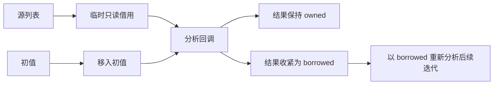

# 归约累加器所有权

## Intent：最终目标

让 reduce 能在不可变绑定语法下逐轮传递唯一拥有的累加器，支持集合与显式状态累加，为后续编译器核心迁移提供必要表达能力。保持输入元素只读、禁止回调捕获、无模块环和无普通 mutation。

## Data：可用证据

当前 ownership/check.zig 对 map/filter/reduce 的所有引用型参数统一赋 borrowed。reduce 初值虽已用 move 求值，累加器仍不能执行消费式 push/pop/concat 等操作。普通函数 Input 也是 borrowed，抽成另一个模块不能解除该限制。

当前 AST/IR 可使用节点 ID 和类型化列表表达非递归数据，不必为照搬 Zig 指针树开放递归类型。自举尚未开始；本轮解决的是累加器权限传递，不把 Zig 编译器包装器或单个 fold 当作自举。

## Edges：边界与限制

- target 先求值并建立临时借用，再 move 初值，阻止初值求值时消费仍将被迭代的源列表。
- 元素参数仍是 borrowed/copy；reduce 第一个参数的权限来自实际 initial 状态，不由类型或冗余 Symbol.ownership 标签猜测。
- 第一次回调分析若使 owned 累加器变成 borrowed，恢复回调前状态后，以 borrowed 累加器再分析整个回调；必须对后续迭代仍然合法。两次分析即可覆盖权限收紧，不引入通用不动点框架。
- 返回摘要合并初值与回调结果，空源数组返回初值。借用结果继续冻结来源，调用结束只释放本轮未逃逸临时借用。
- 保留 initial 的实际消费，不让回调分析恢复旧初值的权限。回调不能捕获外部绑定。
- 不使普通导入函数自动消费 Input，不改变列表 ABI、循环执行顺序或错误传播。
- 当前 push/concat 生成新缓冲并复制标量或引用槽；重复增长尚未具备摊销常数时间的容量复用。本轮不宣称已得到高性能词法器；高效构建集合与跨函数的显式消费仍需独立推进。
- 不新增测试、不执行全量测试、不调用浏览器。使用现有所有权/集合目录与真实文档示例验证。

## Answer：交付与成功标准

正式修改包含 ownership/check.zig 的 transform 状态转移与必要短 helper，以及 expressions.zig 中静态元组索引到已有 tuple_field IR 的降低。记录新建列表初值、空归约、借用降级和来源保护的语义；文档提供实际集合累加例及运行证据。编译器构建、相关既有检查与示例通过后提交 push。总体前置功能、自举及全特性文档范围不缩小。

## 自我复核与验证记录

已实现并完成只读复核：严格区分 target 前和 initial 后两份状态快照，回调状态恢复不会撤销初值消费；释放临时 loan 在恢复之后执行，保留外层借用。只把参数标记改成 owned 的初始想法不足以成立。

最终编译器构建 14/14 步成功。含静态元组索引的最终代码已通过现有 ownership 前端目录 412 项与 ownership contracts 16 项，共 428 项。正式源码与草稿逐字一致，diff 空白检查通过；没有新增测试文件或执行全量测试。

真实文档示例已构建运行：展平后反转输出 `[4,3,2,1]`，数据驱动栈操作输出 `[1,2,4]`。空输入与原有 reduce_sum/reduce_digits/reduce_index 目录的结果见 [运行结果](归约累加器所有权/运行结果.json)。复用目录时仅格式化临时副本，未修改原有用例。

自我批判：最初实际展平示例暴露出“权限可用但 inline 回调不能投影元组”的表达缺口，因此补齐通用静态索引。原有运行目录包含预期错误；第一次核对脚本使用 check=True 将正确的错误退出误判为脚本失败，随后改为同时核对退出状态和预期错误名称。该修正不影响编译器代码。借用降级检查保持保守，不提供路径相关的逐轮状态证明；列表增长性能和普通函数输入消费尚未解决。

### 示例验证发现的必要补充

消费式列表操作返回 `(更新列表, 操作结果)` 元组，而当前源码只有语句解构可以投影元组；inline reduce 回调没有语句块。因此只修所有权仍无法表达更新后的累加器。补齐通用 `tuple[整数常量]`，直接使用已有 tuple_field IR；不改变返回协议、不硬编码第 0 个字段、不引入动态元组索引。编译期拒绝动态和越界索引，所有权继续使用已有元组字段规则。knownType 同步识别静态字段，保留上下文类型推导。
