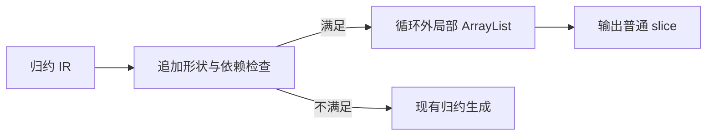
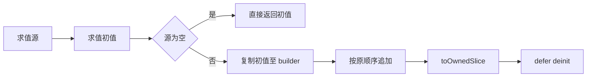

# 归约追加生成实施计划

## Intent：最终目标

解除自举扫描与输出构造中只追加归约的平方复制开销，保持现有语言语义和公共 slice ABI。

## Data：可用证据

当前 genz collections 对 push/concat 每轮分配新长度并复制全部旧内容；transform 的 map/filter 已使用标准 ArrayList。owned 不能证明完整 allocation：pop 缩短 slice，splice 返回内部 slice，原生结果也未携带 allocator 来源。因此不能通用 realloc 旧 slice。

## Edges：边界与限制

仅优化 list 累加器的只追加数据流：直接返回 push/concat 的第零元组字段，或条件分支递归组合这些更新及原样返回累加器。追加参数和条件不得依赖累加器，阻止中途别名和逃逸。判定基于 IR，不检查示例名称或业务数据。未满足条件继续使用现有 lowering。

源与初值各求值一次，保持先源后初值顺序。空源直接返回初值。首次实际追加才向局部 ArrayList 一次复制初值，循环内保留容量并追加，最后输出 owned slice；全程不追加时返回原初值；不推测旧 slice 容量，不释放旧 slice。局部 builder 在错误和成功路径均正确清理。不改变 IR、公开类型或源码语法。

本轮不是任意列表容量复用；含 pop/splice、观察累加器内容或跨函数传递的状态归约仍未优化。不得以本轮完成替代全部自举要求。不新增测试、不全量测试、不使用浏览器。

## Answer：交付与成功标准

正式变更位于 genz，源码草稿置于本目录。复用已有归约运行目录和真实文档示例，检查最终生成代码确实将 builder 留在循环外，并运行最终应用。按 IDEA 记录语义与性能证据，完成后提交 push。

## 自我复核

实际实现分为 append_reduce/root.zig（匹配与生成）和 dependencies.zig（IR 依赖传播），transform 仅添加尝试优化入口。两轮只读复核未发现确定漏洞。依赖表穷举 IR 节点，object 的实际 evaluation、嵌套 transform、call 参数与 match 均覆盖；未命中前不修改生成状态。

原方案在非空源进入循环前复制初值，会让所有分支均不追加的程序无端分配。因此改为首次追加参数求值和长度检查完成后才初始化 builder；空源与全跳过保持原初值。toOwnedSlice 成功后清空 ArrayList，defer deinit 安全；失败时回收 builder 自己持有的缓冲，不释放来源 slice。

最终构建 14/14 步成功。追加容量变化必然改变分配次数及 OutOfMemory 的具体发生时点，不声称分配失败轨迹等价；正常结果、条件短路、参数显式错误与长度 Overflow 顺序保持。当前每个候选 reduce 扫描本函数 expressions，不引入新的分析缓存。

真实性能核对复用已提交的 flatten 示例，分别运行旧生成程序与新程序，并逐个检查输出。8000 个单元素行在当前 macOS 宿主上，旧程序峰值常驻内存 257622016 字节，新程序 1499136 字节；单次含启动与 JSON IO 的观测耗时分别约 0.105 秒与 0.008 秒。这不是稳定微基准，也不代表其他归约获得相同比例；根本证据是生成循环外只有一个 builder，循环内追加，不再每轮复制前缀。完整观测见性能记录.json。

现有定向检查：test-nested-collections 的 21 项与 test-generation-runtime 的 3 项全部通过（23/23 构建步骤）；覆盖嵌套作用域及生成缓存冷、热、变更、禁用和损坏恢复。不推导这些检查覆盖所有追加匹配条件；命中路径由文档示例实际构建运行及生成源码核对提供证据。

最终 CLI 复跑原有 reduce_sum 372 项、reduce_digits 372 项、reduce_index 255 项共 999 项，输出和预期错误全部匹配。文档示例的逐项追加、条件追加、全跳过和空输入均已实际运行；含 pop 的既有 stack 示例继续走普通归约并输出正确结果。
