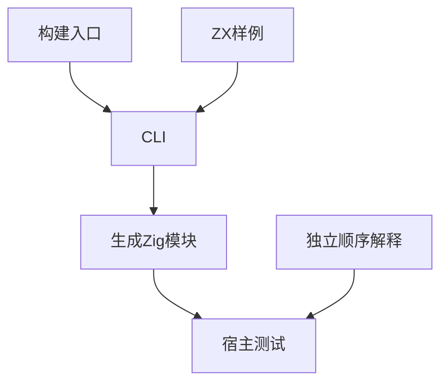
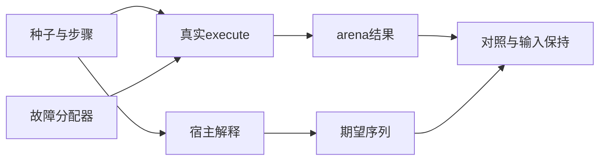

# 归约追加运行时验证计划

## Intent：最终目标

第 385 部分：用真实 CLI 生成代码验证归约追加优化的值、顺序、输入保持、内存清理和线性空间边界，并验证不适用优化的累加器依赖路径。

## Data：可用证据

实现 5b04a033 在 push/concat、条件和恒等分支中保留 ArrayList 容量；条件或追加值依赖累加器时退出优化。输入初值在首个追加时复制到缓冲区。参考现有 build/runtime.zig 的 CLI 生成入口和 support/control.zig 的 arena 生命周期。

## Edges：边界与限制

只改测试和文档。宿主使用生产 execute 的 ArenaAllocator 契约，OOM 在 arena 底层分配器注入。有限规模的容量上界是回归检查，不是渐近复杂度证明。不用耗时阈值，不要求特定生成变量名。共享生产代码可能被实现会话修改，记录实际验证基线。

## Answer：交付格式与成功标准

八个 ZX fixture 覆盖 push、concat、选择追加、嵌套分支、依赖累加器的条件、长度参数、索引参数、push/pop 回退。Zig 宿主使用独立顺序解释计算期望值，检查输出与输入保持；代表性场景遍历所有底层分配失败；优化场景检查不同规模的 arena 容量上界。注册 test-reduce-runtime，完成 Debug 与 ReleaseSafe 验证后提交并 push。

## 执行与自我复核

初始接入有工作目录错误和宿主编译期分支错误，已修正。随后发现生产缺陷：items.push(items.length + step.value) 在参数读取前就将接收者标记为 moved，CLI 于 argument.zx:8:54 拒绝。已向用户指定实现会话报告，对方确认并处理；未由测试会话修改生产代码。

修复前可执行的六场景 Debug 与 ReleaseSafe 均通过 86/86 项检查，但整体目标仍因 argument 编译失败而退出 1，不能报告全绿。随后增补 first_value 运行时场景及 receiver 分析检查，修复后验证如下。

### 容量门禁敏感性

对照样例在 push 两个相同分支之前读取累加器长度，保持结果相同但触发当前生成器回退。使用首次真实构建使用的缓存 CLI 生成，独立 Zig 测试得到 13 项结果/清理检查通过、2 项容量检查失败，退出码 1 为预期对照结果，不属于正式套件失败。

256 步时正常底层分配器的 arena 容量为 318300 字节，禁止原地增长时为 335202 字节，均超过 70656 字节上界。对照代码与日志保存在对照子目录及对照检查.txt，不改生产实现。正式门禁同时检查 arena 保留容量、累计分配字节和底层分配次数；上界是有限回归预算，不能据此声称一般渐近复杂度已被证明。

### 修复后结果

实现会话已修复接收者过早消费：参数求值期间保留受保护的只读状态，求值结束后才最终移动接收者。测试会话只修改测试与文档。

- 新增运行时组合 112 项：四个追加优化场景各 15 项；依赖条件、长度实参、索引实参、push/pop 四个回退场景各 13 项。
- 新增 receiver 分析检查 12 项，覆盖普通绑定、对象字段、元组成员、嵌套索引、临时 transform 参数、借用/二次消费/逃逸拒绝和分配失败。
- 本部分新增合计 124 项；所有权入口既有 41 项，因此两个入口合计 165 项。
- Debug：44/44 构建步骤、165/165 测试通过。
- ReleaseSafe：44/44 构建步骤、165/165 测试通过；两种模式不累加为独立用例。
- 运行时使用独立宿主顺序解释计算期望，覆盖空种子、非空种子、空步骤、单步、不同长度、空追加、全部禁用、u64 最大值、零和重复元素。成功与 OOM 路径均验证输入保持。
- 每个模式包含三个 OOM 测试，遍历真实 execute 的底层分配失败。容量门禁检查三个规模及两种底层增长行为；不以分配地址或生成变量命名作断言。

### 自我复核

这里验证的是特定受支持 ZX 表达式和有限输入规模，不能替代全部归约语义或完整 Test262 一致性。集合操作的通用回退目前允许较高内存开销，本部分不把优化上界强加给依赖累加器的回退场景。对照只证明当前容量门禁能识别失去追加优化，不能证明所有未来性能退化都能检出。

验证期间共享工作区存在实现会话的 owned Input 及接收者修复改动，结果基于当时真实源码，不能描述为 ca246429 的干净基线全部通过。生产实现文件指纹保存在执行结果.json。正式提交仅含本部分测试、草稿、计划与日志。

### 提交前复核

生产修复已包含在 b674fa5f。该提交上再次执行两个入口，Debug 与 ReleaseSafe 均为 44/44 构建步骤、165/165 测试通过，日志为提交基线检查.txt 与提交基线安全发布检查.txt。受检生产文件指纹未变化，compiler/genz/core/cli 无未提交差异。本部分格式与范围差异检查通过。

下一部分验证新发布的显式 owned Input 跨模块消费契约，包括调用拒绝、归档/链接身份、发布后调用与实际运行；随后继续 Test262 待办。整体目标尚未完成。
