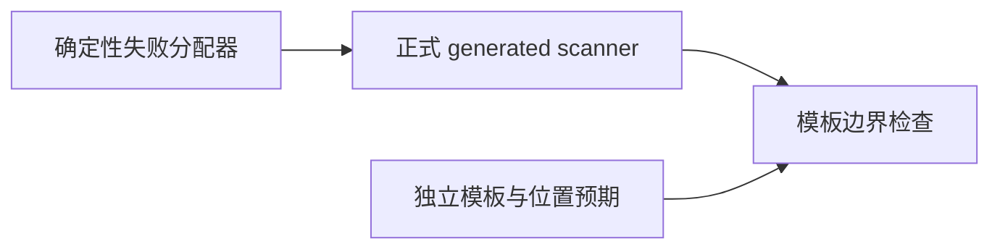
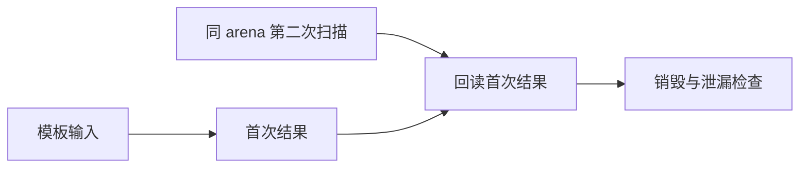

# 嵌套模板元数据与资源边界

## Intent

验证模板内部结构不会污染外部 token 元数据，且连续扫描及分配失败不会破坏结果或泄漏资源。

## Data

现有 scanner 元数据测试已覆盖普通 token 与词、符号映射。本轮使用正式 generated scanner，加上已有确定性分配失败适配器；测试文件在 scanner_metadata 目录内，固定全量检出不修改。

## Edges

仅检查词法扫描，不宣称模板内部表达式通过语法或类型检查。十种模板覆盖原始换行、插值字符串括号、对象括号、注释中的闭合符号、内层模板、内层插值及转义。外层输出为一个 Template token，内部注释不属于外层 comments。

## Answer

新增三项测试：10×4×4=160 个模板/前间隔/后间隔组合，核对前后 token、完整模板、EOF 所有标量字段与 span，以及外部 comment span。另两项逐分配失败检查有效嵌套模板和未闭合插值注释；同 arena 再扫描 return 后回读之前结果。OOM 路径验证销毁清理，不宣称注入 OOM 后同 arena 重试。

## 执行与自我复核

Debug、ReleaseSafe 均正常退出：14/14 构建步骤、11/11 测试通过。新增加三个测试，其余八个全部在本轮重新执行。命令为 `zig build test-scanner-metadata -j2 --summary all`，ReleaseSafe 另加 `-Doptimize=ReleaseSafe`。

嵌套模板中的注释没有进入外部 comments；外部注释的位置由拼接输入独立计算。资源测试仅在正常首次扫描之后验证同 arena 连续执行及旧结果存活，故障注入遇到 OOM 时销毁 arena 清理，不伪称验证了 OOM 后复用该 arena。没有修改生产代码、没有新发现的生产缺陷、未向实现会话发送消息。固定检出全量任务仍独立运行，本轮新测试未写入该检出。
