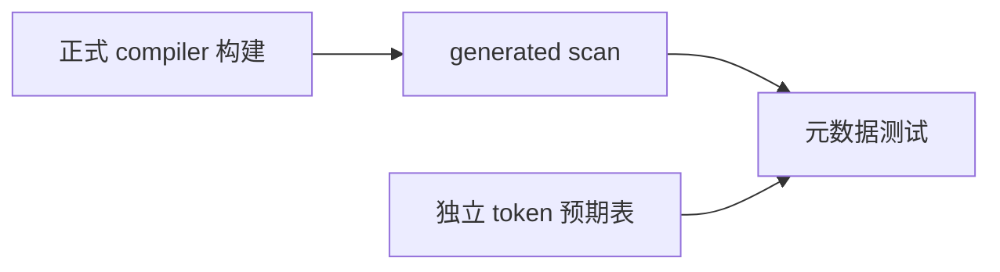
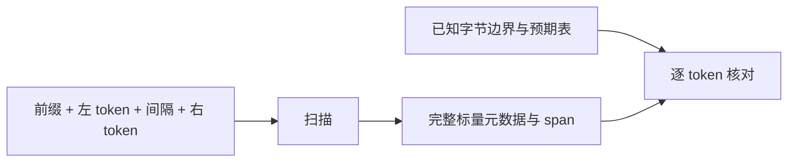

# 扫描器元数据边界回归

## Intent

验证新增 token 标量元数据不会在相邻 token、注释、空白、模板和 EOF 间错误残留。

## Data

abe7f30b 的正式生成入口是 scan.zx；正式 lexer 模块依赖 generated。实现侧已重放 873 份材料，本轮增加独立组合边界并注册正式测试目标。首 token 的 line_break 按既有 parser 语义为 false；仅 token 间 CR/LF 影响后一个 token。

## Edges

直接引用正式 compiler 构建生成的扫描器，不运行文档草稿。预期 token 表独立列出六种类别的词、标点与 dollar 值，换行由已知间隔原始字节判断，不调用生产词法 helper 推导预期。内部组合次数不额外计为 Test262 用例；本轮不验证整个关键字 DFA 或所有标点。

## Answer

新增 test-scanner-metadata，接入全量 test。三个测试覆盖 3 种前缀 × 6 左 token × 12 间隔 × 6 右 token 的 1296 组合、72 个尾间隔组合、12 个纯间隔输入，共 1380 次真实 scanner 调用，检查全部 token 元数据及字节 span。执行 Debug 与 ReleaseSafe。

## 执行结果与自我复核

Debug、ReleaseSafe 均正常退出：6/6 构建步骤、3/3 测试通过。命令为 `zig build test-scanner-metadata -j2 --summary all`，ReleaseSafe 另加 `-Doptimize=ReleaseSafe`。测试时 compiler 工作区无未提交改动。

六种代表 token 足以检查不同类别之间的元数据清理，但不能替代所有关键字、前缀及标点映射枚举。预期表是测试 oracle，不是生产针对用例的分支；生产源码未改。未观察到缺陷，未向实现会话发送消息。1380 是三个测试中的输入组合数，不增加 Test262 已审阅或具名目录计数。
