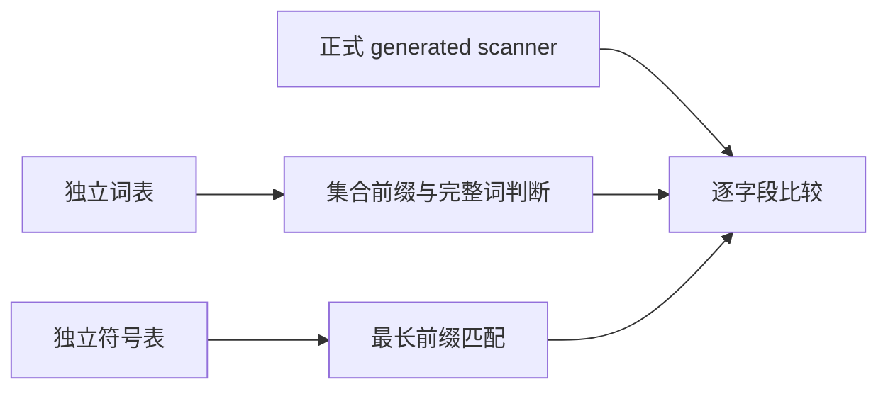
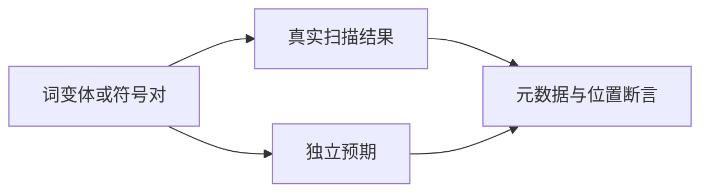

# 扫描器词与标点完整映射

## Intent

覆盖当前全部 25 个保留字、15 个上下文词及 31 个标点映射，验证识别前缀、大小写和最长匹配。

## Data

正式语言保留字及上下文词集合已由 scanner 接入。上一轮只覆盖六种代表 token，本轮将独立预期词表固定于测试目录，不导入生产 JSON 或识别函数。

## Edges

上下文词仍是 Identifier；word 字段可保留合法 DFA 前缀，不把非完整词一律误判为 Dead。测试预期通过独立词表集合的前缀关系推导。标点预期从 31 项符号字典做最长前缀匹配，注释起始优先；双符号输入中的未闭合块注释验证词法诊断。不是一般长度输入的穷尽证明。

## Answer

新增四个词测试和一个标点测试，接入 test-scanner-metadata。词测试逐个检查所有非空前缀、三种标识符尾缀、前导 dollar 及 dollar 起始新 token、每个字母的大小写翻转；标点测试遍历 31×31 个相邻组合。每个有效 token 都核对全部标量元数据和 span，另检查 EOF 与注释。执行 Debug、ReleaseSafe。

## 首轮预期复核

首轮 Debug 6/7 通过，词尾 dollar 预期单 token 失败。复核正式 advance.zx 与 bootstrap/lexer/lex.zig：标识符后续字符仅字母、数字、下划线，dollar 只允许作为起始。因此移出普通标识符尾缀组合，新增 word + dollar + word 必须分成两个 token 的对照，继续检查第二个 token 的 dollar 与 word 元数据。此为测试 oracle 修正，不是生产语义回归；未修改生产实现。

## 执行与最终复核

Debug、ReleaseSafe 最终均退出 0：10/10 步骤、4/4 重新执行的词测试通过，其余四项为通过的缓存结果，目标合计八项。首轮两种模式的标点测试均已通过，最终未修改其源码。本轮新增五项测试，内部组合计数为 {"prefixes": 206, "suffixes_and_leading_dollar": 160, "case_changes": 205, "dollar_boundary": 40, "punctuation_pairs": 961}，总计 1572 次扫描；不作为新增 Test262 逐项映射。

命令为 `zig build test-scanner-metadata -j2 --summary all`，ReleaseSafe 另加 `-Doptimize=ReleaseSafe`。有限词和标点表来自当前语言契约，若未来增加词表或符号需同步扩展；此测试没有借用生产表计算预期。无生产缺陷，未向实现会话发送消息。
