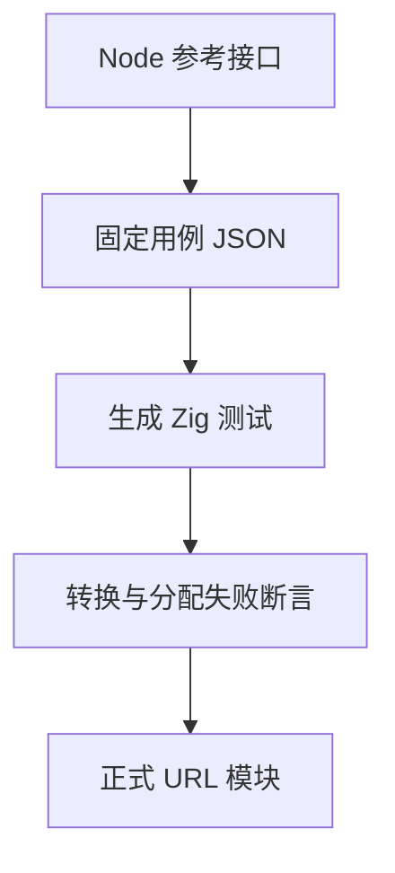
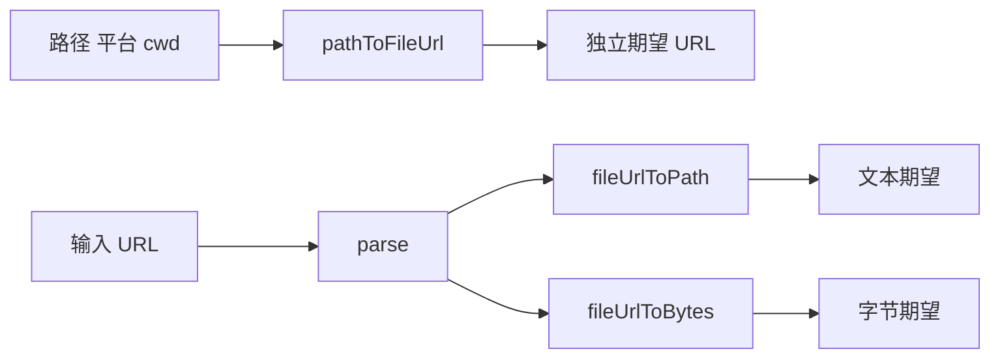

# 文件 URL 验证计划

## Intent：最终目标

验证 POSIX 与 Windows 显式平台下文件路径和 file URL 双向转换、文本与字节接口差异，以及所有案例的分配失败清理。发现问题提交最小复现给实现会话。

## Data：可用证据

生产契约见完整URL实施计划的文件路径转换阶段。对照 Node URL 文档 https://nodejs.org/api/url.html 及官方 v26.10.0 文件路径测试；独立参考输出使用本机 Node v25.8.1 的显式 windows 参数，保存为固定 JSON，正式测试离线消费。

## Edges：边界与限制

cwd 必须显式传入；不使用参考运行进程的 cwd 生成相对路径期望。参考接口没有显式 cwd，因此相对路径用独立 path.posix/win32.resolve 解析后参考转换；特殊盘符环境不作为跨平台保证。ZX 公共调用链后续单独覆盖。错误枚举名称不要求与 Node 一致。

## Answer：交付格式与成功标准

按 from_path、to_path、to_bytes 分类保存独立 Zig 用例。覆盖 ASCII 字符矩阵、Unicode、盘符、UNC、扩展路径、相对路径、无效百分号、编码分隔符、非 UTF-8 字节、非 file scheme。逐例运行正常断言和 checkAllAllocationFailures。Debug 与 ReleaseSafe 全部通过后提交推送；失败不删除、不改期望来迎合生产实现。

## 固定覆盖清单

- from_path：347 条，包含 3 条拒绝。
- to_path：551 条，包含 280 条拒绝。
- to_bytes：551 条，包含 9 条拒绝。
- 额外 2 项原生测试分别遍历两平台的 5 种非法 UTF-8 字节串，以及缺失 host 的原始 URL 记录。
- 1,449 条参考案例均以操作、平台、输入和 cwd 联合作唯一性核对；示例与完整矩阵重叠时去重，不依据生产执行结果删例。
