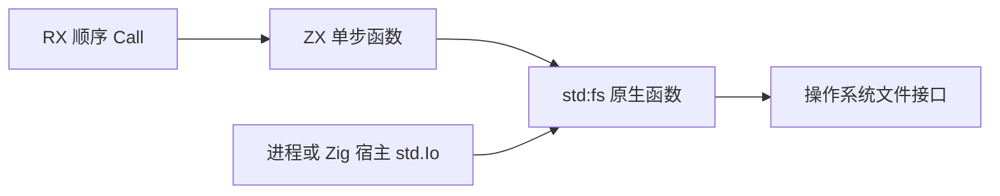
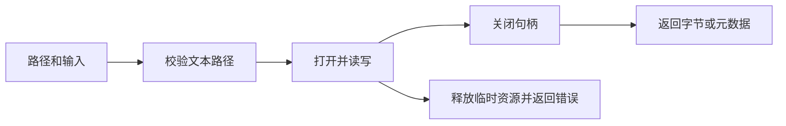

# 文件标准库与原生 I/O 参考

## Intent：用途

通过 `std:fs` 在 ZX 函数中调用文件系统操作，由 RX 编排多步操作。应用使用进程的 I/O 实现；Zig 直接消费生成库时提供 `std.Io`。不需要安装 zxc 运行库。

## Data：接口来源

操作分类参考 [Node.js File system](https://nodejs.org/api/fs.html)，当前实现使用 Zig 0.16 `std.Io.Dir` 和 `std.Io.File`。本页描述 zxc 实际提供的 15 个接口，不承诺完整 Node.js API 或 JavaScript 行为兼容。

实际声明位于 [fs.d.zx](../../packages/compiler/standard/interfaces/fs.d.zx)。标准库属于 compiler 包，Zig 生成由 genz 负责，CLI 提供应用宿主。

## Edges：使用边界

- 路径是 UTF-8 字符串；相对路径从应用进程工作目录解析。嵌入 NUL 返回 InvalidPath，非法 UTF-8 返回 InvalidUtf8。底层系统中的非 UTF-8 文件名不能通过这些文本接口表示。
- `io` 表示宿主 I/O 能力，不是文件路径沙箱。文件权限由宿主和操作系统决定。
- 所有操作都可能返回错误。多次调用没有自动文件事务；后续失败不撤回此前已经成功的文件写入。Store 的提交也不把外部文件操作纳入原子事务。
- 写入默认创建或截断文件，不承诺持久化到物理介质；目录遍历顺序由系统决定。
- 原生 I/O 仍被纯计算 Parallel 和未建模的形式证明入口拒绝。
- 尚未提供原子追加 appendFile、文件句柄 API、流、监听、递归复制/删除、chmod/chown、utimes 或完整 Stats。尤其不能用“查询长度后写入”冒充原子追加。

## Answer：ZX 接口

```zx
import fs from "std:fs"

export type Input = { path: string, max_bytes: u64 }

export type Output = string

export default function (in: Input): Output {
  return fs.readText(in)
}
```

调用参数只包含业务数据，不在 ZX 中手动传入 allocator 或 io。

| 接口      | 输入                                          | 输出与行为                                                          |
| --------- | --------------------------------------------- | ------------------------------------------------------------------- |
| readFile  | `{path: string, max_bytes: u64}`              | `u8[]`；完整读取二进制文件，长度大于 max_bytes 时返回 StreamTooLong |
| readText  | 同 readFile                                   | `string`；读取后校验 UTF-8，不移除 BOM、不改换行                    |
| writeFile | `{path: string, data: u8[]}`                  | `void`；创建或覆盖二进制文件                                        |
| writeText | `{path: string, text: string}`                | `void`；校验 UTF-8 后创建或覆盖文本文件                             |
| truncate  | `{path: string, length: u64}`                 | `void`；修改已存在文件的长度，不创建缺失文件                        |
| mkdir     | `{path: string, recursive: bool}`             | `void`；recursive 为 true 时创建缺失的父目录，并接受已有目录        |
| readdir   | `string` 路径                                 | `string[]`；返回目录条目的名称，不递归，不附加父路径，不排序        |
| rmdir     | `string` 路径                                 | `void`；删除空目录                                                  |
| unlink    | `string` 路径                                 | `void`；删除文件或符号链接                                          |
| rename    | `{from: string, to: string}`                  | `void`；按操作系统规则重命名或移动                                  |
| copyFile  | `{from: string, to: string, exclusive: bool}` | `void`；复制文件；exclusive 为 true 时拒绝覆盖已有目标              |
| realpath  | `string` 路径                                 | `string`；返回已解析符号链接的绝对路径，目标必须存在                |
| readlink  | `string` 路径                                 | `string`；返回符号链接保存的目标文本，保留相对形式                  |
| stat      | `string` 路径                                 | `Stat`；跟随符号链接查询目标                                        |
| lstat     | `string` 路径                                 | `Stat`；查询链接本身                                                |

`max_bytes` 是包含端点的长度上限，0 允许空文件。发生超限或 UTF-8 校验失败时，已分配的读取缓冲区会释放；文件和目录句柄在成功或失败路径都会关闭。

```zx
export enum Kind { File, Directory, SymbolicLink, BlockDevice, CharacterDevice, Fifo, Socket, Unknown }

export type Stat = { kind: Kind, size: u64, mtime_ms: i64, ctime_ms: i64, atime_ms: i64? }
```

`size` 是字节数；时间为相对 UTC 1970-01-01 的整毫秒，子毫秒向零截断。系统不提供访问时间时 atime_ms 为 null，ctime_ms 是元数据变更时间，不是创建时间。无法用 i64 表示的时间返回 TimestampOutOfRange。

`u8[]` 在 Zig ABI 中是字节切片。现有 CLI 的 JSON 输出采用 Zig 默认约定：合法 UTF-8 字节输出字符串，其余字节输出整数数组；空字节列表输出空字符串。示例用 `std:encoding.encodeHex` 展示二进制内容，避免显示形式影响阅读。

### RX 编排

ZX 不允许将 void 结果绑定为变量。把单步写入封装为返回 void 的 ZX 文件，在 RX 中省略 out：

```zx
import fs from "std:fs"

export type Input = { path: string, text: string }

export type Output = void

export default function (in: Input): Output {
  return fs.writeText(in)
}
```

```xml
<Module>
  <Call fn="write_text" in="$in" />
</Module>
```

省略 out 仍然执行调用；发生错误时终止该调用链。多个调用按 RX 流程顺序执行。

### Zig 宿主与原生声明

带 I/O 的普通生成入口：

```zig
const result = try library.execute(&arena, input, io);
```

带 Store context 的入口：

```zig
const result = try library.execute(&arena, input, &context, io);
```

生成的 State 请求入口：

```zig
const result = try request.execute(input, io);
```

纯计算函数继续使用既有签名，不增加 io。生成入口的 `requires_io` 常量说明是否需要此参数。CLI 自动传入 `std.process.Init.io`。库不会创建隐藏的全局线程池。

`.d.zx` 的注入参数按 allocator、io、业务参数排序，前两项均可省略：

```zx
export declare function load(allocator, io, path: string): string throws
export declare function remove(io, path: string): void throws
export declare function echo(io: string): string
```

第三个声明中的 `io: string` 是普通业务参数。对应前两个声明的 Zig 实现签名分别为：

```zig
pub fn load(allocator: std.mem.Allocator, io: std.Io, path: []const u8) ![]const u8
pub fn remove(io: std.Io, path: []const u8) !void
```

[原生配置示例](原生IO与文件标准库/原生示例/main.zx)同时演示普通 io 业务参数与实际 I/O 能力注入。

pkg.yaml 的外部单函数映射支持 `implementation.io_argument: true`，与 allocator_argument 一样由编译器注入，不包含在业务 Input 类型中。返回所有权仍按现有原生接口规则处理。

IR 实验版本已升级为 11，包含 io_argument 和顺序调用的 evaluate 语句；旧版本库需使用当前编译器重新发布。能力变化参与函数模块身份与生成缓存，避免复用旧签名。

### 可运行交付

在仓库根目录执行：

```sh
zxc build docs/2026-10-05/原生IO与文件标准库/示例/main.rx --out /tmp/fs_workflow
/tmp/fs_workflow '{"directory":"/tmp/zxc-files-example","text":"hello zxc"}'

zxc build docs/2026-10-05/原生IO与文件标准库/示例/main.rx --mode lib --out docs/2026-10-05/原生IO与文件标准库/消费/library
zxc build docs/2026-10-05/原生IO与文件标准库/消费/main.zx --out /tmp/fs_consumer

cd docs/2026-10-05/原生IO与文件标准库/Zig消费
zig build
```

工作流示例创建三个文件，读取后删除它们和示例目录，因此 directory 应使用独立的示例路径。它返回文本、二进制内容的十六进制表示、目录名称、绝对路径和元数据。

[读取符号链接示例](原生IO与文件标准库/示例/inspect.zx)接受 `{path,max_bytes}`，比较 stat 与 lstat；[Store 示例](原生IO与文件标准库/状态示例/main.rx)把读取的文本发布到单 Object，再读取已提交的内容。





## 验证与自我复核

具体构建、运行、错误边界与目标平台证据见 [实施记录](原生IO与文件标准库实施计划.md)。交叉编译成功不等于在对应操作系统上实际运行通过；未实现项仍以上述边界为准。
