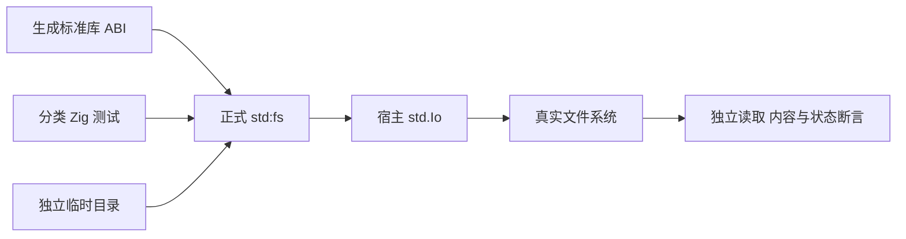

# 文件标准库边界验证计划

## Intent：最终目标

第 380 阶段把新 std:fs 的真实文件系统行为纳入 packages/test：验证内容、大小限制、UTF-8、目录和路径操作、元数据、符号链接及失败分配清理。先覆盖底层操作的可观察契约，再接续 RX 无 out 调用与 IO 传播的编译执行测试。

## Data：可用证据

std:fs 新增 readFile/readText/writeFile/writeText/truncate/mkdir/readdir/rmdir/unlink/rename/copyFile/realpath/readlink/stat/lstat。它通过生成的 zxc_abi 取得类型，以宿主 std.Io 操作真实文件系统。已有标准库资源测试使用 compiler.module("standard") 和 std.testing.allocator，可直接覆盖正式实现而不替换实现。

已核对 Zig 0.16 Dir.readFileAlloc：limit 为排他上限，达到即 StreamTooLong。因此实现的 max_bytes + 1 用于表达包含上限，需要以空文件、恰好上限与超过一字节验证，不能仅凭加一判定缺陷。

## Edges：边界与限制

每项测试使用独立 std.testing.tmpDir，路径由临时目录导出，不修改项目文件或切换进程 cwd。只读类 API 做分配失败枚举；修改类 API 检查错误前后真实文件状态，不假定整个多操作流程具有事务回滚。目录列表不依赖文件系统顺序，时间戳不使用时钟延迟或精确当前时间作预言。

当前功能仍为实现聊天的工作区改动。测试先验证工作区；提交前核对生产能力是否已提交，避免把依赖缺失 API 的测试单独推到远端。若发现确实缺陷，提供最小复现请求实现聊天修复。本阶段不修改生产实现、不声称验证 IO 编译参数链，也不声称根全量回归。

## Answer：交付格式与成功标准

- 在 tests/standard/resources/fs 下按读取、写入、目录、路径、元数据和资源失败分类；短公共夹具只管理独立临时目录与独立底层读写。
- 真实读写二进制、UTF-8 和零字节；验证读取包含上限、写入截断、truncate 缩小/扩展、exclusive copy 和顺序错误后的状态。
- 路径 NUL 与无效 UTF-8 必须先拒绝；双路径操作对每个路径都检查，不让无效目标改变有效源或目标。
- 目录枚举拥有名称内存；metadata/stat 与 lstat 跟随链接的区别、链接原文、canonical path 均用独立创建对象验证。
- 逐次分配失败覆盖 readFile/readText/readdir/stat/lstat/realpath/readlink 的成功与已分配后校验失败路径。
- 记录实际数量、命令、日志、基线及自我复核，满足依赖后按部分 commit/push。

## 自我复核

本文件为实施前计划。直接调用标准库不会证明 RX evaluate 语句执行顺序或 IO 参数传播，相关链路应单独用生成代码验证，不能用这里的通过代替。

## 第 380 阶段执行记录

已新增 49 项独立命名 Zig 测试：读取 9、写入 7、目录 6、路径 9、元数据 6、路径校验 4、分配失败 8。正式文件在 `packages/test/tests/standard/resources/fs/`，构建入口为 `test-standard-fs`，由既有 `test-standard-resources` 接入根 test。

已验证 15 个文件 API 的正常和错误边界。读取验证 256 种原始字节、空文件/零限额、包含上限与拒绝截断前缀、最大 u64 上限、UTF-8 BOM/嵌入 NUL/换行及非法 UTF-8。写入验证截断旧后缀、空内容、非法文本不创建或破坏目标；truncate 验证缩小、扩展补零和缺失错误。目录验证递归与非递归、名称内存独立、隐藏及 Unicode 文件名、不依赖顺序、非空拒绝与空目录删除。

路径操作验证 exclusive copy 保留目标、普通 copy 替换、rename 移动、缺失源不改变目标、unlink 只删链接、readlink 原文和悬空链接、realpath 跟随并归一化。15 个 API 均验证 NUL/非法 UTF-8 路径拒绝；copy/rename 另核对第二路径合法性先于变更。元数据核对文件字节长度与独立快照、目录、stat/lstat 的符号链接区别、受控 mtime/atime 的毫秒单位和 ctime 与独立文件系统观测一致。

逐次分配失败分别覆盖 readFile、readText、readdir、stat、lstat、realpath、readlink，以及 readText 读取后 UTF-8 校验失败的释放；没有把发生真实写入后的失败误解为全流程事务回滚。

验证经过：

- 首轮 39 项运行通过，分配失败测试编译发现测试自己的匿名结构体指针不能当作 ABI 结构体指针。改为上下文推导的 `&.{...}`，未改变生产实现，见 [首轮日志](文件标准库边界测试草稿/首轮结果.txt)。
- 修正后 `test-standard-fs`：18/18 步骤、47/47 项通过，见 [专项日志](文件标准库边界测试草稿/专项结果.txt)。
- 补齐空文本零限额与时间戳后，`zig build test-standard-resources --summary all`：**37/37 步骤、103/103 测试通过**，其中新文件测试 49、既有其他标准库资源测试 54，见 [资源聚合日志](文件标准库边界测试草稿/资源聚合结果.txt)。

生产实现已由实现聊天提交为 **81ccb7a7**，最终聚合验证后 compiler/core/genz 无生产工作区 diff。测试在原生 x86_64 macOS、Zig 0.16.0 执行；不把运行结果扩大到其他平台，也未执行根全量回归。本阶段未发现需要向实现聊天反馈的生产缺陷。

自我复核：所有文件均位于测试创建的临时目录。读写结果用独立底层文件 API 核对；目录名称不排序假设；时间戳由测试显式设置，不等待或比较当前墙上时间。测试直接调用正式标准库，只证明该层行为，RX evaluate 和宿主 IO 参数传播仍需下一阶段独立生成执行验证。
