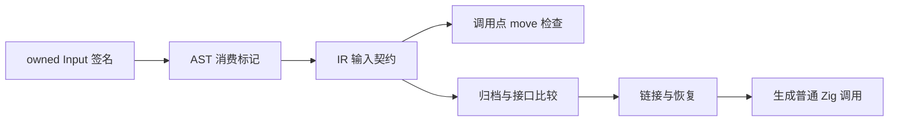
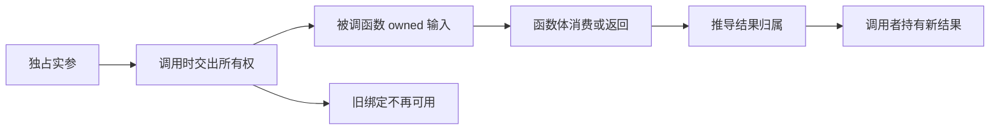

# 显式输入消费实施计划

## Intent：最终目标

允许独占状态通过普通 ZX 模块辅助函数转移，解除自举逻辑分模块后只能读取输入的限制。保持默认借用、无模块环、无回调捕获，不把状态更新塞回原生编译器。

## Data：可用证据

当前 ownership 检查无条件把函数输入设为 borrowed，call 始终 read 实参；reduce 独占累加器因此仍无法交给消费它的普通辅助函数。IR 已有返回归属摘要，但没有输入消费契约。Function 与 Program 在模块归档、链接、缓存恢复、RX 调用和库入口中多次互相重建，单改 checker 会丢失信息。

## Edges：边界与限制

- 新语法仅在默认函数参数位置识别 `in: owned Input`，不增加全局关键字。`in: Input` 保持借用。
- AST Program、IR Program/Function 和归档 Signature 增加 consumes_input 布尔标记；IR 升至 12，旧缓存不默认为新语义。
- 消费函数的引用输入以 owned 进入检查；每个调用点与返回值是否使用无关地 move 实参，引用值必须实际 owned。标量仍 copy。临时借用、借用输入、已移动值不能消费。
- 返回权限仍由函数体推导；consumes_input 不把 borrowed 输出升级为 owned。
- 本轮不改变聚合值整体移动粒度，不增加部分字段移动；调用者应先读取后续需要的标量，再转移聚合 owner。
- 原生外部函数继续只接受借用，结构验证与归档恢复拒绝外部 consumes_input=true。
- owned 不是分配来源证明，不能据此 free/realloc 任意输入 slice。
- 生成的 Zig 入口暴露 consumes_input 常量。宿主必须保证输入及可变子对象没有仍存活的别名；这是静态调用契约，不是 runtime 唯一性检测。
- 不新增测试、不执行全量测试、不使用浏览器。复用既有检查与真实多模块应用、库发布消费验证。

## Answer：交付与成功标准

实现语法、IR/归档、checker、RX/库传递、生成元数据与缓存身份。用真实模块展示 owned 状态经 helper 更新并继续消费，验证冷/热缓存及库发布消费。按 IDEA 记录执行证据、公开 reference 和自我复核后提交 push。

## 自我复核与实施记录

实施前已用只读分析核对转换点、接口比较及 native 拒绝边界。批量结构修改优先检查 grit，但当前安装版本的语言列表不支持 Zig；采用限定文件与精确匹配脚本，逐项复核 diff，不将 Zig 作为其他语言解析。

### 优先处理测试会话反馈：接收者参数求值

测试会话在既有 fixture `packages/test/tests/collections/reduce/fixtures/argument.zx` 发现 `items.push(items.length + step.value)[0]` 被错误拒绝。根因是 list_operation 在参数求值前就 move 接收者。对可以追溯到根绑定的 receiver 改为：先只读求值一次，确认根仍 owned，再建立临时 loan，顺序求值参数，确认接收者未逃逸或二次消费后最终 move。复杂新构造 receiver 保持原有一次求值路径；不重复求值、不恢复已经发生的消费。

同一接收者的标量读取和不逃逸的只读调用因此合法；参数消费接收者、把其引用返回为参数或发布到 Store 仍拒绝。动态索引的接收者求值完成后也重新核对根状态，不能借索引中的副作用绕过唯一性。本轮直接复用测试会话新增的 fixture 与既有运行目标，不自行新增测试。

### 最终证据与自我批判

- 最终编译器构建 14/14 步成功。
- 最终定向检查 `test-reduce-runtime test-ownership-contracts test-frontend -Dfrontend-filter=ownership/`：48/48 步、571/571 项通过，包括接收者参数反馈对应的 reduce-argument 13 项；当前 ownership contracts 已由测试会话扩展为 47 项。
- 既有 test-link-runtime、test-library-runtime 与 test-ownership-contracts 在输入消费实现后通过；没有执行全量测试，也没有修改或新增测试文件。
- 实际 ZX 模块调用、空归约、RX 顺序编排、发布 ZX 库、库再次发布后消费、Zig 宿主消费全部构建运行成功。运行输出与二进制摘要保存于运行结果.json。
- 模块冷缓存 analyzed=2、生成 generated=3；热缓存 analyzed=0/reused=2、生成 generated=0/reused=3。输入消费标记参与接口比较，入口生成指纹直接写入标记，函数名称身份也包含消费契约。
- 两轮只读复核检查了 Program/Function 转换点、native 禁止标记、临时借用、Parallel、RX 包装及库恢复。原生函数的 input 模式没有被隐式放宽。

自我批判：最初只检查了新增输入契约，没有从普通接收者参数顺序发现旧实现的过早 move，测试会话提供了可复现证据后优先修复。接收者预留目前限于可追溯至单一根绑定的 reference/field/tuple_field/index；复杂条件接收者保持原有保守路径。输入消费是整个 owner 的转移，尚非细分字段权限系统。跨 helper 的追加没有被局部 builder 优化，不能以该示例推导自举状态构建已达到目标性能。Zig 宿主元数据也不是唯一性证明，存储可写性与生命周期仍由宿主契约保证。
