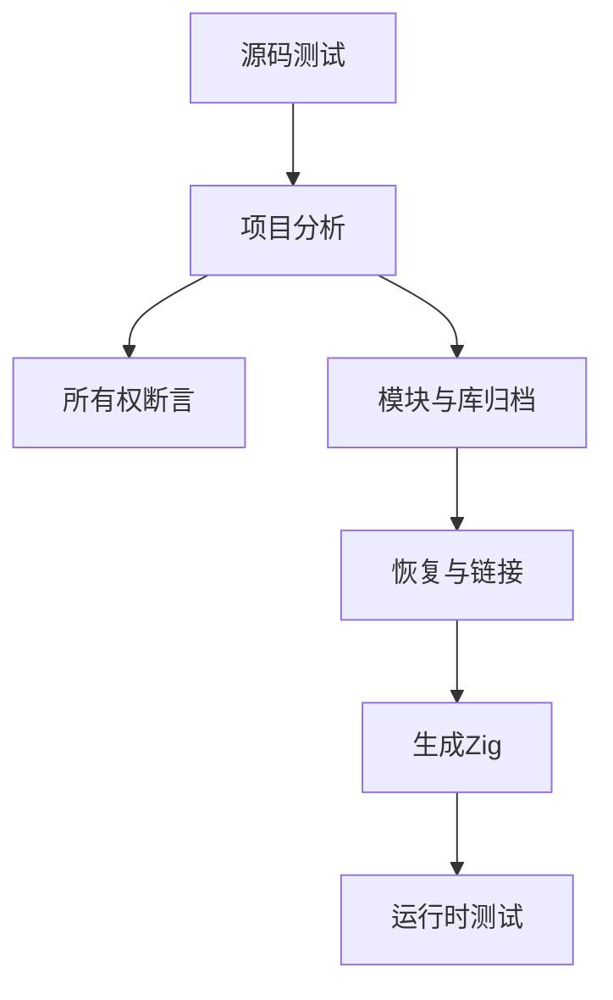
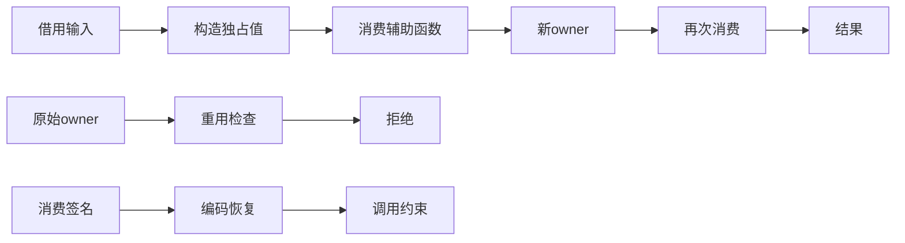

# 显式输入消费验证计划

## Intent：最终目标

第 386 部分：验证 b674fa5f 新增 owned Input 契约在源码调用、归档、链接与真实生成执行后保持一致，阻止借用值、已经转移的 owner 和伪造接口绕过消费约束。

## Data：可用证据

实现参考显式输入消费参考.md。默认输入借用，显式 owned 允许独占引用输入；标量仍可复制。消费标记进入 IR、artifact signature、library/module 恢复和 Zig 公开元数据。当前测试参考 ownership/reduce/check、library/imports/fixture 与 incremental/native_runtime/compile 的成熟入口。

## Edges：边界与限制

仅修改测试与文档；生产缺陷发送指定实现会话。聚合字段转移消费根 owner，不假设部分移动。外部原生接口仍借用。宿主对 owned 输入提供真实可写且唯一的存储，不能把 const 切片伪装成 owner。跨函数归约不声明局部追加容量优化。

## Answer：交付格式与成功标准

分层建立分析拒绝与合法场景、编译库编码/恢复/消费、真实 Zig 运行时输出与 OOM 检查；专用 test-owned-input 入口接入总测试。每类证据独立计数，在 Debug/ReleaseSafe 验证后提交并 push。

## 执行记录与自我复核

新增 test-owned-input，接入 packages/test/build.zig 总入口。正式代码按 analysis、library、modules 与 runtime 职责组织，源码与构建草稿保存在同名目录。

### 结果与计数

- 分析检查 22 项：独占输入与返回值、借用拒绝、旧绑定/分支消费、标量可复制、聚合字段归属、归约跨函数、owned 输入仍可返回借用值，以及成功/拒绝路径 OOM。
- 库检查 9 项：编码恢复后独占出口、合法/非法调用、独占包装器再发布、伪造借用标记拒绝，以及恢复与再发布的分配失败。
- 模块检查 6 项：owned/borrowed 两类模块缓存恢复，原始字节释放后的逆序重链接，两个方向的消费签名冲突拒绝，两个完整缓存链路 OOM。
- 运行时共 60 项组合：每条链路 10 项，覆盖源码、模块重链接、编译库消费、库再发布、独占输入追加和独占输入原地 reverse。包括入口 consumes_input 元数据、空输入、最大 u64、重复值/零、不同规模和两个底层分配失败遍历。
- 总计 97 项；Debug 与 ReleaseSafe 各 28/28 构建步骤、97/97 检查通过，不把两种模式累计成 194 项独立测试。
- 正式验证命令：在 packages/test 执行 zig build test-owned-input --summary all，及追加 -Doptimize=ReleaseSafe。

### 接入修正与真实缺陷区分

初次模块测试引用 artifact.Signature，但该类型没有公开导出；改为从公开字段推导 @TypeOf(module.functions[0])，没有改生产接口。首轮该入口编译失败，另两组 29 项通过；日志保留为契约与归档检查.txt。随后完整 85 项通过，增加借用输出边界后 87 项通过，自审后补充真实原地修改输入入口，最终 97 项通过。

未发现新的生产缺陷，因此未向实现会话发送消息。

### 自我复核与边界

输入消费和输出归属是两个独立契约。测试同时证明 owned Input 可以返回 borrowed 输出，不能凭输入标记直接推断输出可继续消费。宿主的独占输入来自 arena 内新分配的可写存储，执行后不再读取旧输入；借用入口则在成功和执行错误后检查输入保持。运行时预期由宿主独立构造，不读取生成器内部变量或用生成代码本身计算期望。

原地 reverse 入口补上了仅测试追加时遗漏的真实写操作。OOM 验证 arena 生命周期，不承诺所有消费操作在失败后恢复原输入；独占输入已经转移，宿主不能重用它。

本部分尚未覆盖 RX/Store/Parallel 与 owned Input 的交互，也未验证所有持久缓存上下文失效组合和外部原生接口伪造。下一部分继续这些边界，再回到 Test262 待办。整体生产级语言及 Test262 对齐目标仍未完成。

首轮核对 HEAD 为 2a0fcc2c，已包含生产实现 b674fa5f。运行期间实现会话正在修改标准库 modules.json/root.zig 及 compiler README；生成执行记录时，对方已将其提交为 1f9a8c35，生产工作区差异为空。本部分没有改动这些文件，因此不把记录生成时的干净状态倒推为整个测试期间固定提交验证。执行结果.json 区分记录时 HEAD、记录时工作区状态和执行期间观测到的改动，并保留相关源码指纹。
