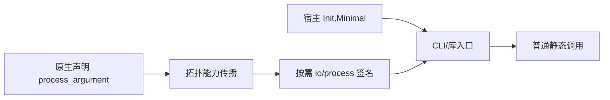
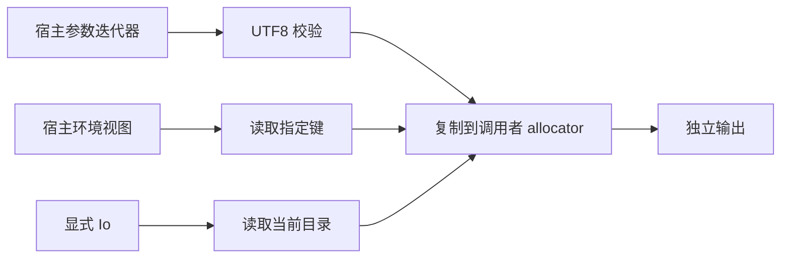

# 显式进程上下文实施计划

## Intent：最终目标

为自举 CLI 提供真实命令行参数、指定环境变量和工作目录读取。所有进程上下文由宿主显式提供，调用图静态决定签名，不在标准库隐藏初始化进程或 I/O 实例。

## Data：可用证据

Node.js 的 [argv](https://nodejs.org/api/process.html#processargv)、[env](https://nodejs.org/api/process.html#processenv) 与 [cwd](https://nodejs.org/api/process.html#processcwd) 是功能参考。当前 Zig 0.16 提供 std.process.Init.Minimal（Args 与 Environ）和显式 Io 的 currentPath。现有原生声明支持 allocator/io 注入，genz/io.zig 已按拓扑顺序传播能力；CLI 及 Store Request 仅在实际需要时追加 io。

本轮源码核对基线为 26031df0，此前 owned Input 和同步子进程已经完成，不重复实现。其他测试会话已补充相应运行边界与基线说明。

## Edges：边界与限制

- 原生声明允许固定顺序 allocator、io、process 注入，可省略；process 对应 std.process.Init.Minimal。带类型的业务参数 process:string 仍按业务参数解析。
- External 与外部 Implementation 增加 process_argument；IR 升至 13。链接比较、清单解析、缓存身份和发布/消费保持字段完整。
- 生成函数参数顺序为 allocator/arena、业务输入、可选 Store context、可选 io、可选 process；纯函数及仅 IO 函数保持既有签名。
- 提取小型 capabilities 模块复用现有拓扑布尔传播，不复制第二套图遍历；已有 genz.io.functions/uses 公共入口保留。
- CLI 用 init.minimal 注入；Input=void 且需要 process 的应用可以接收任意原始参数。非 void 输入继续恰有一个 JSON 参数，普通纯 void 入口继续拒绝额外参数。
- 标准库新增 std:process.argv、getEnv、cwd。argv 返回真实宿主 argv（含第零项），不模拟 Node 的解释器/脚本前缀。getEnv 缺失返回 null；不修改环境。cwd 仅需要 Io，不因模块中其他函数而增加 process 参数。
- argv 用 iterateAllocator，逐项验证 UTF-8 并复制，迭代器 deinit 后结果仍有效；所有失败路径释放已复制项。getEnv 输出复制并验证 UTF-8；键禁止空、NUL 与等号。cwd 用 currentPath 和精确长度复制，避免把含 sentinel 的 allocation 冒充普通字符串 allocation。
- Minimal.environ 是宿主提供的环境视图。Windows 的 GlobalBlock 显式选择 global 或 empty，并非跨平台冻结环境快照；不声称可以通过该类型在所有平台注入任意独立环境 Map。
- 不新增测试、不执行全量测试、不使用浏览器。复用已有原生、IO、库与 Store 检查，实际运行 CLI、库和宿主消费；不读取或打印无关环境变量。

## Answer：交付与成功标准

实现声明与清单字段、IR 版本、能力传播、原生适配、生成入口、CLI 与 Store Request 转发、标准库及使用文档。验证 process-only、io-only、两者同时需要、纯入口四种签名，验证原始 argv 与显式选定环境变量，验证冷/热缓存、应用/库/宿主和 State 请求。代码草稿与资源存入本功能目录，完成后提交 push。

## 自我复核

声明、IR、清单解码和 genz 函数能力传播已实施，zig fmt 与 git diff --check 通过；Store Request、CLI、缓存身份及标准库已接入。编译器 zig build 与 zig build dist 通过；组合能力应用已实际运行，保留 alpha、two words 两项原始参数，指定环境键返回中文 value，cwd 返回仓库目录。首次应用构建暴露 currentPath 返回长度问题，已按 buffer[0..length] 修正。四种能力组合均构建并运行成功；组合应用热缓存 generated=0/reused=5。发布库经 ZX 和 Zig 宿主实际运行成功。State 请求区分空值、缺失与正常环境值。未验证其他平台实际运行。必须避免把静态原生声明能力扩大为隐式全局上下文，也不能让所有调用者为未使用能力支付参数传递。Store 初始化仍维持既有纯初始化要求，不因 process 能力而放宽。最关键的实际验证是 process-only 和 io-only 不互相污染，以及中间模块和缓存恢复不丢失 capability 标记。

## 执行结果与自我复核

应用、库消费、Zig 宿主和 State 请求在当前平台构建运行成功。环境缺失返回 null，空值返回空字符串。未运行全量测试；示例供复现，生成发布目录和二进制不纳入源码提交。本轮结果不能证明全部平台运行或整体自举完成。
