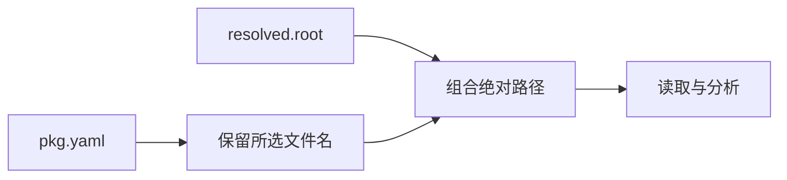

# 显式项目清单路径修复

## Intent：最终目标

修复项目目录中 --project pkg.yaml 触发的可复现崩溃，让显式相对清单与自动发现使用一致的项目根语义。

## Data：可用证据

独立测试会话的阶段 402 回归在 semantic_lint/project_test.ts 复现 Debug SIGABRT。cli/project.zig 对 dirname(path) 解包空值；更深层原因是 package/project.zig 把仅含相对路径的 std.fs.path.resolve 结果当作绝对清单返回。Zig 的 resolve 不自动引入 cwd，因此 pkg.yaml 仍没有目录部分。

## Edges：边界与限制

在包项目加载器修复返回值契约，复用已校验图中的物理工作区根，并保留所选清单文件名。不用 dirname orelse 当前目录掩盖错误，不改格式或语义规则。保持已有成员包清单选取方式，不修改测试会话文件及其报告的无关 TypeScript 问题。只运行反馈指向的定向回归，不跑全量测试。

## Answer：修复与成功标准

根包 manifest_path 由 resolved.root 与所选清单 basename 组合，确保有绝对父目录并与包作用域根一致。正式回归 test-semantic-lint 应通过，显式相对路径不得再崩溃；补充直接构建观测确认公共项目加载入口受益。

## 定向验证

按反馈执行 packages/test 的 `zig build test-semantic-lint --summary all`，11/11 构建步骤通过，Node 回归为项目检查 13 项及参数检查 5 项，共 18 项通过。覆盖 pkg.yaml、./pkg.yaml、nested/../pkg.yaml 与绝对路径，原显式清单崩溃不再出现。回归源码由独立测试会话维护，本次没有新增或修改测试文件。

日志见 [定向回归](显式项目清单路径修复/定向回归结果.txt)。修复只有共享项目加载器的一处路径构造变化；不将无关 TypeScript 检查错误归因于本次改动或顺手修改。

必要编译器构建 14/14 步成功。在项目语义检查/示例目录内，以 `zxc build main.zx --project pkg.yaml --out /tmp/zxc_explicit_project` 实际构建成功，程序输入 7 返回 8。没有将完整目标标记为完成；标准库 URL 等后续工作仍待继续。

## 自我批判

本次修复的是清单路径返回值契约，不能泛化成所有路径、链接和权限边界均获证。保留原始清单文件名以及包图的物理根，比在下游给空 dirname 填入当前目录更符合既有包归属语义。定向回归已有证据，不另外增加重复测试代码。
