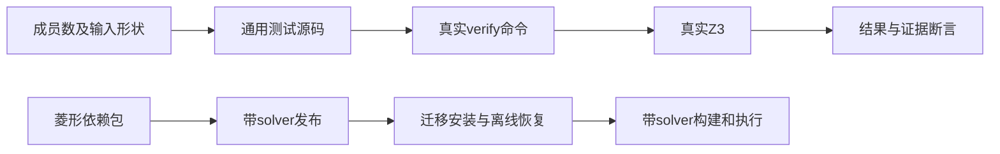
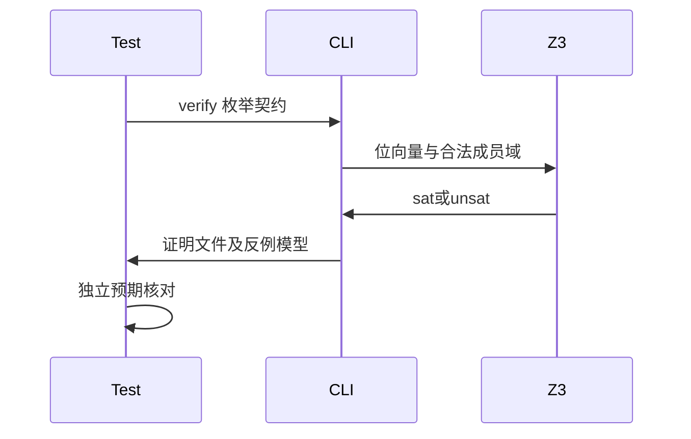

# 枚举有限域证明与跨库验证

## Intent：最终目标

阶段三百六十一：为a42806c8的有限枚举证明补齐边界、真实反例和不可满足前提测试，并验证菱形包闭包在发布、移除源码、安装及离线恢复后继续接受真实求解器检查。

## Data：可用证据

生产新增enumWidth、枚举输入域约束、常量与相等比较、符号图位宽。现有三成员闭包只验证执行，驱动尚未显式要求solver；实现记录明确没有单成员、2幂边界和枚举反例专项。旧verification驱动的浮点不支持诊断需同步新增enum后的措辞。

## Edges：边界与限制

只改测试与文档，不修改并行生产实现。选择1、2、3、4、5、8、9成员，覆盖非零最小位宽与多组2幂边界；形状为标量、对象和元组。真实Z3，不能以伪造solver或仅SMT字符串替代结果。不能以本轮有限样本声称任意枚举大小或Test262全量已完成。

## Answer：交付与成功标准

每个形状与成员数覆盖合法域穷尽、排除最后成员的错误契约；标量和对象覆盖排除全体成员的不可满足前提，多成员另测轮换不动点不存在。断言solver结果、前提可满足性、反例模型、源证据和SMT输入域。接入test-verification，跑已有验证与库发布回归，通过后提交push。

## 自我复核

单成员必须保留一位且排除编码1；非2幂必须排除额外编码。反例专门迫使求解器选择最后一个成员，防止输入域误截断。不可满足前提不能以真空证明报告成功。轮换用不等式契约核验，不复制生产算法做预期。

## 驱动修正与语言边界

初轮把对象的枚举输入假设为input_0；实际对象字段规范化后布尔字段在前。改为从SMT中查找唯一枚举位向量的声明并使用对应符号，继续检查准确位宽及域上界。不能将符号编号错误当成生产缺陷。

元组使用解构语法；数组下标不能用于元组。契约分析明确禁止函数调用，不能借用导入函数在requires或ensures中提取元组元素。最终元组场景在函数体中解构并计算域穷尽、轮换无不动点，再以ensures(out)验证；错误契约直接约束枚举输出。元组没有声称覆盖基于成员排除的requires，标量与对象完整覆盖该类不可满足前提。

最终74个枚举场景：39个正确性质、21个最后成员反例、14个不可满足前提。反例模型解码为整数，断言恰为成员数减1，不能只检查模型文件存在。每项核验真实Z3版本、源文件证据和前提/证明结果。

## 实测结果

| 验证                             | 结果                                       |
| -------------------------------- | ------------------------------------------ |
| 最终test-verification            | 14/14构建步骤成功，退出码0                 |
| 新枚举专项                       | 74/74场景成功，真实Z3                      |
| 原验证驱动                       | 20个场景通过                               |
| 公开入口验证                     | 8个场景通过                                |
| 初轮test-library-publish独立分支 | success，12项Node测试通过（包含1项父测试） |
| @zxc/test typecheck              | 退出码0                                    |

初轮联合命令因新增驱动错误退出1，不能把整条命令报告为通过。库发布分支独立完成并成功；只修改枚举驱动后，重新执行test-verification获得最终14/14结果。库发布驱动没有后续变更，不重复其耗时执行。

菱形闭包现在显式传入真实solver，发布一次、源码删除后安装并构建、移除在线registry及解包缓存后离线安装并再构建；保留6次三成员应用执行和独立Zig消费者。没有通过删除solver参数规避枚举支持。

测试基线e48f1bda，生产工作区存在实现聊天并行改动；本轮未改生产，不将局部测试通过扩展为全部工作区验证。没有确认新生产缺陷，未发送问题消息。未执行根目录全量回归；新增场景为Node枚举验证，不增加JSONL目录用例数量，也不将其称为新增Test262用例。

测试副本与机器可读结果保存于枚举有限域测试草稿目录，原始日志本地忽略。文档按IDEA给出目标、证据、边界和交付标准；完整Test262与ZX全部特性目标仍未完成。
