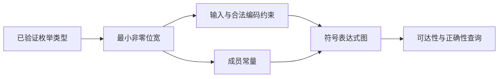
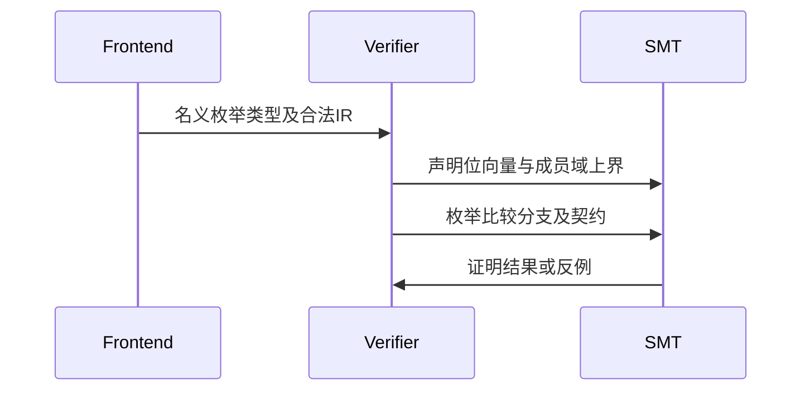

# 枚举有限域证明

## Intent：最终目标

让形式化证明支持语言已有枚举的输入、常量、比较与分支，保持显式solver和契约验证，不因库发布需要跳过证明。

## Data：可用证据

统一库菱形依赖专项使用三成员枚举，发布时显式要求真实Z3。现有证明器parameter、graph.value、enum_value与相等比较均未接入枚举，导致在发布前拒绝。IR已验证枚举成员索引与名义类型一致性。

## Edges：边界与限制

枚举使用足够编码所有成员的最小非零位宽；输入必须限制在0到成员数减1，避免把无效编码纳入语言值域。不得把枚举当作可参与任意整数算术的类型。不扩展字符串、Store或外部调用的证明语义，不修改测试。

## Answer：实施与成功标准

统一位宽计算，参数声明同时写入有限域约束，常量使用成员索引，相等比较与图节点保持枚举位宽。用真实Z3验证既有包发布专项，以及有限域有效契约和反例拒绝。

## 自我复核

非2幂成员数必须有域约束；单成员枚举不能使用零位宽；枚举名义身份仍由前端保证，不能因编码相同合并不同类型。正例通过不足以证明反例会被拒绝，需保留真实求解器反例验证。

## 验证结果

使用真实Z3运行已有`test-library-publish`专项，扩展后的12/12构建步骤通过，Node共7项通过。枚举菱形闭包完成统一发布、单独归档安装、删除原源码后的ZX/Zig消费及离线恢复；既有纯类型与错误契约拒绝等专项仍通过。最终根构建14/14通过。

直接对既有leaf/main.zx执行verify并保存[实际SMT查询](枚举证明/枚举轮换.smt2)。输入声明为2位向量，带有`(assert (bvule input_0 (_ bv2 2)))`，成员常量与分支同样为2位。这核验了三成员枚举的有限域约束，不是通过关闭solver让发布通过。

未新增测试用例，未运行全量测试。本轮错误契约拒绝由已有整数契约用例覆盖；没有单独新增单成员、2幂成员数或枚举反例测试，不能把专项成功声称为所有枚举形状的穷尽证明。位宽实现使用成员数通用计算，未针对三成员用例硬编码。
