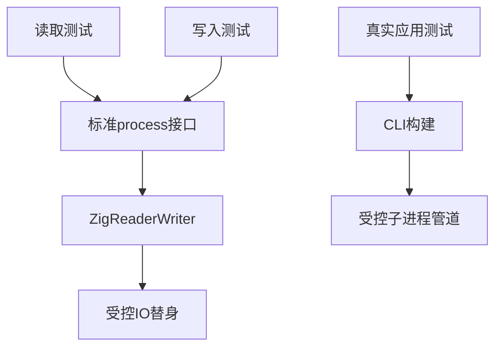
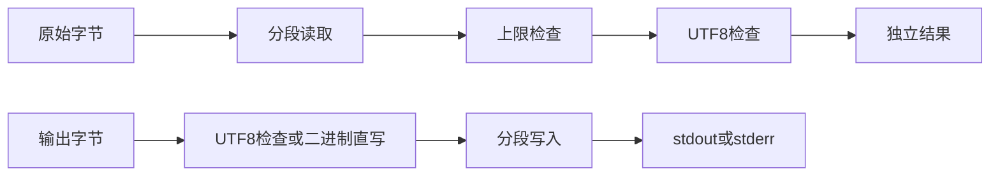

# 标准流边界验证计划

## Intent：最终目标

第 391 部分，验证 std:process 的六个标准流接口：二进制与文本读取、stdout/stderr 二进制与文本写入。验证边界由输入字节数和 UTF-8 规则推导，不能只根据实现中的缓冲区大小决定预期。

## Data：可用证据

当前实现位于 packages/compiler/standard/src/process_stdio.zig，契约见标准输入输出参考：读至 EOF，超过 max_bytes 报错，文本拒绝无效 UTF-8，写入不自动换行且每次刷新，不关闭句柄。成熟测试组织参考 resources/process 的 IO 替身和分配失败检查。

## Edges：边界与限制

IO 替身只接收标准句柄，并控制每次读写数量、EOF、错误及取消。不得读取用户终端 stdin。真实应用测试通过受控子进程管道完成，不访问网络、不浏览器确认。生产缺陷发给指定实现会话，测试不改实现。IO 替身结果不能代替所有平台 OS 行为证明。

## Answer：交付格式与成功标准

新增独立 test-process-stdio 入口，按读取、写入、真实应用分文件组织。两种优化模式验证空流、零限制、恰好/超过限制、跨缓冲、UTF-8、多次操作、部分写、失败后恢复及所有分配失败。记录真实结果、自审、源码草稿后提交 push。

## 执行结论

按计划完成 49 项直接接口检查与 50 项真实应用场景。Debug、ReleaseSafe 均通过，未发现生产缺陷。详细边界、自我批判和夹具修正见标准流边界验证记录。
