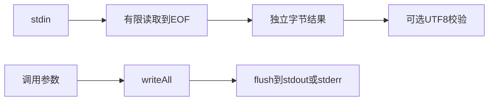

# 标准输入输出实施计划

## Intent：最终目标

使 ZX/RX 与发布库能够读取 stdin、向 stdout/stderr 写出原始字节或 UTF-8 文本，为自举 CLI 输入和诊断补齐基础能力。

## Data：可用证据

Node.js process.stdin/stdout/stderr 是功能参考：https://nodejs.org/api/process.html#processstdout 。当前原生 io 参数可沿调用图静态传播，文件标准库已有字节与 UTF-8 双接口。Zig File.readerStreaming 与 Reader.allocRemaining 提供管道读取和显式字节上限；File.Writer 提供 writeAll/flush。

## Edges：边界与限制

- std:process 新增 readStdin(max_bytes)、readStdinText(max_bytes)、writeStdout(data)、writeStdoutText(text)、writeStderr(data)、writeStderrText(text)。读取注入 allocator/io，写入仅 io，不要求进程参数视图。
- 读取直到 EOF；必须提供字节上限，超过返回错误；这不是交互式逐行读取或事件流。
- 标准句柄由宿主进程提供，不关闭句柄。每次写入完成后 flush，不自动添加换行，不保证并发写入原子性；写失败可能已部分输出。
- 文本入口严格 UTF-8，字节入口保持原始数据。
- 不引入全局 Reader/Writer 状态、线程或事件运行库；函数是普通同步调用。
- 现有生成 CLI 在业务调用后仍序列化 Output（void 为 null）。写 stdout 时须由调用者考虑这一协议；需要完全控制 stdout 的程序可从 Zig 宿主消费库。独立 CLI 输出协议另行明确，不能按是否使用某 API 隐式切换。
- 不新增测试、不运行全量测试；使用实际管道应用与库宿主检验。不能通过固定输入或输出特判实现。

## Answer：交付与成功标准

正式原生实现、声明、草稿、参考说明及实际运行记录。验证大小上限、UTF-8 与字节差异、stdout/stderr 分离，完成后单独提交 push。

## 自我复核

读取大小上限不能替代 EOF，持续打开的管道仍会等待。源码接口可用不代表完整 Node Stream API 已实现。CLI JSON 输出协议必须明确记录，避免把额外的 null 误当作 stdio 实现附加内容。

源码核对补充：两个生成 CLI runner 的最终 JSON 输出同样需使用 initStreaming，以免重定向到普通文件时覆盖业务函数已写内容。这属于同一 stdout 位置契约修复，序列化协议不变。

## 实际验证

- 编译器 dist 构建通过。
- text/bytes 应用构建通过；六项真实管道输入结果保存在 标准输入输出/读取结果.json。恰好上限与空输入通过，超限与无效文本按契约拒绝，字节接口保留 0xff。
- write.rx 静态编排两个 stdout 调用与一个 stderr 调用，真实文件重定向得到 stdout abcabcnull 换行、stderr abc；证明业务顺序保留且 runner JSON 不覆盖。
- ZX 不支持普通 void 调用语句或绑定 void 值，示例按既有 RX 编排契约实现；未放宽语言规则。
- 底层 Reader.appendRemaining 达到 limit 即失败，读取采用 max_bytes +| 1 探测 EOF，与文件标准库一致。

- 发布库的 Zig 宿主构建运行成功：stdout 为 hosthost，stderr 为 host，无附加 JSON。未新增测试，未执行全量测试，跨平台运行未验证。
