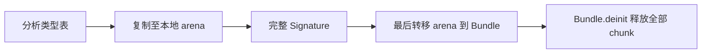
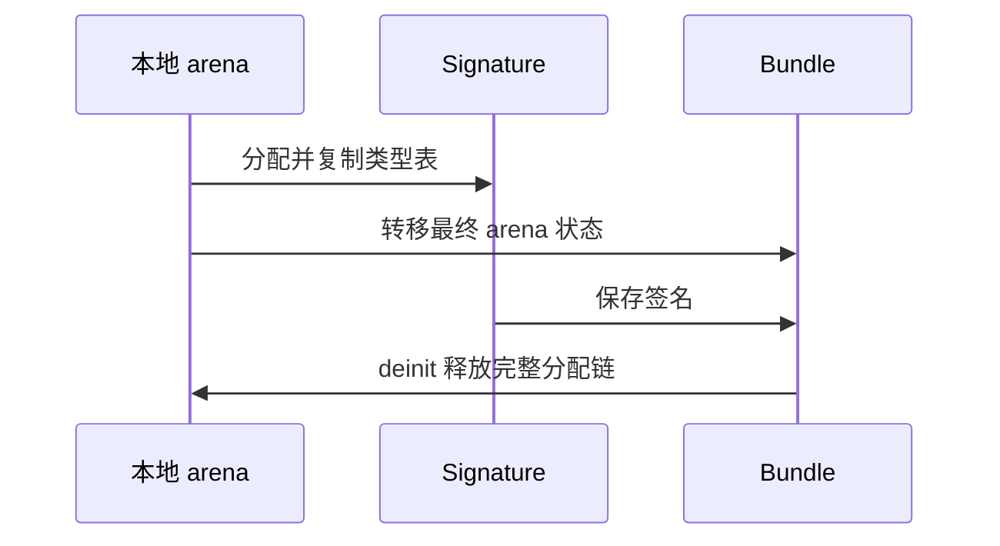

# 模块签名 Arena 归属修复

## Intent：最终目标

修复测试会话报告的模块生成 Bundle 类型签名泄漏，保持类型表独立于 analysis/cache 的所有权。

## Data：可用证据

`test-module-generation` 的 cache hit bundle 与 helper body edit 两个现有检查分别报告约 31 KB 的单块泄漏。分配栈指向 compiler/backends/zig/modules.zig 的类型签名复制，记录位于 `确定性故障注入/静态入口Debug.log`。

返回结构初始化先按值复制 `.arena = arena`，随后 `.signature.types` 调用 type_table.copy。复制类型表可能扩展 arena 的链表头；返回 Bundle 保存的是扩展前的 arena 状态，新增 chunk 不在其释放范围内。这是生产所有权问题，与故障注入次数确定性无关。

## Edges：边界与限制

不删减类型签名、不借用 analysis 内存、不修改测试断言或分配器。只调整生产构造顺序，让所有分配在转移 arena 前完成。失败路径继续由原 errdefer 释放完整 arena。

## Answer：实现与成功标准

先以局部 Signature 完成类型表复制，再返回 Bundle。成功标准是现有模块生成专项通过，既有独立生命周期契约维持不变，没有泄漏报告。只运行该专项，不新增测试、不执行全量回归。

## 自我复核

修复后在 packages/test 执行 `zig build test-module-generation -j4 --summary all`，8/8 构建步骤、9/9 测试通过，未报告泄漏。包含反馈中的 cache hit bundle 和 helper body edit 两个现有测试，未修改测试实现。

之前只验证类型定义与普通模块调用，未发现 arena 按值复制后的分配边界。类型表必须保留独立副本，但副本的分配必须先于 owner 的最终转移；本次用构造顺序修复根因。
