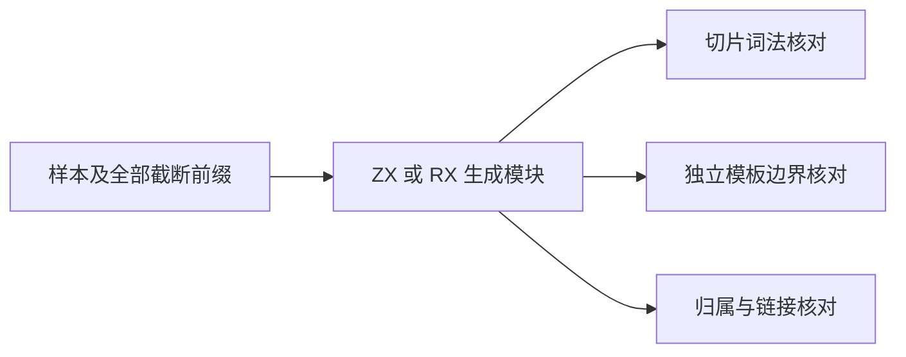
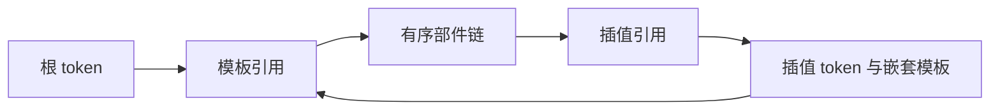

# 模板预处理语义回归

## Intent

验证模板预处理输出的部件顺序、全局字节跨度、插值归属与 token 引用，并检查切片词法结果转换回全局位置时的数据一致性。

## Data

prepare.zx 已输出完整平坦模板数据；frontend/template.zig 仍提供独立的 end/interpolationEnd 边界算法。正式 lexer 已使用 ZX 生成扫描器，因此它与 prepare 内扫描器的交叉检查只能证明适配、切片与位置转换一致性，不能宣称扫描算法独立。

## Edges

对根词法成功的输入验证全部结构：每个模板、部件、插值恰好归属一次，链无环且可遍历，Text/Expression 交替并覆盖完整模板内容，模板及插值边界与原生算法一致。根词法失败的前缀变异只核对诊断，不据此声称验证了部分模板结构。

保留原始空 Text 部件与原始转义字节，不进行求值或解码。所有源码通过真实静态生成入口执行。测试代码及数据放在 packages/test，生产源码不修改。

## Answer

在现有模板构建入口增加语义子目标及聚合目标，两个入口复用一次生成。样本覆盖空文本、相邻插值、转义、嵌套模板、引号/注释内伪分隔符、CRLF、多个顶层模板及非法插值字节；对样本逐字节截断检查失败边界。执行 Debug/ReleaseSafe 并记录限定范围后提交。

## 结果与自我复核

最终输入为 19 个完整样本和 271 次逐字节截断，每条入口 290 次检查，两条入口合计 580 次；前缀之间允许重复，不把它们称为 580 份唯一用例。新增两个测试声明，在 ZX/RX 各执行一次。

`zig build test-template-preparation -j2 --summary all` 的最终 Debug 结果退出 0，25/25 构建步骤成功，新语义测试 4/4 实际执行通过，既有资源测试八项使用缓存。增加 `-Doptimize=ReleaseSafe` 后退出 0，25/25 步、12/12 测试全部实际执行通过。

结构检查独立验证所有部件链与唯一归属，原生 end/interpolationEnd 验证边界。词法比较验证种类、全局 span、注释、诊断和相邻 token 之间的 line_break，dollar 标志根据真实首字节推导；word/symbol 分类继续由既有扫描器元数据测试覆盖，不宣称此处独立证明。成功诊断字段必须为空且跨度为零。

包含空 Text、空插值、插值中的非法数字和非法字节、注释与引号中的伪闭合符、多模板，以及中文多字节文本；后者逐字节截断而非按字符截断。根扫描失败时只核对诊断，未对生产允许保留的部分模板数据强加未定义要求。

格式化仅调整空行，已比较格式化前后移除空行后的逐行内容相同，JSON 保存两组指纹及日志摘要。没有发现生产缺陷，未发送实现会话消息；没有修改生产源码，没有增加 Test262 审阅数。全量固定检出回归仍是独立验证，不能用此处结果代表整个编译器完成对齐。
