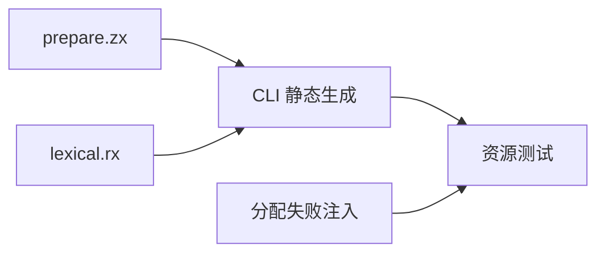
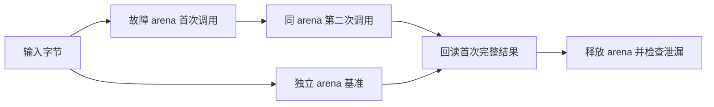

# 模板预处理资源回归

## Intent

为正式模板预处理模块补充可持续运行的分配失败清理与结果生命周期测试，确保嵌套模板及插值数据不会因同 arena 后续调用而失效。

## Data

生产 prepare.zx 输出根词法结果、token 到模板映射、模板、部件和插值数组；lexical.rx 是统一模块的编排入口。当前已有文档差分验证，但 packages/test/bootstrap 仅注册类型解析器资源测试。

## Edges

测试只添加在 packages/test，生产逻辑不修改。RX 与 ZX 两种编排路径都静态生成普通 Zig，使用真实 prepare/lexical 源码。资源测试比较独立 arena 的基准结果及同 arena 再次调用后的完整结果，并对每个底层分配点注入失败；不以自比较宣称模板语义完整对齐。基准同时断言已知模板/部件/插值数量或明确的错误消息。

## Answer

注册 test-template-preparation-resources 并接入全量测试，覆盖无模板、嵌套模板、增长中的兄弟插值、未闭合插值注释四种输入。复用已有故障 allocator，Debug/ReleaseSafe 运行后记录真实结果，发现实现问题发给实现会话。

将现有类型解析构建中的源码依赖收集函数移入独立 build/source_inputs.zig，供两个生成入口共用，维持原目录与文件依赖追踪行为。

## 结果与自我复核

Debug 执行 `zig build test-template-preparation-resources test-type-parser -j2 --summary all`，退出 0，36/36 步、24/24 测试全部执行通过：模板资源八项以及既有类型解析十六项。ReleaseSafe 执行 `zig build test-template-preparation-resources -Doptimize=ReleaseSafe -j2 --summary all`，退出 0，19/19 步、8/8 测试全部通过。

每条生成路径包含四项测试。无模板样本断言模板、部件、插值均为零；嵌套样本断言 2/8/3；40 个兄弟插值断言 1/81/40；错误样本先完成一个模板，再遇到未闭合插值注释，明确断言 unterminated comment in template。每种样本都在同 arena 再执行 next 模板后回读首次完整结果；标准故障注入配合禁用 resize/remap 的已有分配器验证所有实际分配失败点及释放。

源码依赖收集函数与搬移前逐字比较，仅函数名由私有 trackSources 改为公开 add，函数体不变。初次 Debug 的测试源码误用了当前 Zig 不接受的 ** 数组重复语法，随后改成显式缓冲区填充；这是测试构造错误，不是生产缺陷，失败日志仍保留。

基准完整结果来自独立 arena 的同一实现，因此证明资源清理及跨调用保留，不证明模板词法的全部语义。手工数量和错误消息仅提供必要的非空路径校验；已有差分验证仍负责语义。没有新增专用运行库，没有修改生产实现或向实现会话报告未发生的缺陷；Test262 审阅计数不变。固定检出全量 ReleaseSafe 回归尚在运行，其旧快照不包含本轮新测试。
