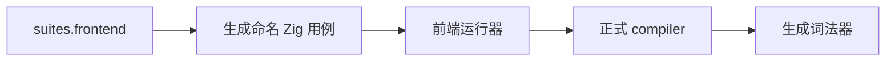
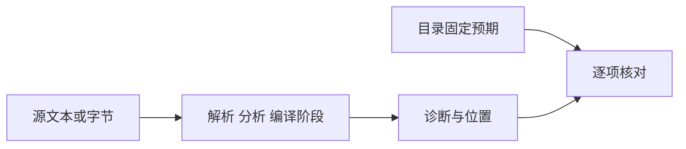

# 正式前端目录回归

## Intent

在新 ZX 词法器正式接入后，执行测试包完整前端目录，确认已有成功/拒绝、诊断阶段与字节位置不回退。

## Data

生产词法迁移 f1a9e65e，测试修正 1b4d078c。正式词法入口 11206 组差分零差异，compiler 自身前端 309 项已在 Debug/ReleaseSafe 通过；这些不能替代测试包完整前端目录。

## Edges

从 packages/test 执行 test-frontend，不传 frontend-filter。该目标只覆盖 suites.frontend，不包括其他运行/宿主目录。旧全量 ReleaseSafe 进程仍然存活，不启动第二个全量进程。共享工作区后续修改必须记录，不以启动时 HEAD 代替最终来源证据。

## Answer

记录命令、退出码、汇总、注册目录与源码指纹。失败时核对原始预期、固定上游来源和新实现；不通过修改预期隐藏真实回归。Debug 与 ReleaseSafe 分别执行。

## Debug 结果与覆盖范围

完整注册目录含 5305 个命名用例：1511 项 parse、3790 项 analyze、2 项 compile，以及 2 项 Unicode 注释穷举驱动。后两项各遍历 0..65535 范围，按既有规则核对非法 UTF-8、注释终止与忽略行为；不将其内部枚举次数额外计为新的目录用例。

Debug 正常退出，8/8 步骤成功、5305/5305 测试通过。注册列表与每份目录 JSONL 的 SHA-256 保存于启动记录.json。没有修改已有预期，也没有新增适配或本地用例。

## 自我复核

这次验证确认正式生成词法入口能够承接已有前端目录，不意味着所有语言或全部 Test262 已对齐。运行目标未覆盖 runtime、标准库、NAPI、WASM 或宿主集成；这些仍由各自门禁及正在运行的全量回归负责。目录计数不能替代执行证据，本记录仅对实际执行的 test-frontend 给出结论。

## 最终结果

ReleaseSafe 正常退出：8/8 构建步骤成功、5305/5305 测试通过。结束时 HEAD 与启动时同为 1b4d078c，compiler/core/genz/test 没有已跟踪源码差异，目录文件散列复核一致。未发现生产缺陷，未向实现会话发送消息。日志散列与两种模式汇总已保存在启动记录.json。
