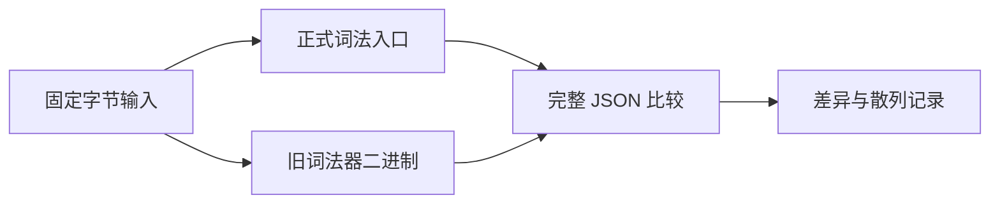

# 正式词法入口差分

## Intent

验证生成词法器接入正式 frontend 后，Zig 适配层的 token、comment、diagnostic 及位置与迁移前词法器保持一致。

## Data

此前词法草稿差分已保存 11206 组原始字节输入及旧 reference 二进制散列。新 compiler 构建以 bootstrap seed 生成 lexer，并将其注入 frontend 的 lexer 模块。

## Edges

直接使用 compiler dependency 正式 frontend 的 lexer import，不自行编译替代词法器。旧 reference 二进制必须匹配既有记录的 SHA-256。输入逐项核对既有哈希，不更改旧资源；新输出另存。有限差分不证明全部输入等价，不增加 Test262 适配或目录计数。

## Answer

新观测器输出正式 lex API 的完整 JSON，逐项与旧 reference 比较。记录二进制、生产源码、输入清单指纹及失败明细。构建或执行失败不能记为相等。

## 前端专项发现与修正计划

首次 compiler test-frontend 执行 306/308 通过，两个失败均有明确测试侧依据：

- consumption_test 仍要求移动 object.values 后读取独立标量 object.count 被拒绝，与已实现并记录的逐字段所有权契约冲突。修正兄弟字段可读预期，新增继续读取 moved 字段和复制不完整父对象的拒绝对照，避免只放宽旧断言。
- project_test 直接使用 std.testing.checkAllAllocationFailures，允许 backing resize/remap，出现 NondeterministicMemoryUsage。采用测试包已验证的相同最小适配器禁用 resize/remap，保留原项目及逐分配点失败与清理检查，不捕获或忽略 OOM。

改动仅限 compiler/tests。另发现正式 IR契约.md 仍保留整根消费描述，已通知实现会话同步正式契约；未将上述两项归因为新词法器语义回归。

## 已完成验证

正式入口差分首轮 11206/11206 完整 JSON 一致，零执行失败，耗时 76.12 秒，运行期间记录的词法源码无变化。前端陈旧测试修正后，compiler test-frontend 为 7/7 步骤成功、309/309 测试通过。

验证脚本增加自动构建及构建前后源码指纹检查，避免后续复现忘记重建而读取旧二进制；旧 reference 二进制继续严格验证此前保存的 SHA-256。该旧二进制是当前工作区保留的本地证据，未作为源码提交，不宣称脚本无需此前资源即可在新机器上运行。

前端 ReleaseSafe 专项同样正常退出：7/7 步骤成功、309/309 测试通过。实现会话已在工作区将正式 IR 契约改为静态字段路径消费，独立兄弟字段保留，不完整父对象不能整体重用；本次没有代为修改生产契约文件。

## 自我复核

差分只覆盖固定有限输入，不证明词法器全域等价。记录的是正式适配层经生成词法器返回的完整数据，包含错误诊断，不把子进程失败视为相同结果。前端测试修正基于既有逐字段设计与确定性故障注入前提，并补上拒绝对照；没有删除错误路径测试或放宽清理断言。整体测试包的长时间 ReleaseSafe 进程仍单独观察，不以本次专项成功替代其终态。

自动构建版最终复验：11206/11206 完整输出一致，failure_count=0，耗时 77.06 秒，记录的词法源码在构建与执行期间均未变化。旧 reference 与新观测器二进制散列在执行前后均一致。
