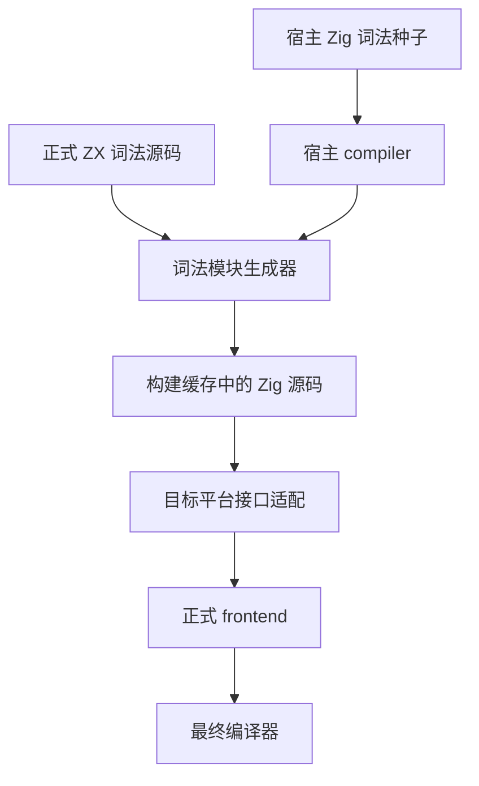
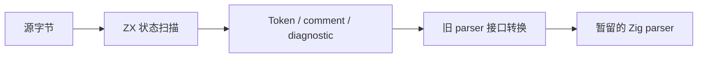

# 正式词法前端

## Intent：最终目标

将已完成差分与容量优化的 ZX 词法器接入正式编译器，普通构建不依赖工作机预装的 zxc，也不依赖 docs 源码或已生成文件。保留后续 parser、语义分析及代码生成迁移所需的真实构建基础。

## Data：可用证据

词法草稿已核对 837 份现有源码，完整 token/comment/diagnostic 零差异；9750 字节输入的 arena 容量在跨函数追加优化后为 518236 字节。主入口输出仅依赖 Zig 标准库。

现有编译器通过四处相对 import 使用 lex；Token 与 Span 是旧 Zig parser 的连续数组接口。模板 parser 和 RX 属性定位仍直接调用 `template.interpolationEnd`，这部分不因替换主 lex 自动迁移。

## Edges：边界与限制

本阶段迁移主词法入口，不能声称整个编译器已自举。旧模板插值定位仍属于未迁移的 Zig parser。旧主词法器及其模板扫描依赖保留为宿主生成种子，不成为最终主词法入口的代理。

正式 ZX 源码移至 compiler 包，消除 docs 依赖。构建生成器只使用 host 模块；生成源码再编译为目标平台模块。同一侧 core 类型身份必须共享。完整源码目录进入构建输入，helper 修改必须重新生成。

适配层调用 ZX 生成结果后，为旧接口建立调用方拥有的 Token/Span 数组，并复制诊断文字，避免临时 arena 逃逸。这是旧 parser 接口尚未迁移时的转换成本，不能描述为零复制最终架构。

## Answer：交付与成功标准

交付正式 ZX 词法源码、宿主种子、构建生成器、旧接口适配层，以及新的阶段核对记录。成功标准为正常 CLI 构建通过、最终主 lex 使用 ZX 实现、既有源码完整差分保持一致，且用新编译器再次生成词法模块得到一致结果。不得新增测试用例或运行全量测试。

## 自我审查

构建无环、词法结果相同和词法模块再生成一致仅证明本阶段闭合；它们不证明语法、类型、模块、后端和 CLI 已由 ZX 实现。不得提前执行最终仓库归档或标记总目标完成。

## 已实施

- 正式 `lexer/` 收纳 27 份词法源码与 4 份数字扫描依赖，所有 import 均在包内；关键词数据及维护生成器也已迁入，不依赖 docs。
- `bootstrap/lexer/` 保存旧主扫描及其模板扫描依赖，供 host 生成器使用。
- `build/compiler.zig` 显式接收 lexer module；`build/lexer.zig` 一次生成源码 LazyPath，再分别装配 host/target adapter，避免递归创建默认 compiler。
- `build/generate_lexer.zig` 按稳定顺序读取源模块，执行完整源码检查、分析及 Zig 生成；正式编译器构建不需要已有 zxc。
- 四处词法入口统一注入 `lexer`，最终主入口没有相对导入宿主种子。
- 构建登记目录变化与每个 `.zx` 文件；CLI 语义缓存另包含 compiler/build、compiler/bootstrap，正式源码已由 compiler/src 摘要覆盖。
- 适配层明确处理 OutOfMemory/长度溢出；其他生成执行错误记录为内部 compiler 诊断，不伪装为内存错误，也不会返回没有 reporter 内容的 InvalidSource。

## 实际验证

1. `zig build dist -Doptimize=ReleaseSafe --summary all`：17/17 成功。
2. `bootstrap-lexer` 独立构建步骤：5/5 成功，保存宿主种子生成文件。
3. 原有 837 份源码逐条校验散列，种子与正式 adapter 的完整 token/comment/diagnostic 零差异。
4. 31 份正式 ZX 源码在种子、正式 adapter、由新 CLI 构建的独立应用之间全部一致。
5. 新 CLI 在 `--no-cache` 下重新编译正式词法源码，结果与宿主种子生成文件逐字节一致：334269 字节，SHA256 为 `7feae58f3866e861c6ca26da77f015aa5f83d678cbc8b1979bbb9f633a648a50`，唯一 import 为 `std`。
6. 现有首页 checkout RX 的 `check-rx --entry` 成功。

未新增测试用例，未运行全量测试；以上为构建、已有源码重放及实际自编译核对。

复现主体命令见 [正式词法前端参考](../正式词法前端参考.md)。差分宿主继续使用已有 `完整词法扫描/reference.zig`：分别将 lexer module 绑定到 bootstrap 种子，或绑定到正式 adapter 并注入生成文件。既有重放脚本增加 `--file-input`，复用同一份输入记录。

## 接入后自我批判

只读审查确认了依赖方向、输入登记、类型身份和 adapter 生命周期，没有发现明确的新增悬空引用或构建环。审查同时指出：调用方 allocator 通常也是 arena，词法临时分配不保证在 adapter 返回时归还物理内存；后续应观测完整 parse 峰值，不能以临时 arena 的 deinit 替代内存证据。

本次阶段一致仅覆盖词法模块。旧 Parser 中的模板插值定位仍存在，整个编译器尚有大量 Zig 源码；此次没有执行最终 zxc_zig 归档或声称完成全编译器自举。

## 测试会话反馈处理

测试会话报告正式入口差分进行到 8704 组时仍为零差异，同时指出 `packages/core/IR契约.md` 保留了过时的整根消费描述。已对照 `ownership/places.zig` 和字段所有权参考，将正式契约修正为静态路径移动、祖先不完整、独立兄弟字段仍可使用，并补充动态索引边界及宿主递归独占约定。该反馈中的 8704 是进行中状态，不计作本轮自行完成的验证总数；相关旧测试预期由测试会话处理，本轮未改测试文件。
