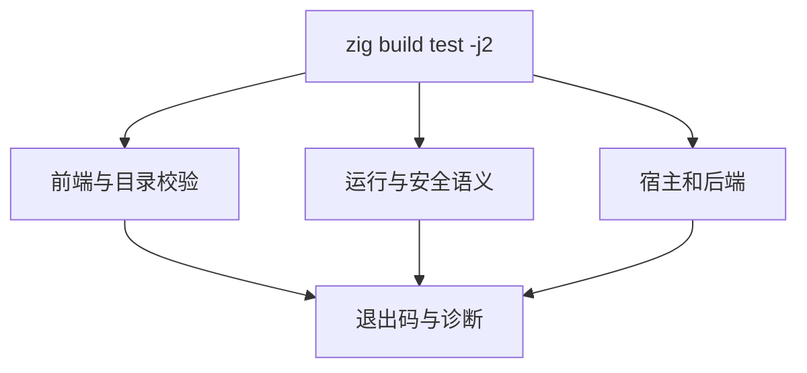
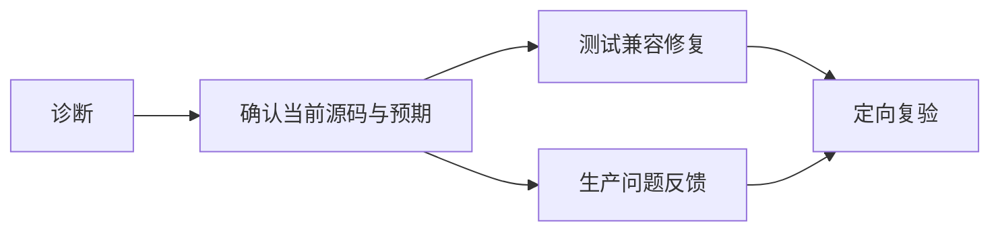

# 测试包全量回归计划

## Intent：最终目标

在 Zig 0.17.0 升级后执行测试包总入口，核对前端、运行、所有权、宿主和生成目录完整性，发现并处理此前定向检查未触达的问题。

## Data：可用证据

基线为 `39e2c3c8`，工具链升级为 `c3ed5b56`。此前定向门禁已通过，矩阵有 80,087 个目录用例，但矩阵审计不证明执行成功，上游仍有 51,410 个文件未完成评审。

## Edges：边界与限制

- 从 `packages/test` 运行 `zig build test -j2`，限制构建并发，保留单一进程句柄观察；观察超时不视为进程退出，不重复启动同一全量命令。
- 只修改测试侧问题；生产问题反馈指定实现会话处理。不修改预期以隐藏生产回归。
- 本次总入口通过也不等于全部 test262 对齐，仍需继续上游评审和新增用例。
- 共享工作区保持其他改动，提交本阶段时精确选择文件。

## Answer：交付格式与成功标准

执行日志与问题清单保存在 `测试包全量回归/`，按真实退出码、诊断与复验记录更新。每完成一部分修复独立提交推送，未结束的总入口保持运行并记录句柄。

## 首批失败归属

所有权与 Store 分配失败检查出现 `NondeterministicMemoryUsage`，已反馈实现会话；正在核对 backing allocator 的 resize/remap 是否破坏故障注入所需的确定性前提，不删检查或吞错误。

XML 位置测试中的源码已迁移为 `{表达式}`，部分 marker 仍指向旧实体文本，且 CR/LF 场景已被改成空格。修复保留两种真实职责：引号字符串属性验证实体解码及字节映射；原始表达式验证实际换行、UTF-8、IR span 与结束位置。不恢复旧的引号表达式语义，不只把 marker 改成容易通过的值。

另两处测试配置缺口为 RX 格式化运行样例仍使用旧引号表达式，以及 manifest 资源隔离构建没有提供升级后新增的 yaml 声明模块；分别同步真实语法和 CLI 成熟构建方式。首次总入口遗漏 `ZXC_TEST_SOLVER`，系统 PATH 没有 z3，形式验证失败属于运行环境配置；已核实 `/tmp/zxc-z3-5.1.0/z3-5.1.0-x64-osx-13.3/bin/z3` 可用，后续使用该路径，不将其当成生产缺陷。

## 集合运行器反射接口适配

全量日志进一步暴露 `tests/support/collections.zig` 的结构体深拷贝仍依赖已弃用的 `std.meta.fields`。现使用 `@typeInfo(T)` 返回的 `field_names` 与 `@FieldType`，保留逐字段递归复制、释放及输入不变断言。

使用已核实的 Z3 路径执行 `zig build test-nested-collections test-object-construction -j2`，进程退出码为 0；日志为 `确定性故障注入/集合反射兼容.log`。这只确认两个专项入口，首次总入口仍在运行，不能据此声明全量通过。

自我复核：这是测试辅助代码对 Zig 0.17 的兼容修复，未修改生产语义，也没有删除深拷贝检查。旧总入口创建于修复前，其失败日志仍须保留作为诊断证据。

## 指定 Z3 后的 Debug 总入口终态

`测试包全量回归/Debug复验.log` 对应进程已退出 1：4988/5007 构建步骤成功，8 个运行器失败；构建器报告 70462/70462 个 Zig 测试通过。不能把该 Zig 计数当成所有 Node 集成测试或整个构建成功。

八个运行器分别为 semantic_lint/rx、semantic_lint/compiled、rx/cli/watch、rx/cli/store_paths、rx/cli/project、library_publish/rx_compiled、verification/public、package_manifest/inspect。前七个旧 RX 夹具在 533f4d34、c3f14f75 修复并专项通过；最后一项是原生实现新标志的预期缺失，详见《原生清单标志回归计划》。八项现均有修复后的定向通过证据。下一次从修正后的测试源码运行完整入口，日志另存，保留此前失败证据。

## 测试驱动类型边界补正

包级 tsc 发现 HTTP fixture response 由 Buffer.from 推断为 Buffer<ArrayBuffer>，却接受 Buffer<ArrayBufferLike>，以及 Process 环境删除测试字段时被推断为必填。补显式 Buffer 与既有 fixture 使用的 NodeJS.ProcessEnv 注解，不改变响应字节、环境删除行为或断言。`node node_modules/typescript/bin/tsc --noEmit` 修正后退出 0。

## 生产实现中途编译失败的专项复验

《夹具修正后Debug.log》的 build_modes 曾在实现会话编辑 value_call 时遇到不存在的 ir.Call；已反馈并在 6b37d623 修复。随后运行 `zig build test-build-modes -j2 --summary all`，退出 0、2/2 步骤成功，实际覆盖安装 CLI、应用、迁移后的 Zig/ZX 库及 264 次压缩调用。日志《构建模式修正后复验.log》保留成功证据。原全量进程仍在执行，不覆盖其失败记录或提前宣称整体通过。

## 夹具修正后总入口终态

上述进程最终退出 1，汇总为 4883/5024 构建步骤成功、两个直接失败、71331/71331 已执行 Zig 测试通过。直接失败为标准类型生成工具编译和 build_modes 运行器，均指向中途 value_call 的 ir.Call 类型引用；日志未出现另一类根因。标准类型生成失败还阻断下游步骤，故专项构建模式通过不能替代完整入口重跑。

待空列表 pop 本部分提交后，使用相同 Z3 路径重新运行完整测试包，日志另存《值返回修正后Debug.log》。此时可纳入新增 filter、值返回、缓存资格、枚举和 pop 测试；先前全量进程的构建图不能自动包含之后添加的注册项。继续只保留一个全量进程。

## 值返回修正后总入口成功终态

《值返回修正后Debug.log》对应完整进程已正常退出，退出码为 0。日志未检出 error: 或 failed command；末尾 package HTTP 的 13 项测试通过。进程启动时未传 --summary all，因此日志没有全量构建步数或统一测试数量，不从局部日志推算总体数量。日志哈希和命令保存在《测试包全量回归/值返回修正后结果.json》。

这次全量运行验证了此前 RX 夹具、反射辅助接口、清单预期以及 value_call 编译错误修正后的整体入口。共享工作区执行期间持续有新生产提交和测试注册，构建图早于 423d6896、acc1e602 新增的引用状态/独立容器用例，因此不能表述为当前 HEAD 的固定快照全量通过。新增部分另有 test-value-return 在 Debug、ReleaseSafe 的 104/104 定向通过证据。

整体 Test262 对齐仍未完成；这次成功不改变适配范围与上游审阅状态。当前全量进程已结束，不再持有待观察进程。

## ReleaseSafe 全量入口

Debug 总入口正常退出后，在 37e54bd7 已提交状态启动 ReleaseSafe 总入口，显式传 --summary all，使用同一已核实 Z3 路径与 -j2。此构建图包括最新引用状态及四种独立容器模式。日志另存《测试包全量回归/ReleaseSafe全量.log》，不覆盖 Debug 记录。

共享工作区仍可能收到实现会话的生产修改，最终报告必须保留此边界；启动事实不等于通过。进程结束前只观察同一进程，不因工具观察超时重复启动。

## ReleaseSafe 首次终态与固定检出复验

旧进程最终退出 1：3585/5121 步骤成功、79 个直接失败，已执行的 Zig 测试 77719/77719 通过。全部 79 条失败命令的 frontend 依赖均缺少 lexer，160 条实际编译诊断均为找不到 lexer 模块，未见其他失败类型。结果及日志 SHA-256 保存于 ReleaseSafe首次结果.json。

该构建图创建于 37e54bd7，早于正式 lexer 接入 f1a9e65e；长期运行期间读取了更新后的 parse、parse_expression、declarations 源码，因此旧依赖图不再满足新源码的导入。此证据不能证明当前提交依然错误，先从当前正式构建图重新验证，不向实现会话报告未复现的旧图问题。

为避免同类混合状态反复出现，创建基于 3d275d2bb616a64ea18caf9529b7162471fd7245 的独立托管检出运行完整 ReleaseSafe。现有 library-bundle-tests 检出含未提交改动，不复用、不清理。新检出不接入主工作区源码软链接，依赖按锁文件安装。最终结果只对该固定提交负责，后续新功能另做专项验证。

固定检出首轮观察句柄随后失效，系统进程列表也不再存在 Zig 构建进程。日志停在 Process 专项第 23 项，没有最终汇总或可取得的退出码，因此状态为终态未证实，不能记为成功。在确认固定检出 HEAD 未变、工作区仍干净后，重新启动相同命令，另存《固定检出ReleaseSafe续跑.log》，并在命令结束时写入《固定检出ReleaseSafe续跑退出码.txt》。保留首轮日志，不根据观察超时重启仍在运行的进程。
