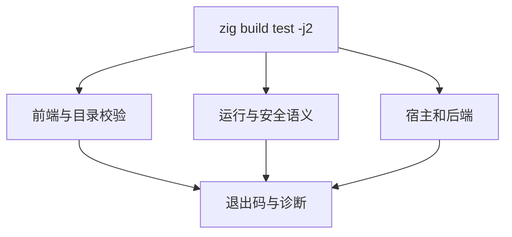
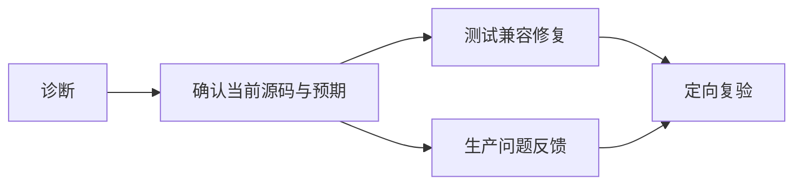

# 测试包全量回归计划

## Intent：最终目标

在 Zig 0.17.0 升级后执行测试包总入口，核对前端、运行、所有权、宿主和生成目录完整性，发现并处理此前定向检查未触达的问题。

## Data：可用证据

基线为 `39e2c3c8`，工具链升级为 `c3ed5b56`。此前定向门禁已通过，矩阵有 80,087 个目录用例，但矩阵审计不证明执行成功，上游仍有 51,410 个文件未完成评审。

## Edges：边界与限制

- 从 `packages/test` 运行 `zig build test -j2`，限制构建并发，保留单一进程句柄观察；观察超时不视为进程退出，不重复启动同一全量命令。
- 只修改测试侧问题；生产问题反馈指定实现会话处理。不修改预期以隐藏生产回归。
- 本次总入口通过也不等于全部 test262 对齐，仍需继续上游评审和新增用例。
- 共享工作区保持其他改动，提交本阶段时精确选择文件。

## Answer：交付格式与成功标准

执行日志与问题清单保存在 `测试包全量回归/`，按真实退出码、诊断与复验记录更新。每完成一部分修复独立提交推送，未结束的总入口保持运行并记录句柄。

## 首批失败归属

所有权与 Store 分配失败检查出现 `NondeterministicMemoryUsage`，已反馈实现会话；正在核对 backing allocator 的 resize/remap 是否破坏故障注入所需的确定性前提，不删检查或吞错误。

XML 位置测试中的源码已迁移为 `{表达式}`，部分 marker 仍指向旧实体文本，且 CR/LF 场景已被改成空格。修复保留两种真实职责：引号字符串属性验证实体解码及字节映射；原始表达式验证实际换行、UTF-8、IR span 与结束位置。不恢复旧的引号表达式语义，不只把 marker 改成容易通过的值。

另两处测试配置缺口为 RX 格式化运行样例仍使用旧引号表达式，以及 manifest 资源隔离构建没有提供升级后新增的 yaml 声明模块；分别同步真实语法和 CLI 成熟构建方式。首次总入口遗漏 `ZXC_TEST_SOLVER`，系统 PATH 没有 z3，形式验证失败属于运行环境配置；已核实 `/tmp/zxc-z3-5.1.0/z3-5.1.0-x64-osx-13.3/bin/z3` 可用，后续使用该路径，不将其当成生产缺陷。

## 集合运行器反射接口适配

全量日志进一步暴露 `tests/support/collections.zig` 的结构体深拷贝仍依赖已弃用的 `std.meta.fields`。现使用 `@typeInfo(T)` 返回的 `field_names` 与 `@FieldType`，保留逐字段递归复制、释放及输入不变断言。

使用已核实的 Z3 路径执行 `zig build test-nested-collections test-object-construction -j2`，进程退出码为 0；日志为 `确定性故障注入/集合反射兼容.log`。这只确认两个专项入口，首次总入口仍在运行，不能据此声明全量通过。

自我复核：这是测试辅助代码对 Zig 0.17 的兼容修复，未修改生产语义，也没有删除深拷贝检查。旧总入口创建于修复前，其失败日志仍须保留作为诊断证据。
