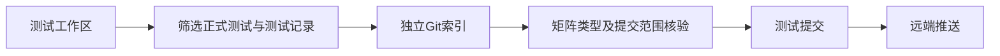
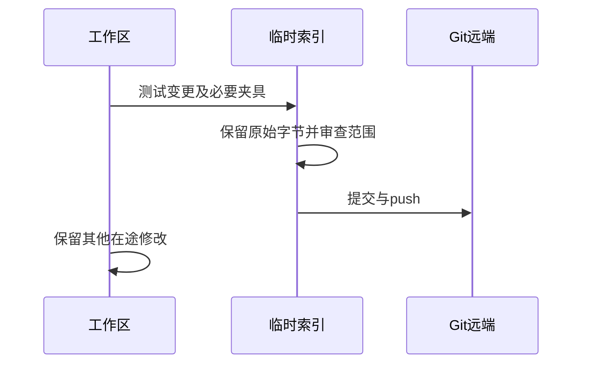

# 测试变更提交记录

## Intent：最终目标

按用户要求提交并push当前尚未提交的测试变更；之后每完成一部分测试均提交并push一次。整体Test262及ZX全特性目标继续进行。

## Data：可用证据

packages/test存在大量此前分阶段验证的未提交文件，包含构建注册、正式案例、生成器、上游审阅和资源夹具。最新统一codec专项16/16通过；提交前复核矩阵与TypeScript。历史全量根回归的版本边界保持原记录，不把本次提交描述为最新全量根通过。

## Edges：边界与限制

只提交测试包及对应测试记录/草稿资源和原测试草稿迁移删除。保留正在修改的CLI生产代码、其他实现文档、全局忽略配置及已暂存的无关日志删除。通过独立临时Git索引构造提交，避免混入现有暂存内容。

归档测试的33个tgz是源码引用的故意损坏/有效夹具，虽然被工作区全局tgz规则忽略，仍需明确纳入测试提交，否则新检出不能编译这些测试。缓存、可执行文件和忽略的日志不纳入。

## Answer：交付格式与成功标准

交付明确的测试提交、远端push结果及剩余工作区边界。暂存内容只读核验；原始负例和上游字节证据不能被批量格式化。提交使用钩子提供的SKIP_SIMPLE_GIT_HOOKS开关，避免自动格式化改写这些夹具；保留已完成的专项、类型与矩阵检查作为实际验证证据。

## 自我复核

提交成功不等于整体语言完成，也不等于所有用例在最新HEAD上重跑过。push必须核实远端分支包含提交；不能把本地commit当作已推送。

## 提交前核对结果

待提交3635个文件：1361个测试包文件（含33个归档夹具）、2274个测试记录/草稿相关路径（其中原.drafts两文件迁移由Git在提交时识别）。矩阵审计与TypeScript均退出0，最新codec专项16/16通过。空白检查162条均为尾部空白/末尾空行/缩进制表符报告，保留原测试与历史证据字节。未执行最新全量根回归。

构造提交时实现聊天继续产生新提交，因此提交索引已重新基于当前HEAD建立，防止旧索引覆盖新实现。提交不包含packages/cli的在途生产修改，也不包含其他已暂存日志删除。
