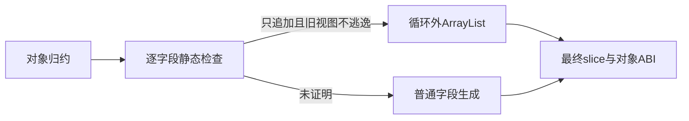
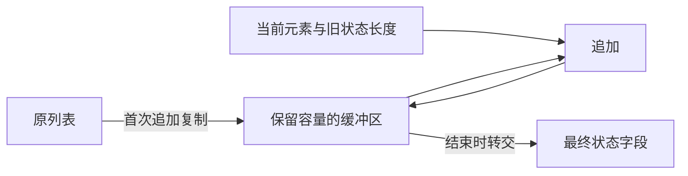

# 状态列表追加实施计划

## Intent：最终目标

对象 reduce 中按字段维护只追加列表的容量，使词法单元、诊断和语法节点等集合能够随输入摊销线性构建。延续顶层状态值布局，不更改公开 slice ABI，不引入专用运行库或动态引用跟踪。

## Data：可用证据

真实 collect.zx 可以编译：State 包含 count 与 values，reduce 每轮返回 count+1 及 values.push(item)[0]。上一项对象值布局已消除状态壳分配，但生成的普通 push 仍逐轮复制整个列表。既有 append_reduce 已有循环外 ArrayList 生成，当前只接受列表作为整个累加器，不能处理对象字段。

## Edges：边界与限制

- 每个列表字段独立检查；字段结果须保持原值，或直接 push/concat 后第零项，允许条件组合。重置及其他操作保留普通生成。
- 不能把旧列表视图带出。其他字段及条件仅可读取候选列表长度；完整列表、索引和一般调用传递均拒绝优化。长度只读取旧 slice 的 len，不解引用可能因扩容失效的 buffer。
- 追加参数同样必须满足只读长度的限制；原有其他状态字段与输入仍可正常参与计算。
- 根对象 spread 只作为受控布局快照处理，必须同时核对 evaluation 与所有最终字段，不能忽略被覆盖表达式的副作用。
- 第一次真正追加时复制原列表，避免修改或释放初值及其其他别名；之后复用 builder 容量。最终转交 owned slice 并回填最终状态，不能让结果引用已经释放的 buffer。
- 保留求值次序和错误传播；分配减少允许改变 OutOfMemory 时点。未证明的字段保留原生成，不改变应用语义。
- 不新增测试、不执行全量测试、不使用浏览器。真实应用和独立宿主容量观测作为本项证据，不把其提升为完整自举或所有集合操作均已优化。

## Answer：交付与成功标准

将字段分析与 builder 生成放在 genz 的对象归约职责目录，复用原对象求值与缓存处理。逐字段决定复用资格，保留条件跳过、原值分支和空源。多字段同时消费还须通过前端所有权约束，不能只凭后端存在多个 builder 的生成能力宣称源语言已支持。交付优化前后生成源码、实际值与容量记录、回退证据及公开参考，完成后独立提交推送。

## 自我复核

主要风险是扩容后继续解引用旧 slice，以及一次表达式被重复生成而追加两次。实现必须先验证使用位置，再建立明确的表达式替换和缓存边界；实现已按这些边界完成，普通读取旧元素和被覆盖追加均保留原生成；相关证据见下文。

## 当前实现与发现

已添加逐字段分析、惰性 builder 与有作用域的表达式替换。替换在 Lower.expr 原有 cache 查询之后执行，保留 aggregate 已绑定的临时值，避免提前生成追加表达式导致重复求值。只有最终候选字段的返回路径上的 projection 可以替换；其他 evaluation 里执行但被覆盖的追加会使候选字段回退。

dist 构建通过，collect 的真实宿主观测输出保持一致。0、100、1000、5000 项的 arena 容量从 84、54526、4463524、120021366 字节变为 84、2062、25216、87566 字节。这里是 allocator 容量观测，不是所有程序的固定内存上限。

select 与 concat 生成一个 builder；需要读取旧列表元素的 index_read 与追加被结果重置覆盖的 overwritten 保留普通生成。最初“追加后再读取旧列表”的覆盖示例先被前端所有权拒绝，随后用不复用被消费所有者的重置形状验证回退，没有放宽所有权契约。

multiple 示例证明还有独立缺口：消费 state.primary 后，读取 state.secondary 也被视为使用已消费的对象；改为不同分支结合 spread 同样受整体所有者约束。因此多字段同时构造的源语言能力仍未完成，不能把后端逐字段循环当作这项能力已经交付，也不以额外复制另一个字段来绕过它。后续需单独研究字段所有权与内部别名关系。

本轮曾暂停实现，优先修复测试反馈的 Gateway 非法头、缺端口及关闭边界；该修复已经独立提交，未混入本项优化。

## 完成证据

真实应用的空输入、普通追加、条件跳过、非空初值 concat、旧元素读取回退和覆盖追加回退均已运行，结果见应用运行结果.json。collect 按正式 lib 模式发布后，由独立 Zig 宿主导入 root.zig 与 abi.zig 执行，得到 count=3、values=[2,3,5]。最终 dist 构建为 13/13 步成功，包含本项优化与已提交的 Gateway 修复。没有新建测试用例、执行全量测试或调用浏览器。

复核本次 diff：只在对象归约生成职责中加入字段分析、builder 和表达式替换；helper 的替换表独立初始化，嵌套作用域在正常与错误路径恢复。未修改前端消费规则。更少的分配允许改变分配失败时点；没有将多字段消费失败包装成完成结果。
