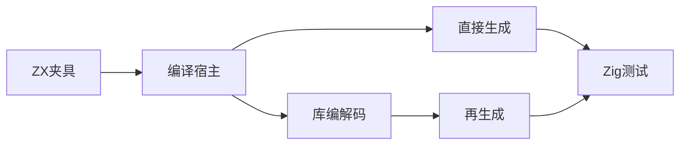
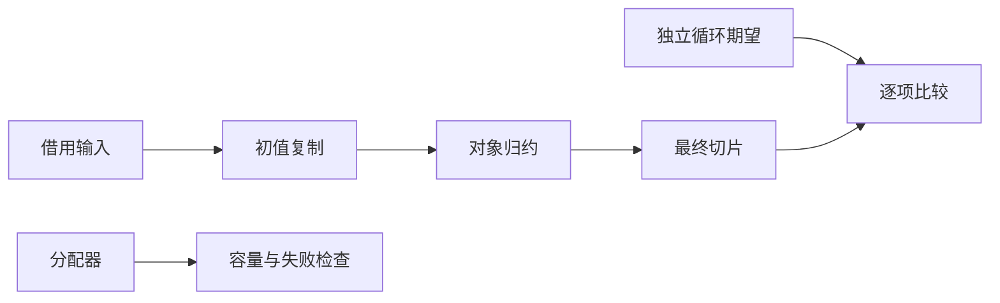

# 状态追加验证计划

## Intent：最终目标

验证对象归约的列表容量复用在真实生成代码中保持值、顺序、旧状态求值和输入不变，并在直接源码与库编解码链路执行。

## Data：可用证据

基线为 10082875 的追加优化和状态列表追加参考。沿用 object_reduce 编译宿主结构；独立 Zig 循环计算期望值，不根据生成代码文字判断优化。

## Edges：边界与限制

共享工作区存在实现会话的所有权修改，保留原状。单字段追加是当前已发布范围；多字段另行验证。不把有限规模分配上限解释为任意规模证明。不修改生产源码，发现缺陷发送指定会话。

## Answer：交付与成功标准

新增 test-object-append，覆盖 push、concat、整状态条件跳过、列表字段条件跳过、索引读取回退、被覆盖追加回退；空输入、非空初值、全跳过、混合序列、OOM、禁止扩容和线性分配上限。Debug 与 ReleaseSafe 均执行，记录证据后提交推送。

