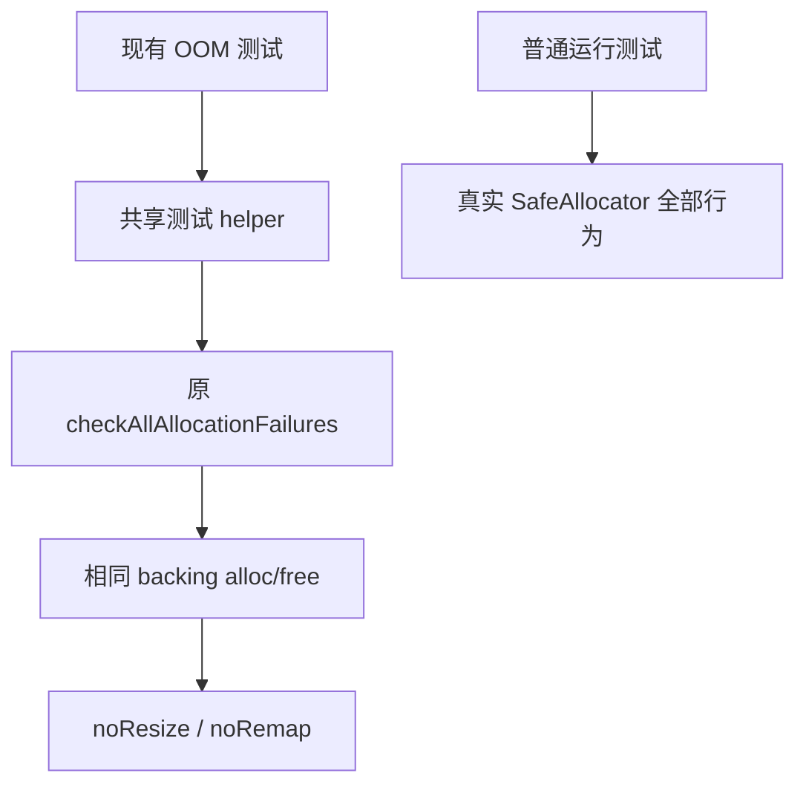

# 确定性故障注入实施计划

## Intent：最终目标

恢复 Zig 0.17 下 `checkAllAllocationFailures` 所需的确定性分配序列，保留故障注入、OOM 传播、吞错和释放检查，不为测试计数修改生产算法。

## Data：可用证据

实现会话 `27035852` 的对照实验说明 SafeAllocator 的 resize/remap 成功与分配位置有关；同一输入 alloc 次数变化，而 noResize/noRemap backing 下稳定，原标准库故障遍历通过。当前 153 个 Zig 测试文件使用该标准检查，实际全量失败分布于多个分析、Store 和生成代码测试组。

## Edges：边界与限制

- 新 helper 仅用于故障注入；普通运行保留真实 `std.testing.allocator`。
- 保留传入 allocator 的 ptr、alloc、free，只在局部复制的 vtable 上使用标准 noResize/noRemap，然后调用原 std.testing.checkAllAllocationFailures。
- 不捕获或忽略 NondeterministicMemoryUsage，不改变测试期望，不使用固定次数或固定容量缓冲区。
- helper 放在测试支持目录，按测试模块显式接入；生成运行器需注册同一模块，不借相对路径逃离模块根。
- 两个只读分析任务梳理构建入口与隔离运行器；正式改动仍由主会话完成，生产目录不变。

## Answer：交付格式与成功标准

先让已稳定复现的字段/缓存所有权门禁通过，再按实际接入根覆盖其他故障注入测试。超过五文件的模式替换先尝试 grit；若 Zig 不受支持，保留失败证据，使用带计数断言的机械替换，并逐项检查导入与运行。

## 第一阶段：所有权测试接入

- `grit` 的 Zig 规则试运行失败，当前工具语言列表不含 Zig，证据保存在 `确定性故障注入/替换规则.grit` 与 `grit尝试.log`；使用带原文和文件数断言的机械替换。
- 共享 helper 保留标准库原遍历；21 个所有权测试文件共 41 处调用切换到该 helper，测试参数、预期与普通 allocator 保持原样。
- 五个构建文件显式注册测试模块依赖，覆盖静态分析与 source/library 生成执行路径；生成的生产 program 没有注入测试模块。
- 字段、缓存的试点通过后，执行 `zig build test-field-ownership test-cached-ownership test-owned-input test-store-ownership-proof test-ownership-contracts -j2`，进程退出码 0。日志为 `确定性故障注入/所有权完整Debug.log`，运行时设置了可用的 `ZXC_TEST_SOLVER`。

### 自我复核与剩余边界

本阶段消除的是故障遍历依赖 backing 原地调整成功与否的非确定性，不证明所有 allocator 策略下都正确。普通行为和增长约束检查仍使用真实 allocator；没有吞掉 OOM 或非确定性错误。只对本次改动检查格式与 diff；目录级格式检查另报既有 `cached/check.zig`，该文件未改。

本阶段仅完成所有权目录。剩余 132 个原使用标准故障遍历的文件仍待按真实模块根接入，其中包含独立命令行运行器和生成器；首次全量回归仍在运行，不声明全量通过或 test262 对齐完成。

## 第二阶段：集合归约执行接入

集合 reduce、object reduce、object append、multiple append 的 8 个文件、13 处故障注入调用已接入同一个 helper。四个构建入口在生成执行测试的 module 上注册依赖，原程序生成器与生产模块不变。

执行 `zig build test-multiple-append test-object-append test-object-reduce test-reduce-runtime -j2`，退出码 0，日志为 `确定性故障注入/集合归约Debug.log`。现有容量、增长、输入隔离和失败传播断言全部保留。

自我复核：四个入口通过仅代表本组运行组合通过。首次全量进程仍使用旧构建图，在文件切换后出现缺少 `allocation_testing` 模块的诊断；此类诊断属于运行中源码与旧构建图不一致，须在迁移完成后重新创建全量构建图。当前不能从这轮总入口得出最终源码通过与否。

静态检索剩余 124 个 Zig 测试文件尚待迁移（不计 helper 自身保留的标准调用）；后续先接入根构建入口中的静态测试，再接入专用构建文件、命令行运行器与生成器。

## 第三阶段：全部活动入口接入与复验

根构建文件的 29 处静态测试创建点按实际源码路径及相对导入闭包核对，迁移 51 个文件；专用构建入口与两个独立 support 模块迁移 53 个文件；三个仍在使用的命令行运行器迁移 19 个文件。运行器用 `fileURLToPath(new URL(..., import.meta.url))` 定位仓库 helper，并把它登记为构建缓存输入，不改变现有位置参数。

与初始检索的 153 文件相比，本次保留 `tests/plugins/protocol_test.zig` 原样：README 明确动态插件入口已从当前构建移除，属于历史测试。不能把历史插件代码计入当前活动能力。其他活动文件的标准故障遍历均通过 helper 调用，URL 基础用例生成器同步修改并重新生成。

### 已发现并处理的问题

静态入口首次复验退出码 1：188/198 构建步骤成功，已执行的 682/682 测试断言通过，但两项测试泄漏及三个编译错误仍使整体失败，不能报告通过。

- 普通缓存生成测试泄漏源于生产 `createCached` 先复制 arena 再分配 signature 类型表。已按用户要求向实现会话报告；实现会话提交 `ca60a17d`，先完成 signature 分配后转移 arena。后续两入口复验中 `test-module-generation` 已通过。
- 后端发布隔离构建的手工源码复制列表遗漏 Node 绑定及其传递依赖。改为把真实 CLI src 目录复制到隔离目录 source，保留原入口的导出和测试逻辑，避免逐个追补导入闭包。`test-backend-publish` 复验退出码 0，日志为 `发布完整依赖复验.log`。
- 初始全量进程已退出 1，结果混合旧配置、旧源码及旧构建图，只保留诊断用途。新一轮须携带真实 Z3 路径并使用完整接入后的构建图。

### 自我复核

本次未修改故障遍历参数、预期结果、OOM 传播或释放断言。构建注册和静态检索只能证明接入完整性的部分证据，不能替代实际执行；当前不能宣称全部 152 个活动测试文件或 test262 整体已通过。完整回归结果将另行记录。

迁移后核对：152 个活动 Zig 文件共 358 处故障遍历接入 helper；本轮新增迁移的 123 个文件经保留字符串与注释内容的词法对比，除 helper 导入、调用前缀及格式外无差异。构建帮助入口退出码 0。专用入口组合已启动，日志为 `确定性故障注入/专用入口Debug.log`，仍在运行，尚无最终结论。

### Gateway 完整响应后的连接重置

专用组合在 513 字节请求头边界出现 ECONNRESET；单独 Gateway 门禁复验 86 项通过，说明需要检查传输时序。`Gateway连接复现.mjs` 对 512/513 字节交替发出 100 次原始请求，`Gateway连接结果.json` 显示 35 次 reset，均已收到完整 431 响应且 content-length 为 0，没有空响应。

测试客户端原先在 error 事件立即 reject，丢弃已完整接收的协议结果。调整为仅对 ECONNRESET 继续在 close 后解析缓冲区，原状态断言、头边界和正文长度校验全部保留；空响应或正文截断仍失败，其他连接错误仍立即失败，没有重试请求，也没有修改服务端。

### 测试接口的 Zig 0.17 适配

- 五个 URL 测试把函数参数反射从 `params[n].type` 改为 `param_types[n]`，URL Record 字段释放改为 `field_names` 与 `@FieldType`，保留逐字段释放。标准库组合复验只剩 HTTP fixture 的旧接口编译失败，195/205 步骤成功。
- HTTP 模拟传输由旧 `netRead/netWrite` vtable 槽位迁移到 `operate` 的 `net_read/net_write` 分支，读结果使用 `ReadResult.data_len`，关闭参数使用 Socket 切片。拒绝连接、短读短写、故障位置、请求内容和关闭次数断言不变。`test-http` 复验退出码 0，真实 HTTP 应用 70 项通过。
- 并行测试的线程跟踪 allocator 把互斥锁改为 `mutexLockUncancelable`，与当前生产并行 allocator 一致，避免在不可返回取消错误的 allocator 回调中忽略新增错误联合。线程统计与底层分配操作不变，待复验。

专用组合最终退出 1：2155/2362 步骤成功，已执行 15558/15558 项断言通过。100 个失败构建步骤分别为 Gateway 客户端 reset 判定 1 项、URL 反射 5 项、HTTP 模拟传输 4 项、并行线程跟踪锁接口 90 项；并非 100 种生产错误。

Gateway 修复后 86 项通过并已提交 `552ebe63`；URL 反射已通过标准库组合中的对应入口；HTTP 单独复验通过。并行总入口正在针对最后一处锁接口修复重跑，未重跑已通过且未再修改的其他专项。

## 第三阶段收束

`test-rx-parallel` 复验退出码 0，日志 `并行跟踪复验.log`。至此两次组合运行暴露的全部失败类别均有修复后的专项通过证据：生产 arena 归属、发布隔离依赖、Gateway 完整响应、URL 反射、HTTP 传输接口和并行锁接口。

本轮完成剩余 123 个活动测试文件的 helper 接入及配套构建/运行器注册；生产缺陷由实现会话修复，测试会话保留原故障遍历与行为断言。下一步使用已提交的完整构建图和显式 Z3 路径启动 `zig build test -j2`；只有该进程终态及完整失败归类才能给出全量结论。
