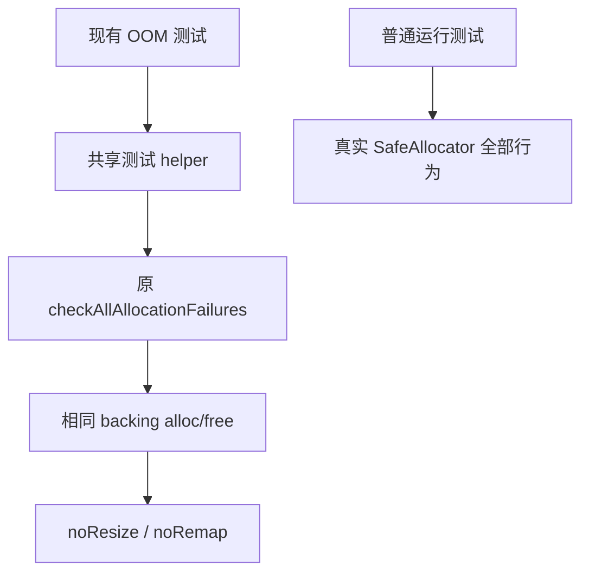

# 确定性故障注入实施计划

## Intent：最终目标

恢复 Zig 0.17 下 `checkAllAllocationFailures` 所需的确定性分配序列，保留故障注入、OOM 传播、吞错和释放检查，不为测试计数修改生产算法。

## Data：可用证据

实现会话 `27035852` 的对照实验说明 SafeAllocator 的 resize/remap 成功与分配位置有关；同一输入 alloc 次数变化，而 noResize/noRemap backing 下稳定，原标准库故障遍历通过。当前 153 个 Zig 测试文件使用该标准检查，实际全量失败分布于多个分析、Store 和生成代码测试组。

## Edges：边界与限制

- 新 helper 仅用于故障注入；普通运行保留真实 `std.testing.allocator`。
- 保留传入 allocator 的 ptr、alloc、free，只在局部复制的 vtable 上使用标准 noResize/noRemap，然后调用原 std.testing.checkAllAllocationFailures。
- 不捕获或忽略 NondeterministicMemoryUsage，不改变测试期望，不使用固定次数或固定容量缓冲区。
- helper 放在测试支持目录，按测试模块显式接入；生成运行器需注册同一模块，不借相对路径逃离模块根。
- 两个只读分析任务梳理构建入口与隔离运行器；正式改动仍由主会话完成，生产目录不变。

## Answer：交付格式与成功标准

先让已稳定复现的字段/缓存所有权门禁通过，再按实际接入根覆盖其他故障注入测试。超过五文件的模式替换先尝试 grit；若 Zig 不受支持，保留失败证据，使用带计数断言的机械替换，并逐项检查导入与运行。

## 第一阶段：所有权测试接入

- `grit` 的 Zig 规则试运行失败，当前工具语言列表不含 Zig，证据保存在 `确定性故障注入/替换规则.grit` 与 `grit尝试.log`；使用带原文和文件数断言的机械替换。
- 共享 helper 仅 13 行；21 个所有权测试文件共 41 处调用切换到该 helper，测试参数、预期与普通 allocator 保持原样。
- 五个构建文件显式注册测试模块依赖，覆盖静态分析与 source/library 生成执行路径；生成的生产 program 没有注入测试模块。
- 字段、缓存的试点通过后，执行 `zig build test-field-ownership test-cached-ownership test-owned-input test-store-ownership-proof test-ownership-contracts -j2`，进程退出码 0。日志为 `确定性故障注入/所有权完整Debug.log`，运行时设置了可用的 `ZXC_TEST_SOLVER`。

### 自我复核与剩余边界

本阶段消除的是故障遍历依赖 backing 原地调整成功与否的非确定性，不证明所有 allocator 策略下都正确。普通行为和增长约束检查仍使用真实 allocator；没有吞掉 OOM 或非确定性错误。只对本次改动检查格式与 diff；目录级格式检查另报既有 `cached/check.zig`，该文件未改。

本阶段仅完成所有权目录。剩余 132 个原使用标准故障遍历的文件仍待按真实模块根接入，其中包含独立命令行运行器和生成器；首次全量回归仍在运行，不声明全量通过或 test262 对齐完成。
