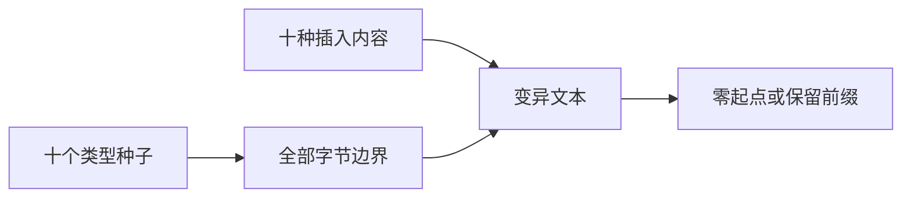
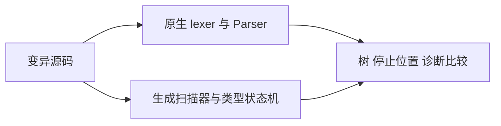

# 类型插入变异验证

## Intent

检查完整嵌套类型与错误类型在任意字节边界插入空白、注释和非法字节后的行为，补充三片段短序列无法覆盖的内部位置。

## Data

沿用正式 check.zig：独立原生 Parser.typeNode 与生成 ZX 类型状态机比较树结构、边链、解析停止位置及诊断 code/message/字节跨度。词法失败独立比较原生 lexer 与生成扫描器的诊断。

选择十个种子，涵盖名称、后缀、泛型、元组、对象、换行字段、缺少分隔及错误闭合。每个种子的所有字节边界插入十种内容：空格、制表符、LF、CRLF、普通块注释、含换行块注释、带 LF 行注释、无 LF 行注释、未闭合块注释和非法 UTF-8 字节。

## Edges

插入可能拆开名称、吞掉后续文本或导致词法失败，不假定变异保持原有语义。每次都按真实源文本重新词法分析和解析。分别从 token 0 和保留 prefix 分号前缀后的 token 2 开始。前缀不参与变异。

这是有限输入差分，不是任意语法的等价证明；不增加 Test262 审阅计数，也不把循环次数记成独立具名测试。生产代码及其他会话正在编辑的构建入口不作修改。

## Answer

新增 insertions.zig 输入枚举器及 parity_test.zig 两个测试，通过既有 test-type-parser 入口执行 Debug 与 ReleaseSafe。结果记录真实命令、输入数量、源码指纹和退出状态。

## 执行记录

每个起点执行 2040 次比较，两个起点共 4080 次；同一组输入在 ZX 与 RX 两条入口各执行一次，共 8160 次入口比较。它们仍只对应两个新增测试声明。

首次 Debug 构建退出 1：ZX 的三个 parity 测试通过，RX 生成失败，错误为 RxEntryOutsideProject。首次 ReleaseSafe 同样退出 1，ZX 全部八个测试执行通过，RX 未生成。已向实现会话提供日志；对方在 7fde841d 将 RX 生成工作目录设为 compiler 项目根。本轮没有修改该构建文件。

修正后重新执行：

- `zig build test-type-parser -j2 --summary all`：退出 0，29/29 步成功，测试全部使用缓存。
- `zig build test-type-parser -j2 -Doptimize=ReleaseSafe --summary all`：退出 0，29/29 步成功，RX 八个测试全部执行通过，ZX 八个测试使用首次运行的成功缓存。

两条入口均包含三个资源测试、三个 parity 测试（原有 408 输入及本轮两个插入测试）和两个短序列测试。ReleaseSafe 前后两次运行合计实际执行两条入口的十六个测试，没有用构建成功替代测试执行证据。首次失败日志保留，最终成功不抹去过程中的接入问题。

## 自我复核

输入覆盖名称内部及语法标点两侧，但每次只插入一段内容，不能代表多处交互变异。非法 UTF-8 与未闭合注释路径主要验证扫描器诊断，不应算作类型树覆盖。差分依据是独立原生实现；若未来原生实现也调用同一 ZX 状态机，则这种独立性会减弱。

本轮发现并反馈的是构建入口缺陷，没有发现本组输入上的类型语义差异。源码指纹在最终验证前后保持一致；未修改生产源码，未新增 Test262 审阅记录。固定检出的全量 ReleaseSafe 仍是另一项验证，不能用此处聚合结果代替。
