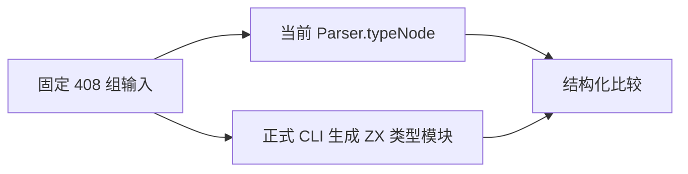
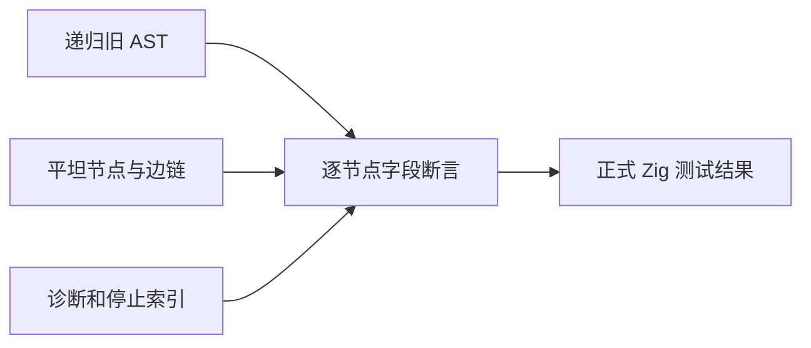

# 类型状态机正式差分回归

## Intent

将已验证的 408 组语法与深度输入纳入 packages/test，使类型状态机变化能通过正式构建入口自动复验。

## Data

文档目录的边界差分已验证 408/408 一致，但依赖本地临时生成文件。正式资源目标已能从当前源码生成独立 Zig 模块。本轮复用该构建产物，用当前 frontend.Parser.typeNode 作结构化参考。

## Edges

类型状态机尚未替换现有 typeNode。比较直接遍历旧 AST 与新平坦树，不经过 JSON 输出，因此保留深嵌套案例而不触发观测器的 JSON 深度限制。若未来 typeNode 改为同一状态机适配器，此目标只能证明接口与树转换一致，不能继续声称两个独立算法的差分。

## Answer

新增 test-type-parser-parity，保留 test-type-parser-resources，汇总为 test-type-parser 并接入全量入口。输入资产置于 tests/bootstrap/type_parser，逐条验证输入散列，比较类型节点、名字位置、顺序、子索引、边链、停止位置、完成态和诊断。执行 Debug、ReleaseSafe，记录实际计数，不将循环内输入冒充新的 Test262 映射。

## 执行结果与自我复核

正式 test-type-parser 入口在 Debug、ReleaseSafe 均退出 0，20/20 构建步骤成功。首轮两种模式均执行四项测试全部通过；补充成功诊断位置归零与非空输入集断言后，Debug 最终复验重新执行差分测试一项、其余三项资源测试为通过的缓存结果，ReleaseSafe 最终复验四项全部重新执行并通过。408 个输入全部逐项比较，失败会打印具体用例名称、起点、深度与源码。

覆盖审计通过，具名目录仍为 80152，已审阅 Test262 2221 份（688 adapted、103 equivalent、1430 excluded），待审 51376。本轮增加一个正式差分测试及其 408 条输入资产，不将内部迭代次数加到目录或 Test262 计数。

名字通过相同源码上的字节 span 比较，元组和对象按反向边链还原源顺序；每条边同时检查索引范围、严格回退及 child 早于父节点。成功结果要求空 frame 和空诊断，失败结果逐字段比较原生诊断。此测试仍不是完整语法迁移证明；未发现生产缺陷，未向实现会话发送消息。固定检出的全量任务不包含本轮新增注册，保持原提交不动。
