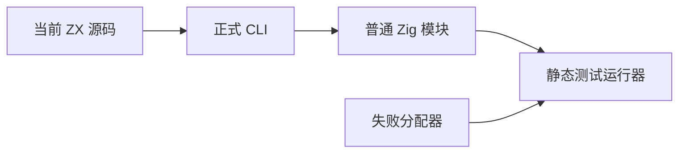

# 类型状态机资源回归

## Intent

将独立类型状态机的分配失败清理和结果存活检查纳入正式测试包，不依赖已有文档目录里的临时二进制或生成源码。

## Data

前两轮独立差分已覆盖 408 个语法/深度输入及 241 次连续追加。现有 allocation_testing helper 禁用 resize/remap，确保标准分配失败枚举确定性。构建跟踪参照 compiler/build/lexer.zig 的目录与文件依赖方式。

## Edges

新增源码全部是测试包装器、测试运行器与构建注册，不改生产实现。包装器直接组合正式 scan.zx 和 parse.zx，正式 CLI 生成普通 Zig 模块并静态编译测试；无专用运行库。类型状态机尚未替换正式 Parser.typeNode，因此此目标不冒充前端迁移完成。

## Answer

新增 test-type-parser-resources 并接入全量 test。三个用例覆盖嵌套对象/元组/application、缺闭合符号诊断和深度预算诊断；逐分配失败检查清理，正常执行路径在同 arena 第二次解析后完整比较首次结果。Debug、ReleaseSafe 执行并保存真实汇总。构建逐文件追踪 lexer 与类型状态机全部 ZX 模块，避免依赖变更后复用过期生成结果。

## 执行结果与自我复核

Debug、ReleaseSafe 均正常退出：16/16 构建步骤、3/3 测试通过。命令为 `zig build test-type-parser-resources -j2 --summary all`，ReleaseSafe 另加 `-Doptimize=ReleaseSafe`。两个构建产物的生成 Zig 源码都只导入 std；源码和日志指纹保存在《类型状态机资源结果.json》。

测试使用独立 arena 中生成的成功基准检查结果存活与深比较，这项比较的职责是资源安全，不冒充独立语义 oracle；此前类型树差分另有证据。对合法结果还独立检查根节点 Object、两个直接字段、完成态和空 frame；两类错误检查明确消息。第二次解析独立检查 Named、停止索引与完成态，然后回读首次全部结果。

首次构建遇到测试构建辅助函数使用旧 LazyPath.getPath 和匿名结构体地址不能隐式转换的问题，已分别按当前 Build 根路径接口和有目标类型的结构体字面量修正。未修改生产解析器或放宽断言。逐分配失败仍保留全部检查；OOM 路径销毁 arena，不声称同 arena 在 OOM 后恢复。未发现生产缺陷，未向实现会话发送消息。
