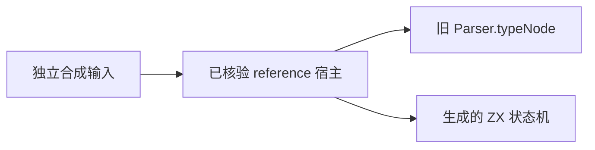
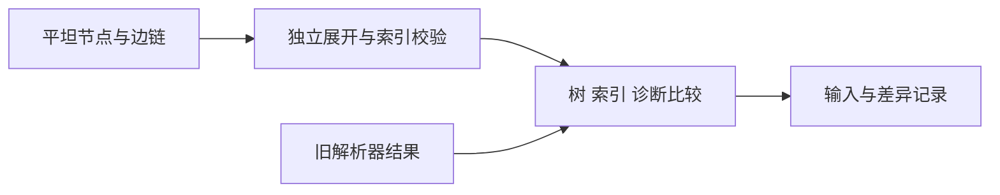

# 类型状态机独立边界差分

## Intent

验证独立 ZX 类型状态机在语法组合、错误位置、起始 token 与嵌套预算上与既有 Parser.typeNode 保持一致。

## Data

ace23b15 实现六种类型节点，现有核对覆盖 844 份源码、8677 个位置。生产 Parser.typeNode 尚未替换。实现侧 reference 宿主同时执行旧解析器与生成的 ZX 状态机；本轮已核对记录的 28 个源码指纹及该宿主二进制指纹。

## Edges

只创建文档目录中的独立验证资源，不将尚未接入的状态机计入正式前端覆盖。初次使用已核验的 reference 二进制，最终独立宿主使用已有的 `/tmp/zxc_type_source.zig` 生成源码并严格验证 SHA-256，然后自动构建；不宣称可直接在全新机器复现。候选源码只采用合法词法字节，语法错误由类型解析器判定。成功时展开平坦节点表为类型树，另检查子节点、边链索引及完成态。

## Answer

构造类型后缀、嵌套对象/元组/application、分隔符与缺失成分组合，使用不同前缀和起始位置，另检查深度 254、255、256 及嵌套容器边界。保存全部输入及 SHA-256、差异、二进制身份和执行结果。构建/执行错误不得视作语义相等，有限差分不证明完整语法迁移完成。

## 执行结果与观测器修正

初次 408 组中有 9 组嵌套输入在核对宿主中中止，首次结果与失败记录保留。单独复现发现栈位于 std.json.Stringify 的固定 256 层容器保护：有效的 127 层类型树序列化为 JSON 后容器深度已超过保护值。旧解析器及 ZX 状态机执行之后，输出阶段中止，不能记为解析器语义差异。

新增独立 observe.zig，旧 AST 按类型逐层输出 JSON 边界，仅叶子名称、诊断及平坦状态使用标准序列化；没有修改生产实现、标准库、深度限制或关闭 ReleaseSafe。宿主通过正式 frontend.Parser 和 lexer import 调用旧解析器，另一侧仍是已核验的生成 ZX 源码。当前 ast.Type 的 enumeration 分支也完整输出，但它不属于本轮 typeNode 的六种节点。

修正后 ReleaseSafe 宿主 7/7 构建步骤成功；408/408 输入的类型树、下一 token 索引和诊断完全一致，六种节点全部出现，覆盖六种诊断，包括嵌套预算耗尽。起点 0、2、4 均覆盖；调用方深度以及 254、255、256、257 层容器边界均保留。源码在执行期间未变化。

## 自我复核

未把子进程中止当成相等，也未删除深度失败输入来获得通过。平坦树展开同时检查子节点必须早于父节点、边链严格回退和 count 一致。测试只证明固定有限输入和当前二进制身份对应实现的差分，不宣称完整前端已经替换，也不增加 Test262 已审阅数。此次发现属于核对工具输出限制，未发现生产语义缺陷，因此未向实现会话发送消息。
