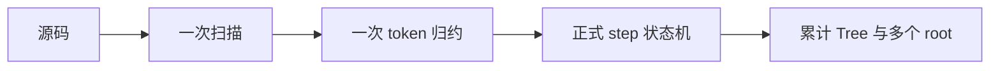
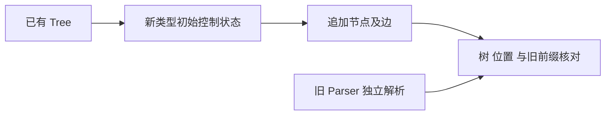

# 类型状态机连续追加验证

## Intent

验证逐 token 调用 step.zx 时，复用已有 Tree 继续解析多个类型不会覆盖既有节点或混淆字段边、元组边的索引。

## Data

类型状态机尚未接入完整前端。上一轮 408 组差分每次使用空 Tree，未覆盖未来程序解析器所需的连续追加。实现文档要求当前控制索引等于全局 token 索引，并保留原节点表。

## Edges

验证用包装器对 source 扫描一次并对 token 列表归约一次，调用正式 step.zx。类型之间以分号分隔，开始位置由独立有限词法规则给出；不把此包装器当作完整程序解析器。包装器和配套资源只存文档目录，不修改生产解析器，不新增运行库。

## Answer

比较每次完成后的 root 树和停止索引与旧解析器结果；检查追加前已有 nodes、fields、items 前缀保持不变，以及所有全局子节点和边链索引合法。通过后保留输入、源码指纹和结果，按阶段提交。

## 执行结果

八种类型结构的全部有序二元组合、八个三元组合及一组十六类型序列，共 73 组。每组从零个开始位置到全部开始位置逐个前缀执行，共 241 次，全部通过。每次检查累计 Tree 的三类表前缀、root 前缀、严格递增 root 索引，以及所有 root 的树和停止位置；空前缀要求三张表为空。树展开额外检查 child 指向此前节点、边链严格回退且数量一致。

验证脚本自动通过正式 CLI 构建包装器，显式 `--optimize ReleaseSafe --no-cache`。源码、编译器、参考宿主和运行程序的 SHA-256 已保存，执行期间源码没有变化。参考宿主使用上轮已修正深层 JSON 输出的旧 Parser，身份通过其结果记录核验。最终 73/73 组、241/241 次执行无差异。

## 自我复核

初版包装器捕获 starts，以及把借用的 token 传给 owned Input，均被现有所有权检查正确拒绝。最终将 starts 显式置于归约状态，按正式 parse.zx 的方式复制 token 标量字段，没有放宽编译器检查。模型只导出类型，没有为测试加入无用途的默认函数。

这里验证的是有效类型间的连续追加，不包含前一个类型失败后的恢复策略。开始位置来自只覆盖本轮 ASCII 类型拼写的独立分词规则，类型间明确放置分号；该包装器不冒充完整程序语法实现。编译结果为普通静态应用，未新增专用运行库。独立验证不增加 Test262 或正式前端用例计数；未发现生产缺陷，未向实现会话发送消息。
