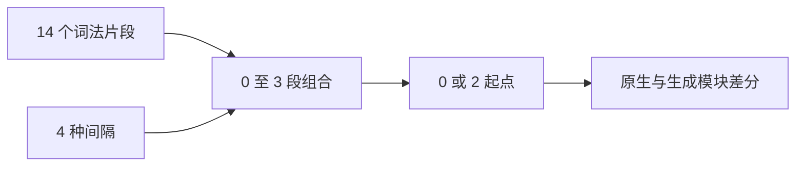

# 类型短序列有限穷举

## Intent

补充类型解析在紧邻标识符、数字、后缀和不完整分隔符处的接受范围、诊断与停止位置验证。

## Data

正式差分已具备旧 AST 与新平坦树的结构比较。当前 408 条输入以有意义的语法形状与深度边界为主，本轮增加与生产识别函数独立的有限输入枚举。

## Edges

词法片段为 T、return、$x、0、_ 及九个类型标点，总计 14 项；间隔为空、空格、换行、带换行的块注释。枚举长度零至三，仅两三片段插入间隔，单片段不重复枚举间隔；三片段的两处间隔使用相同选项，不宣称混合间隔也已穷尽。紧邻数字与名称可能先产生词法诊断，此时比较正式 lexer 与生成包装器的错误数据，不声称执行了类型语法。不是任意输入长度的证明。

## Answer

位置 0 和带 prefix 分号前缀的位置 2 分别执行 1+14+14²×4+14³×4=11775 组，共 23550 次比较。成功结果继续核对树、边链、索引和完成态；失败结果核对诊断。共享比较函数从固定语料运行器中提取，保留原 408 条语料及资源检查，执行 Debug、ReleaseSafe 后提交。

## 执行结果与自我复核

Debug、ReleaseSafe 均退出 0：22/22 构建步骤、6/6 测试全部通过，包括两个短序列测试、原 408 条固定语料的差分测试及三个资源测试。命令为 `zig build test-type-parser -j2 --summary all`，ReleaseSafe 增加 `-Doptimize=ReleaseSafe`。23550 次短序列比较无差异。

共享 check.zig 保留此前完整类型树和停止位置比较。新增词法失败分支只捕获 InvalidSource，其他执行错误继续失败；要求生成结果为完成态、空节点/空 frame，且诊断 code、message、span 全部一致。词法失败没有原生 typeNode 停止位置可比较，因此不报告这部分已验证类型解析索引。

本轮输入数量是两个正式测试内部的有限枚举次数，不增加具名目录或 Test262 审阅数；没有为通过测试修改生产代码。有限片段与统一间隔不代表所有短源文本，现有深嵌套语料仍保留。未发现生产缺陷，未向实现会话发送消息。
