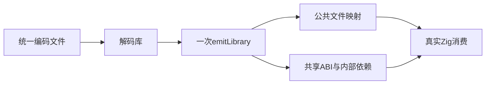
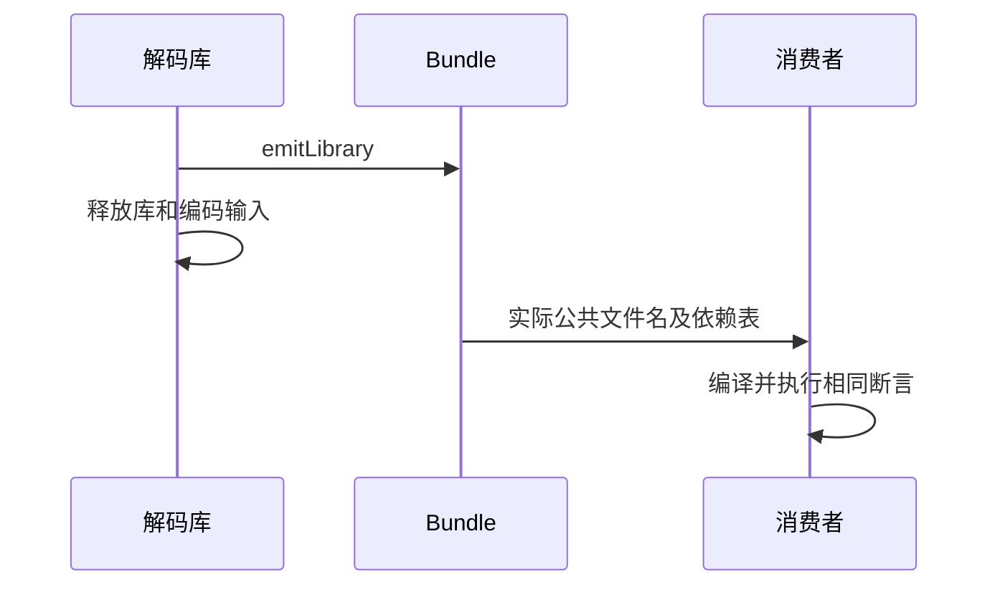

# 统一 Zig 库 Bundle 消费验证

## Intent：最终目标

阶段三百五十一：验证compiler.zig.emitLibrary生成的统一Bundle可直接支持多个公开入口，保留公开文件身份、共享ABI和内部依赖，并在原库释放后可消费。

## Data：可用证据

ff8a187d新增emitLibrary/Cached，返回public_modules、内部modules、types和原生配置。此前运行测试是逐入口emitModules，没有覆盖新的集合生成接口。

## Edges：边界与限制

解码进程调用一次emitLibrary，释放原库后保存完整Bundle。消费者按生产public文件名编译，不能把新API换回逐入口生成。先覆盖无原生Store的ZX与RX混合集合，原生配置和宿主另行验证。

## Answer：交付格式与成功标准

新增独立Bundle重放工具，沿用四组产物和原有消费者，保持公开文件名并传递实际依赖表。补缓存复用、输入释放、错误及分配失败的API测试；完成提交push。

## 自我复核

检查函数调用路径确实进入emitLibrary；公共名称与文件名不是同一字段，消费驱动必须尊重实际文件路径。生成结果独立拥有与缓存命中不能只依赖计数，需比较内容并实际运行。

## 验证结果

新增replay_bundle工具一次调用emitLibrary，在保存结果前释放解码库；保留生产public_SHA256文件名，modules.json分别记录公开导入名与实际path。既有Node驱动仅增加可选path字段，原逐模块生成格式仍可消费。四组纯ZX/RX混合正反序全部编译运行通过，新Bundle路径22次Zig消费者测试及4Node驱动通过。

新增bundle_test.zig五项：原库释放后公开名/哈希文件名/源码有效；缓存第二轮不新增生成项且内容与无缓存一致、释放缓存后仍有效；生成逐点分配失败清理；空公开表InvalidLibrary；真实未证明契约UnverifiedContracts。

首轮联合执行时前三项API测试及所有运行路径通过：49/49步骤、19/19直接Zig测试，另66次消费者Zig执行及12Node驱动。补两个门禁时共享工作区正在接入新的compiled/load.zig，文件尚未写出且resolveTarget改造未完成，编译提前失败。这属于在途修改，未修改或通报其为生产缺陷。

已使用基于d8182221的独立工作区，仅复制本轮测试，完成最终门禁补验：10/10步骤、21/21直接Zig测试通过，其中Bundle五项全部通过。原工作区运行结果和隔离补验分别保留，不合称一次固定HEAD全量回归。TypeScript、Node驱动Prettier、手写Zig格式及源码diff通过。

源码副本、四组实际Bundle生成文件及依赖表/哈希、本地日志位于统一Bundle测试草稿。生产生成文件的EOF空行保持原字节，不批量格式化证据。没有生产缺陷或需通知消息。JSONL73834和Test262审阅2182不变；原生配置、Store运行宿主和最终包发布仍待继续。按要求提交push本部分测试。
