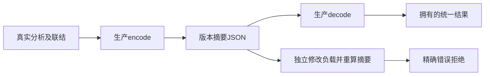
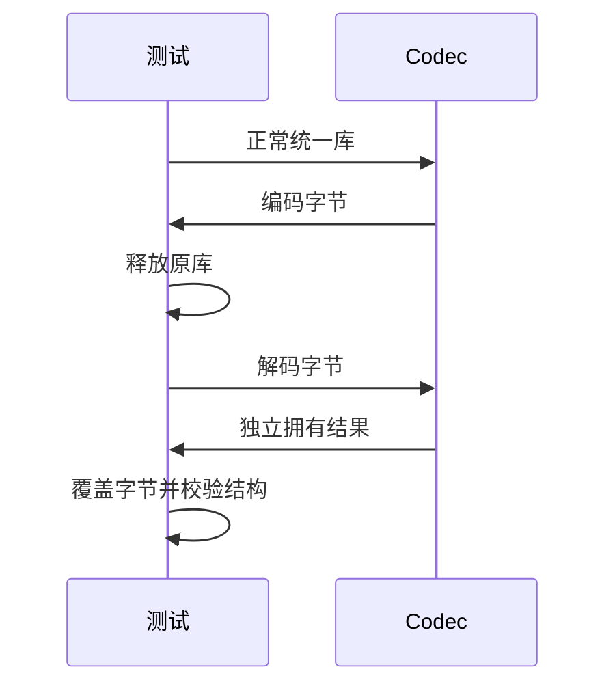

# 统一产物编解码验证

## Intent：最终目标

阶段三百四十八：验证489a0d2d统一library codec的往返、所有权、完整性、版本与语义门禁及分配失败。

## Data：可用证据

格式为zxc.library.v1、SHA256与JSON负载；解码先校验完整性，再解析版本、IR、公开表、名义类型和Store一致性。校验通过的link结果构造正常样本；破坏测试重新计算摘要，确保触达语义检查。

## Edges：边界与限制

损坏样本只在测试中修改真实产物，不修改生产实现。往返不等同跨进程发布完成。深度限制和资源注入记录实际覆盖范围。

## Answer：交付格式与成功标准

新增分组Zig测试与专项入口，保留测试副本与执行日志。精确区分InvalidLibrary和IncompatibleLibraryVersion；释放原库和覆盖输入字节后仍可读解码结果；故障注入不泄漏。

## 自我复核

摘要错误只能证明完整性检查，语义损坏必须携带正确摘要。正常样本必须由生产分析和联结产生，不能自造一份宽松IR掩盖问题。

## 验证结果

新增codec目录fixture、roundtrip_test、rejection_test，注册test-library-codec并接入总入口。专项6/6步骤、16/16测试通过。正常样本包含可调用入口和纯类型枚举模块；核对完整program、exports、nominal_types及再次编码字节一致。释放原库并覆盖/释放编码字节后，解码结果仍拥有名称、路径、名义信息且模块IR有效。

对每一个截断长度及标记/摘要/分隔/正文改字节执行拒绝。重新计算正确摘要后的破坏覆盖payload和program版本、空/重复公开表、函数ID越界、函数来源路径错配、公开Input签名错配、缺失枚举来源、名义类型ID越界、非法JSON和2050层嵌套。变异前断言JSON字段为实际整数ID及第一公开类型名Input，避免错误字段类型导致虚假的语义覆盖。

编码、正常解码、完整JSON解析后语义拒绝均逐点注入分配失败，无泄漏。首轮测试接线遇到Zig跨模块相对导入和参数遮蔽名字错误，已通过显式library_fixture模块依赖及重命名修正，未修改生产实现。最终格式与diff检查通过。

源码副本、生产哈希与本地日志位于统一产物编解码草稿；遵循仓库忽略日志规则，提交不强制纳入log。没有需通知实现聊天的生产缺陷。JSONL73834、Test262已审阅2182不变；未重跑完整根回归，未通过codec重放产物实际执行。后续需补真实消费及发布。

用户随后要求提交所有尚未提交的测试变更，本部分将并入测试工作区补提交；生产源码中的在途修改不纳入。后续按每部分测试完成后提交并push执行。
