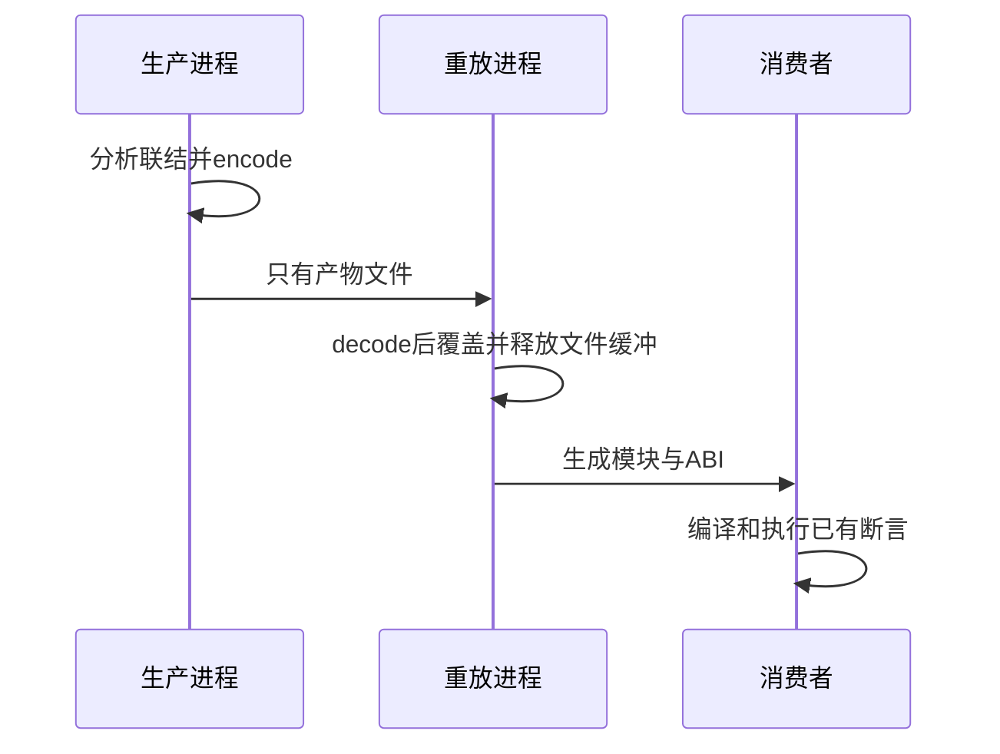

# 统一产物跨进程重放验证

## Intent：最终目标

阶段三百四十九：将统一codec从结构往返推进到真实消费。独立生成进程写出产物，独立重放进程解码并释放输入字节，再生成、编译和运行消费者。

## Data：可用证据

既有纯ZX与RX/ZX混合两组夹具各有正反序联结和实际运行断言；上一阶段codec16项接口测试通过。复用同一消费者，避免新增仅验证序列化字段的浅层测试。

## Edges：边界与限制

生成器与重放器是独立可执行文件，重放器只接收编码文件，不接收原分析或源码。测试构建仍保留源码用于生成，不能声称发布包已完整可搬迁；包级CLI发布另行验证。

## Answer：交付格式与成功标准

新增archive生成模式和replay工具，复用依赖图Zig消费者；四组编码文件经独立进程重放，全部现有计算、别名、短路及错误断言通过。完成后提交并push本部分测试。

## 自我复核

将解码接在同一分析arena之后不能证明脱离原分析，本批用不同进程。保留原消费者结果规则，不能为了重放通过改变期望值。

## 验证结果

生成器增加archive前缀模式，把真实联结结果通过codec写成.zxlib；新增独立replay可执行文件，只读取该文件，decode后覆盖并释放page_allocator文件缓冲，再生成模块。原生成循环抽到emit.zig，由直接生成与重放共用，保持生产接口调用一致。

新增test-library-replay专项并挂入library-runtime。四组文件分别为纯ZX正反序及RX/ZX混合正反序；重放结果通过4+4+7+7=22次Zig消费者测试执行及4个Node驱动，共106次execute调用。包含原直接生成路径的整体library-runtime为26/26构建步骤、44次Zig消费者测试执行及8个Node驱动通过。

新测试复用既有消费者，未改变期望值，也不重复计为新增JSONL案例。手写Zig格式及源码diff检查通过；Node驱动未修改。生成证据原样保留生产输出的末尾空行，暂存检查的24条EOF空行提示不通过改写证据消除。没有发现生产缺陷，无需通知实现聊天。源码、四份编码产物和重放生成结果及哈希保存在统一产物重放草稿；日志保留本地，不强制加入Git忽略文件。

JSONL73834、Test262审阅2182保持不变，未跑完整根回归。提交范围为五个测试/构建源码、本记录、测试索引及对应草稿证据；按用户要求完成后提交并push。包级CLI统一发布、Store运行宿主和原生接口仍待继续验证。
