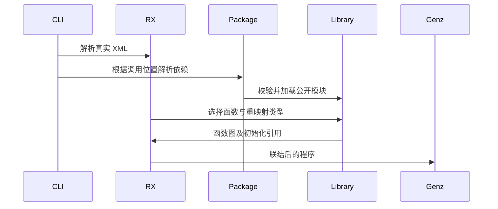

# RX 公开编译模块入口

## Intent：最终目标

让 RX 流程直接调用包公开的统一编译模块，接通已有产物解析与 RX 联结，为 Store 显式绑定与应用宿主消费提供真实入口。

## Data：可用证据

当前 Call.fn 始终解析为项目内 ZX 文件，Call.service 始终解析为项目内 RX 文件。统一库已经保存函数图、公开模块、类型身份和 Store 初始化元数据。复用 project.resolveTarget 与 compiled.load，避免伪造 ZX 包装源码。

## Edges：边界与限制

新增 Call.module 明确表示依赖包的公开编译模块，与 fn/service 三选一。保留现有省略后缀的本地引用含义。加载产物不授予 Store 能力；已发布 RX 模块沿用其内部显式 Store 授权，和本地 Call.service 一致；调用者不获得 Store 句柄。裸 Store transaction 不能通过 module 越权调用。库初值进入现有静态内存宿主装配。保持源码 RX 依赖图完整检查；已编译产物由 IR 验证器检查。不新增测试用例、不运行全量测试。

## Answer：交付格式与成功标准

实现标签、CLI 依赖装载与 RX 类型/函数联结；以真实发布包在 RX 中调用、构建和执行证明入口。初始化元数据跟随函数索引重映射，不能因 RX 包装丢失。记录明确的阶段边界。




## 自我复核

只有纯函数调用通过不能证明 Store 消费完成；需要实际执行同实例跨模块更新、再次发布后调用，并确认普通 ZX 仍拒绝隐式 Store 调用。所有检查结果在实际运行后填写。

## 无输入调用

Call.module 的 Input 为 void 时允许省略 in，推导器将该参数约束为 void，生成器直接生成 unit IR；非 void 目标会报类型错误。没有伪造 ZX 表达式或包装源码。fn/service 的既有必填 in 契约保持不变。

## 权限边界复核

编译模块必须来自当前包声明的依赖及其公开导出。含 Store 的目标必须是已验证的 orchestration；其逐次授权已保存在函数图中。调用与本地 service 相同，只执行被导出的流程，不允许给 module 附加 setter，也不向普通 ZX 或调用者 context 注入 Store 句柄。宿主只初始化最终应用实际需要的槽位。

## 实施与实际结果

- 纯算术编译包：RX 直接调用两个 public module，输入 3 输出 40，并成功再次发布。
- Store 编译包：RX 调用公开 read/advance，输入 4，结果为 before=3、first=7、second=11、after=11；消费目录仅含发布包，不含原始 Store/RX/ZX 实现。
- 再次发布上述 RX 后，新包调用该公开模块两次，第一次 3→7→11，第二次 11→15→19。初值记录保持一条，函数索引经两层联结后仍有效。
- 单独重新运行第一个应用仍从 3 开始，不跨进程恢复。
- check-rx 从仓库根目录装载上述消费项目成功；修正了 collection 相对路径与包归属所需绝对路径之间的衔接。

实际命令、输出及初始化元数据见 [执行结果](RX公开模块执行结果.json)。代码副本位于 RX公开模块草稿，正式修改保持 compiler/cli 现有职责边界。

复现：在仓库根目录执行以下命令。原生 --out 指定可执行文件路径，lib --out 指定目录。

```sh
zig-out/bin/zxc build docs/2026-10-05/统一库/RX公开Store消费/main.rx --out docs/2026-10-05/统一库/RX公开Store消费/应用
docs/2026-10-05/统一库/RX公开Store消费/应用 4

zig-out/bin/zxc build docs/2026-10-05/统一库/RX公开Store消费/main.rx --mode lib --out docs/2026-10-05/统一库/RX公开Store发布

zig-out/bin/zxc build docs/2026-10-05/统一库/RX公开Store再消费/main.rx --out docs/2026-10-05/统一库/RX公开Store再消费/应用
docs/2026-10-05/统一库/RX公开Store再消费/应用 4
```

再消费目录的 published 是本次发布产物的完整搬迁副本；更改上游后需重新复制，再构建消费者。

## 验证范围与自我批判

根构建 14/14 通过。现有 test-rx-inference 与 test-library-link 合计 180/180 通过；compiler 的 test-rx 为 39/39；现有 test-rx-state-app 的 8 项应用内存行为通过。此前 test-rx-cli 的文件路径、Store 路径、项目构建及 watch 专项也通过。没有新增测试用例，也没有运行全量测试或浏览器。

只读复核没有发现本轮权限提升或初始化函数索引错位。check-rx 仍是结构与目标检查，完整类型与能力检查由 infer/build 执行。独立请求 arena 的长期服务入口、直接重建已编译清单、库级 watch 与旧生成文件清理仍需继续完成；本轮不据顺序 CLI 运行宣称这些已完成。
