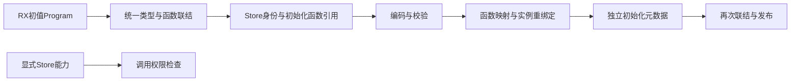
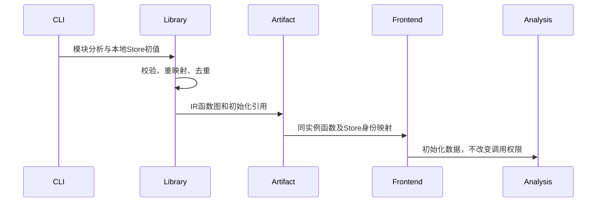

# Store 初始化进入统一产物

## Intent：最终目标

Store初值随统一库保存、搬迁和再次联结，保持共享类型和依赖实例身份；初始化元数据不授予读写能力。

## Data：可用证据

RX分析持有store_definitions，但当前library.Result和codec未保存初值。compiled.load已经重映射函数类型与Store身份，可复用此映射。普通ZX调用Store函数仍被拒绝；RX当前仅解析本地ZX/RX/Store路径，已编译Store库的显式调用入口尚待接入。

## Edges：边界与限制

本阶段把初值纳入统一函数图，以Store身份、schema_version和函数索引记录初始化声明；不能单独复制旧类型ID。旧的显式宿主库允许没有初始化声明，不能假设其初值为零。禁止通过context.stores或删除权限检查自动授予能力。不新增测试用例、不执行全量测试。

## Answer：实现与成功标准

源码Store初值先校验并联结到统一类型/函数表；相同身份必须具有一致版本与初值，否则拒绝。编码保存引用，解码校验引用与Store对象类型；导入使用同一函数映射和Store实例重绑定，AnalysisResult独立传递初始化声明。Zig库生成保留初始化函数和可供后续宿主装配使用的元数据。

## 自我复核

保存元数据不等于完成CLI调用：RX公开模块解析、显式Store绑定以及内存宿主装配仍需后续接通。检查不能只看字段存在，还需校验初值函数输出类型、重复身份冲突、数据生命周期和导入后的身份一致。

格式写入升级为zxc.library.v2；读取器仍识别已发布的v1，但v1不得携带非空初始化元数据。IR版本不变，因为新增的是库级初始化声明与既有函数引用，没有修改IR指令。旧的显式宿主库不被伪造初值。

## 实施与验证结果

compiler.library.Input接收本地初值Program；联结器将它映射到共同类型/函数表。同一Store身份的重复本地声明只保留一个初始化函数；版本或规范化函数结构冲突则拒绝。Graph校验覆盖身份、重复、函数索引、void输入、对象输出、无外部调用/Store能力/契约及关联Store对象类型。

CLI发布现有counter示例（value=3、history=[8]），两个公开模块共享一条初始化记录。另一个源码包仅导入其公共Input类型，再经解码、前端实例绑定、联结和编码重新发布；Store身份变为store.library实例身份，函数引用仍有效，权限组合保持一致。重新发布生成的初始化模块实际编译执行输出value=3 history={ 8 }。具体命令与元数据见Store初始化结果.json。

类型导入只是本阶段验证元数据保留的入口，没有调用Store读写函数或创建应用共享宿主。现有test-library-link与test-library-bundle两个专项通过；最终根构建14/14通过。没有新增测试用例、运行全量测试或调用浏览器。

重复发布还暴露workspace过度扫描无关目录的问题，已独立修复并通过31项既有workspace用例。原目录重复发布恢复成功，生成缓存generated=0/reused=3。修复见工作区无关目录扫描修复记录。

## 尚未完成

本阶段未接通RX公开库模块目标、显式Store声明/授权绑定及应用内存宿主装配；RX内部分析包装的初始化元数据透传也需随该链路接入。不能把初始化模块执行成功宣称为CLI Store库完整消费。后续继续复用明确的权限检查，禁止普通ZX函数直接调用带Store能力的函数。
