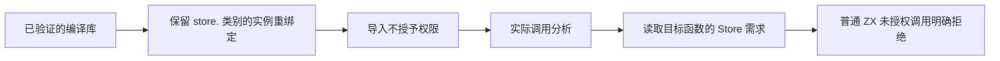

# 已编译 Store 导入修复记录

## Intent：最终目标

修复已编译库的 Store 身份重绑定，使仅导入状态模块的程序仍具有合法 IR，并在普通 ZX 未获得编排授权却调用状态函数时给出明确能力诊断。

## Data：可用证据

独立测试会话提供了真实 RX/Store 经联结与 codec 往返后导入的复现，见 [测试记录](../已编译Store身份与授权验证.md)。原实现使用通用 library 前缀重绑定所有路径，破坏了 Store 路径必须以 `store.` 开头的既有契约。普通函数调用分析只读取输入输出签名，未在调用处检查目标的 Store 需求。

## Edges：边界与限制

只修改生产实现，测试文件及其记录由测试会话维护。保留现有 IR Store 校验，不扩展普通 ZX 的权限，也不因为 import 自动添加调用者的 Store 槽位。本次不声称已完成库 Store 初始化或完整宿主执行。

## Answer：修复与验证

Store 重绑定使用独立格式 `store.library:<实例字节长度>:<实例>:<原路径去掉 store. 前缀后的部分>`。路径保留 Store 类别、实例边界与原 Object 身份，同实例引用一致，不同实例相互隔离。

调用分析直接读取已经联结的目标函数表；目标具有 Store 槽位时，普通 ZX 调用返回 capability 诊断，要求显式授权的编排 Call。没有在导入元数据中另存一份易失配的权限标志，也没有修改 IR 验证规则。



执行测试会话提供的现有专项命令：

```sh
cd packages/test
zig build test-library-link --summary all
```

结果为 20/20 构建步骤、42/42 测试通过。其中新增的三项覆盖仅导入时调用者 stores 为空且 IR 合法、双实例路径隔离，以及未授权调用的 capability 诊断。未新增或修改测试用例，未运行全量测试。

自我复核：此前纯计算产物消费不能覆盖 Store 的专用路径契约。修复以保持既有身份类别和检查真实函数能力为依据，没有按示例实例名硬编码，也没有放宽非法 Store 路径。
